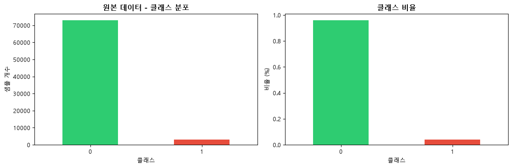
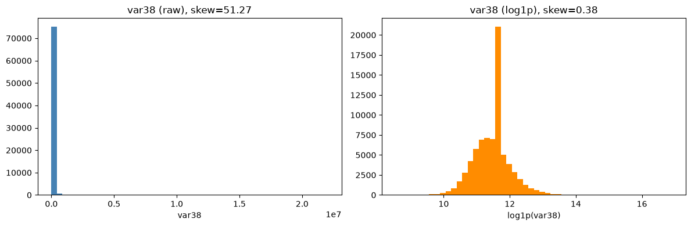
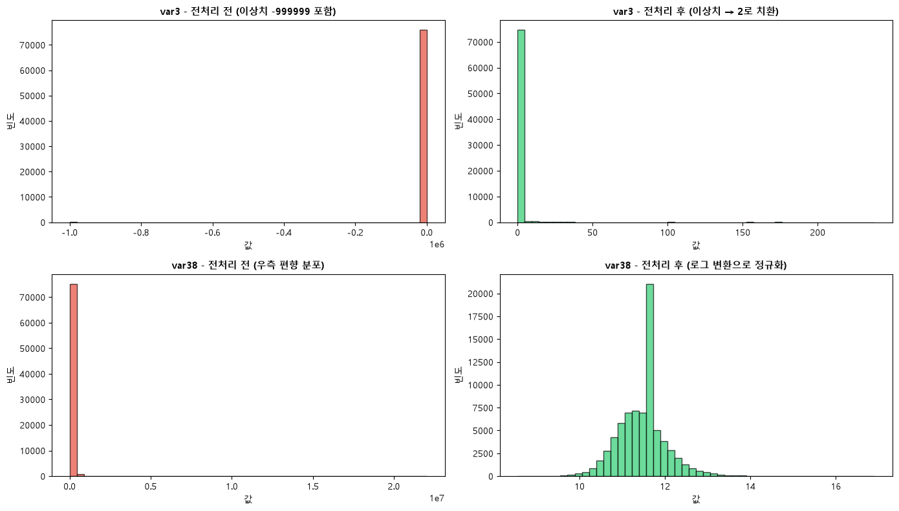
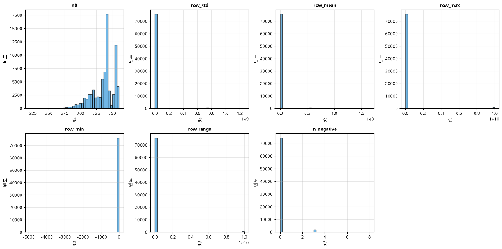
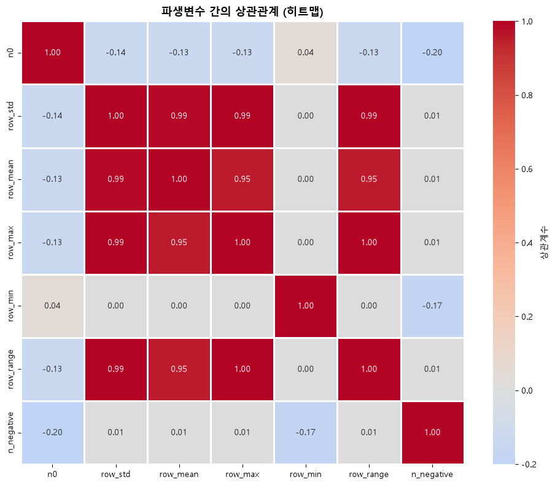
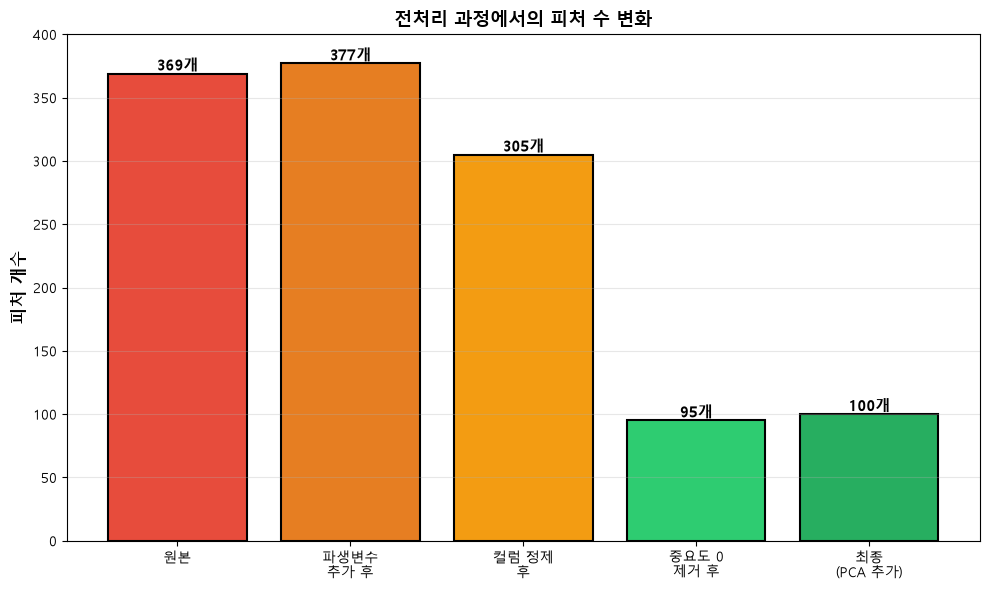
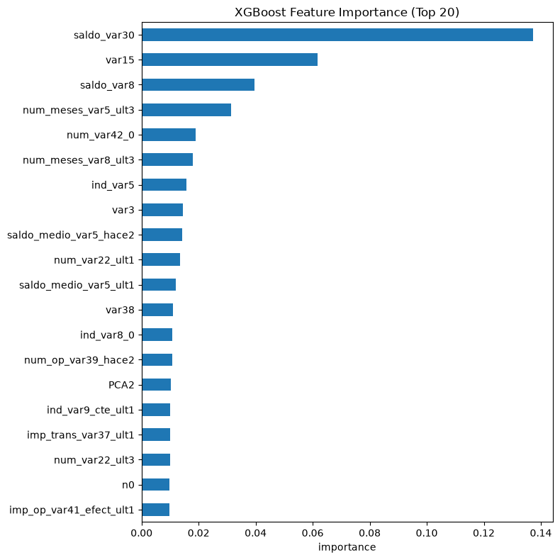
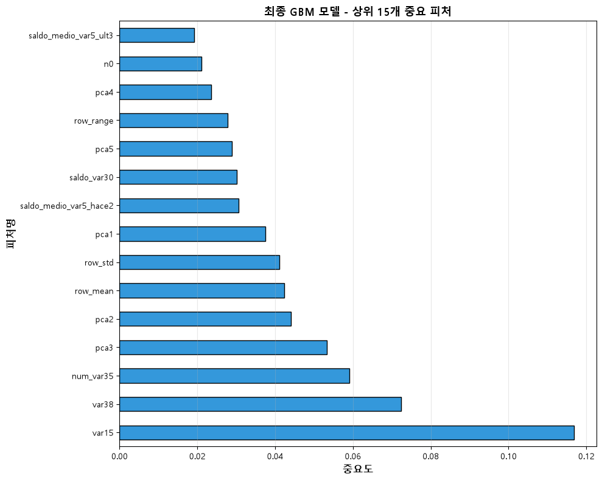
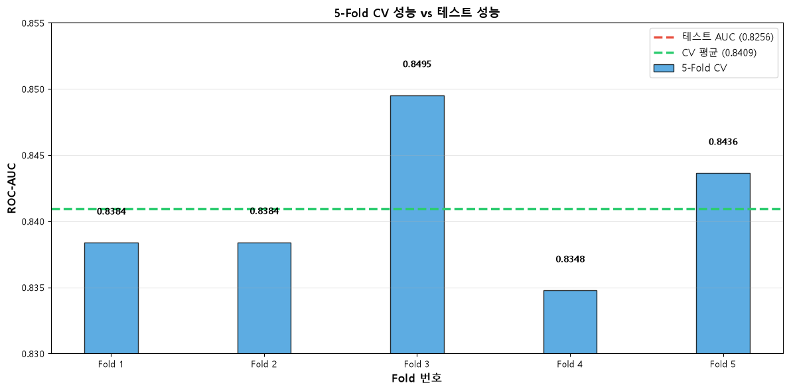
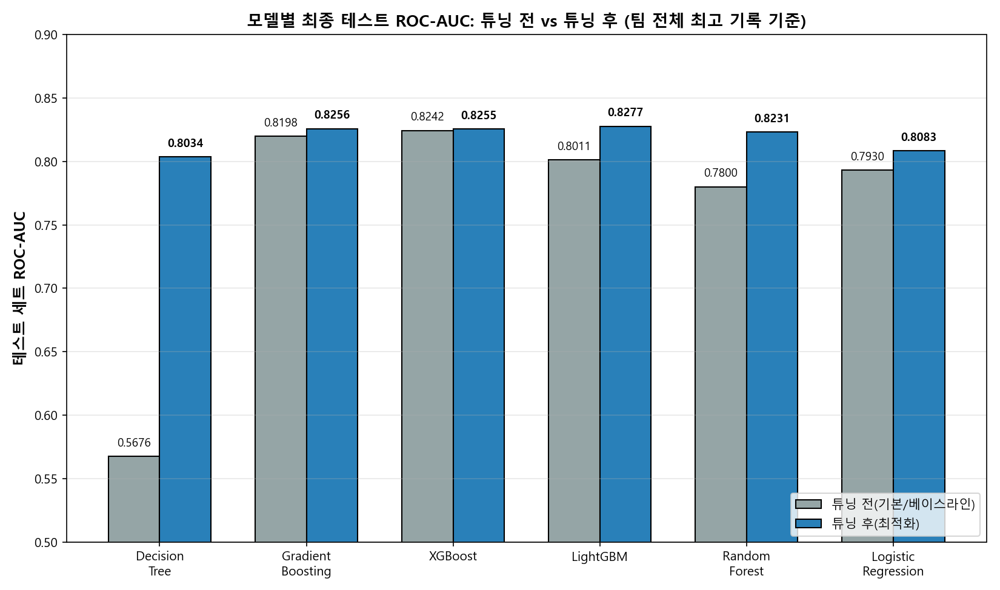

## 0. 초록

본 보고서는 스페인 산탄데르 은행이 Kaggle에 공개한 *Santander Customer Satisfaction* 데이터셋(76,020건, 369개 익명화 피처)을 이용해 고객의 서비스 불만족 여부(TARGET)를 예측하는 이진 분류 프로젝트를 정리한 것이다. 불만족 고객이 전체의 3.96%에 불과한 심각한 클래스 불균형과, 결측치가 `-999999`·`9999999999` 같은 비정상 값으로 위장되어 있는 데이터 특성상 정교한 전처리가 요구되었다. 팀원 5명이 Decision Tree, Gradient Boosting, XGBoost, LightGBM, Random Forest, Logistic Regression 6개 모델을 각자 독립적으로 실험하고, `RandomizedSearchCV`·`GridSearchCV`·`Hyperopt`(TPE) 등 서로 다른 하이퍼파라미터 최적화 기법을 적용해 비교했다. 그 결과 부스팅 계열(LightGBM·GBM·XGBoost)이 ROC-AUC 약 0.825~0.828 구간에서 사실상 동률의 최고 성능을 기록했으며, 그중 LightGBM(0-importance 피처 제거 + PCA 추가)이 **0.8277**로 프로젝트 전체 최고 기록을 세웠다. 분석 결과, 모델 선택보다 이상치 처리·파생 변수·피처 가지치기로 이어지는 **전처리 품질**이 성능 상한을 결정하는 더 큰 요인이었으며, 하이퍼파라미터 최적화의 효과는 모델 구조(단일 트리 vs 앙상블 vs 선형모델)에 따라 크게 달랐다는 결론을 얻었다.

---

## 1. 서론

### 1.1 연구 배경 및 필요성

Santander Customer Satisfaction은 스페인 산탄데르 은행이 Kaggle에 공개한 이진 분류 데이터셋으로, 익명화된 370여 개의 금융·거래 관련 피처를 이용해 고객이 은행 서비스에 **불만족(TARGET=1)** 할지 **만족(TARGET=0)** 할지를 예측하는 문제이다. 실제 은행 입장에서는 불만족 고객을 이탈(해지) 이전에 조기 식별해 선제적으로 대응하는 것이 핵심 목표이며, 이 때문에 단순 정확도보다 두 클래스를 얼마나 잘 분리하는지를 나타내는 **ROC-AUC**가 대회 및 본 프로젝트의 공식 평가지표로 사용된다.

데이터셋은 76,020건의 학습 샘플과 371개 컬럼(ID, TARGET 포함)으로 구성되어 있으며, 불만족 고객이 전체의 약 3.96%에 불과한 심각한 클래스 불균형을 가진다. 또한 컬럼명이 `var3`, `imp_op_var39_comer_ult1`, `saldo_medio_var5_hace2`처럼 비식별화되어 있어 도메인 지식을 직접 적용하기 어렵고, 대신 결측치가 `-999999`, `9999999999` 같은 비정상적인 큰 값으로 인코딩되어 있는 등 실무형 데이터 전처리 역량이 요구되는 데이터셋이다.

### 1.2 과제 목적

본 프로젝트는 팀원 각자가 서로 다른 전처리 전략과 모델(Decision Tree, GBM, XGBoost, LightGBM, Random Forest, Logistic Regression)을 담당해 실험한 뒤, 이를 하나의 파이프라인 관점에서 비교·정리하는 것을 목표로 한다. 절차는 (1) 데이터 이해 및 EDA, (2) 데이터 전처리, (3) 모델링 및 비교, (4) 하이퍼파라미터 최적화, (5) 성능평가 및 해석, (6) 결론 및 회고의 순서로 진행되었으며, 본 보고서 역시 이 흐름을 그대로 따른다.

---

## 2. 데이터셋 소개

### 2.1 데이터 출처 및 구성

| 항목 | 내용 |
|---|---|
| 데이터 출처 | Kaggle *Santander Customer Satisfaction* (`train.csv`, `test.csv`) |
| 학습 데이터 크기 | 76,020행 × 371열 (`ID`, `TARGET` 포함) |
| 제출용 테스트 데이터 크기 | 75,818행 × 370열 (`TARGET` 미공개) |
| 피처 수(ID·TARGET 제외) | 369개, 전부 익명화된 수치형 변수 |
| 타깃 변수 | `TARGET` — 0: 만족, 1: 불만족 (이진 분류) |
| 클래스 분포 | 0: 73,012건(96.04%) / 1: 3,008건(3.96%) → 약 **24.3 : 1** 불균형 |
| 결측치(NaN) | 0건 — 대신 `var3=-999999`, `delta_*=9999999999` 등 값으로 위장된 결측/이상치 존재 |
| 평가지표 | ROC-AUC |

### 2.2 데이터 특성 및 구조 분석

`describe()` 기준으로 확인한 대표 변수들의 통계량은 다음과 같다 (전처리 전 원본 기준).

| 변수 | 추정 의미 | count | mean | std | min | 25% | 50% | 75% | max |
|---|---|---|---|---|---|---|---|---|---|
| `var3` | 국적/지역 코드 추정 | 76,020 | -1,523.20 | 39,033.46 | **-999,999** | 2.00 | 2.00 | 2.00 | 238.00 |
| `var15` | 연령 추정 | 76,020 | 33.21 | 12.96 | 5.00 | 23.00 | 28.00 | 40.00 | 105.00 |
| `var38` | 자산·잔액 규모 추정 | 76,020 | 117,235.81 | 182,664.60 | 5,163.75 | 67,870.61 | 106,409.16 | 118,756.25 | 22,034,738.76 |
| `imp_op_var39_comer_ult1` | 최근 상거래 관련 금액 | 76,020 | 72.36 | 339.32 | 0.00 | 0.00 | 0.00 | 0.00 | 12,888.03 |

`var3`은 25/50/75% 값이 모두 `2`인데 `min`만 `-999999`인 것에서 결측치가 특정 상수값으로 인코딩되어 있음을 바로 알 수 있고, `var38`은 왜도(skewness)가 **51.27**에 달할 정도로 극단적인 우측 편향 분포를 가진다. 369개 피처가 전부 수치형이면서도 스케일(범위)이 컬럼마다 수천 배씩 차이 나는 것도 이 데이터셋의 구조적 특징이며, 이 두 특징이 이후 전처리 방향(이상치 치환, 로그 변환)을 결정한 핵심 근거가 되었다.

<p align="center"></p>
<p align="center"><em>그림 1. TARGET 클래스 분포 — 원본 건수(좌)와 비율(우). 불만족 고객이 전체의 약 4%에 불과한 심각한 불균형을 보인다.</em></p>

### 2.3 Feature 이름 특징

369개 피처는 비식별화되어 있지만, 컬럼명 접두사만으로도 대략적인 데이터 성격을 유추할 수 있다. 접두사별 개수를 집계하면 다음과 같다.

| 접두사 | 개수 | 추정 의미 | 예시 |
|---|---|---|---|
| `num_` | 143 | 거래/상품 보유 **건수**(count) | `num_var4`, `num_var5_0`, `num_meses_var5_ult3` |
| `ind_` | 75 | 특정 상품·조건 보유 여부 **지표**(0/1 플래그) | `ind_var1_0`, `ind_var26`, `ind_var39` |
| `saldo_` | 71 | 계좌·상품별 **잔액**(balance) | `saldo_var30`, `saldo_medio_var5_hace2` |
| `imp_` | 49 | 거래 **금액**(import/amount) | `imp_op_var39_comer_ult1`, `imp_ent_var16_ult1` |
| `delta_` | 26 | 두 시점(예: 1년 vs 3년) 사이 값의 **변화량** | `delta_imp_aport_var13_1y3` |
| 접두사 없는 개별 변수 | 5 | 국적(`var3`)·연령(`var15`)·자산규모(`var38`) 등 별도 체계로 명명된 변수 | `var3`, `var15`, `var21`, `var36`, `var38` |

`_ult1`/`_ult3`(최근 1개월/3개월), `_hace2`(2기 전) 같은 접미사도 함께 나타나는데, 이는 은행 데이터에서 흔히 쓰이는 "관측 시점(최근 N개월/N기 전)" 표기로 추정된다. 즉 완전히 익명화된 데이터라도 접두사·접미사 명명 규칙을 분석하면 "이 피처가 건수인지 금액인지 잔액인지 변화량인지"는 어느 정도 구분할 수 있으며, 이는 3.2절의 상관관계 해석과 3.3절 이상치 분석(어떤 접두사 계열에서 결측 위장 값이 나타나는지)의 근거로 활용되었다.

### 2.4 동일 값인 Feature

전체 369개 피처 중 **34개 컬럼**은 모든 76,020개 샘플에서 값이 단 하나뿐인 상수(constant) 컬럼이었다(예: 특정 상품을 가진 고객이 데이터셋 안에 아예 없어 해당 지표가 항상 0인 경우). 상수 컬럼은 분산이 0이므로 어떤 모델을 쓰든 예측에 전혀 기여할 수 없어 제거 대상이 된다. 실제 제거는 4.4절(피처 정제)에서 수행한다.

### 2.7 중복 Feature

상수 컬럼을 먼저 제거한 뒤 남은 335개 컬럼을 대상으로 전치(`.T`) 후 `duplicated()`로 확인한 결과, **29개 컬럼**이 다른 컬럼과 76,020개 값이 완전히 동일한 중복 컬럼이었다(예: `ind_var26_0`과 `ind_var26`, `num_var26_0`과 `num_var26`처럼 `_0` 접미사가 붙은 버전과 안 붙은 버전이 사실상 같은 값을 가지는 경우가 다수). 중복 컬럼을 남겨두면 다중공선성만 키우고 정보량은 늘지 않으므로 4.4절에서 함께 제거한다.

### 2.8 ID 변수

`ID`는 1~151,838 범위의 정수로, 76,020개 행 모두 유일값(중복 없음)이며 값이 단조 증가하는 것으로 보아 고객 계좌 개설 순서 또는 Kaggle 제출용 일련번호로 추정된다. 실제 서비스 만족도와는 인과적으로 무관한 단순 식별자이므로, 모든 팀원이 학습 피처에서 제외하고 예측 이후 제출(submission) 파일을 만들 때 인덱스 역할로만 사용했다.

### 2.9 타깃 변수 분포 분석

클래스 불균형이 매우 심하기 때문에 단순 정확도는 다수 클래스만 예측해도 96%에 도달하는 착시를 일으킨다. 따라서 팀 전체가 초기 EDA 단계부터 정확도 대신 ROC-AUC, 그리고 필요 시 Precision/Recall/F1을 함께 확인하는 방향으로 지표를 통일했다(그림 1).

---

## 3. 탐색적 데이터 분석(EDA)

### 3.1 기술통계 분석

2.2절의 `describe()` 결과에서 이미 확인했듯, `var3`은 결측이 상수로 위장돼 있고 `var38`은 왜도 51.27의 극단적 우측 편향을 보인다. 이 두 변수 외에도 `imp_`/`saldo_` 계열 다수가 0이 대부분이고(75%값이 0) 소수의 큰 거래 금액만 꼬리처럼 늘어진 분포를 공통적으로 가져, 전체 369개 피처 상당수가 "0이 압도적으로 많고 우측으로 치우친" 준희소(quasi-sparse) 분포라는 공통 특성을 확인했다.

### 3.2 상관관계 기반 주요 변수 분석

TARGET과의 단순 상관계수를 몇몇 대표 변수에 대해 확인하면 다음과 같다.

| 변수 | TARGET과의 상관계수 |
|---|---|
| `num_meses_var5_ult3` | **-0.1483** |
| `var36` | +0.1029 |
| `var15` | +0.1013 |
| `num_var4` | -0.0802 |
| `saldo_var30` | -0.0371 |
| `saldo_medio_var5_hace2` | -0.0201 |
| `var38` | -0.0195 |
| `imp_op_var39_comer_ult1` | +0.0104 |

가장 큰 절댓값 상관을 보인 `num_meses_var5_ult3`(최근 3개월 내 `var5` 관련 활동 개월 수 추정)은 값이 클수록(최근 활동이 활발할수록) 오히려 불만족 확률이 낮아지는 방향(-)으로, "활발한 거래 이력 = 안정적 고객"이라는 해석과 부합한다. `var15`(연령)와 `var36`은 양의 상관을 보여, 특정 연령대·상품 유형(var36)에서 불만족 비율이 상대적으로 높다는 것을 시사한다. 다만 개별 변수의 절대 상관계수는 모두 0.15 미만으로 크지 않아, 단일 변수만으로는 설명력이 부족하고 여러 변수의 조합(3.4절 이상치 처리 이후 파생 변수, PCA 성분 등)이 필요하다는 판단의 근거가 되었다. 실제로 5.4절 모델링에서도 이 변수들(`var15`, `var38`, `saldo_var30` 계열)이 XGBoost·GBM 모두에서 상위 중요 피처로 재확인된다(그림 7).

### 3.3 이상치 분석

`describe()`의 `min`/`max` 극단값을 통해 이 데이터셋의 이상치가 무작위 노이즈가 아니라 **특정 값으로 위장된 결측치**라는 패턴을 확인했다.

- `var3 = -999999`: 정상 범위(대부분 2 근방)를 크게 벗어난 값으로, 결측을 나타내는 관례적 sentinel 값으로 추정된다(116건).
- `delta_*` 26개 컬럼의 `9999999999`: 정상 값이 대부분 -1~1.5 범위인데, 이 값만 10자리의 명백히 비정상적인 대형값으로 나타나 역시 결측/해당없음의 sentinel로 판단했다.

이런 "값으로 위장된 결측치"는 `isnull().sum()`으로는 전혀 잡히지 않기 때문에(2.1절에서 확인했듯 결측치 0건으로 표시됨), `describe()`의 min/max를 직접 들여다보는 과정이 없었다면 놓쳤을 이상치다.

### 3.4 변수별 이상치 시각화

<p align="center"></p>
<p align="center"><em>그림 2. var38 로그 변환 전(좌, skew=51.27) 후(우) 분포 비교.</em></p>

<p align="center"></p>
<p align="center"><em>그림 3. var3 이상치 치환(상단), var38 로그 변환(하단) 전/후 분포 비교.</em></p>

### 3.5 중복 값 제거

컬럼(변수) 차원의 중복은 2.7절에서 다뤘고, 여기서는 **행(row) 차원의 중복**을 확인한다. `ID`를 제외한 나머지 370개 컬럼(피처+TARGET) 전부가 동일한 행이 있는지 `duplicated()`로 재검사한 결과, 총 5,791건이 하나 이상의 중복 그룹에 속했고 그중 4,807건(전체의 **6.32%**)이 "첫 등장 이후의 여분(extra)" 중복 행으로 확인되었다. 중복 행 그룹 내 TARGET 분포(만족 5,536 : 불만족 255 ≈ 95.6:4.4)는 전체 분포(96.04:3.96)와 크게 다르지 않아, 이 중복이 특정 클래스에 쏠려 성능을 왜곡시키는 정도는 아닌 것으로 판단된다. 다만 본 프로젝트의 실제 팀원 노트북들을 재확인한 결과 이 행 단위 중복은 어느 파이프라인에서도 명시적으로 제거되지 않았다 — 이는 8장 회고의 개선점으로 함께 기록한다.

### 3.6 특정 컬럼 로그 변환

`var38`은 왜도 51.27의 극단적 우측 편향 분포를 가져 `log1p` 변환으로 정규화했다(그림 2). 구체적인 변환 코드와, 이를 `var38` 한 컬럼을 넘어 왜도가 큰 다른 컬럼들로 확장 적용한 사례는 4.2절에서 다룬다.

---

## 4. 데이터 전처리

팀원 대부분이 아래와 같은 공통 전처리 파이프라인을 기반으로 각자의 모델에 맞게 일부 단계를 가감하는 방식으로 작업했다. 트리 계열(RandomForest 등)은 단조 변환에 불변하다는 이유로 로그 변환·PCA를 생략하는 등, **모델 특성에 맞춰 전처리를 다르게 적용**한 점이 본 프로젝트 전처리 전략의 특징이다.

### 4.1 이상치 처리

- **`var3` 결측 이상치**: `-999999`로 인코딩된 116건(학습 기준)을 최빈값인 `2`로 치환.
- **`delta_*` 계열 이상치**: 26개 `delta_*` 컬럼에 남아있던 `9999999999`(비정상 대형값)를 결측으로 간주해 `NaN` 처리 후 각 컬럼의 중앙값으로 대체(용우). 일부 모델(Decision Tree)에서는 값을 대체하는 대신 "몇 개의 `delta_*` 컬럼이 이상치였는가"를 별도 플래그 피처(`delta_missing_cnt`)로 남겨 정보 손실을 방지했다.

### 4.2 분포 변환

`var38`은 왜도 51.27의 극단적 우측 편향 분포를 가져 `log1p` 변환으로 정규화했다. 아래는 로그 변환 전후 분포 비교이다(그림 2, 3 재참조).

Random Forest와 로지스틱 회귀를 모두 담당한 유경은 두 모델의 특성에 맞춰 로그 변환 적용 여부 자체를 다르게 가져갔다. 로지스틱 회귀에서는 `var38` 한 컬럼에만 로그 변환을 적용하는 것에서 나아가, **왜도 절댓값이 1을 초과하는 326개 컬럼 전체**에 부호를 보존하는 `signed log1p`(`sign(x)·log1p(|x|)`) 변환을 적용해 선형 결정 경계가 왜곡된 분포에 과도하게 휘둘리지 않도록 했다. 반면 Random Forest에서는 "트리 분할은 임계값 비교만 사용하므로 단조 변환이 성능에 영향을 주지 않는다"는 이유로 동일한 로그 변환을 의도적으로 생략했다 — 같은 사람이 담당 모델의 특성에 따라 전처리를 다르게 설계한 대표적인 사례다.

### 4.3 파생 변수 생성

행(row) 단위로 고객의 거래 패턴을 요약하는 파생 변수를 추가했다.

| 파생 변수 | 정의 | 의도 |
|---|---|---|
| `n0` | 고객별 값이 0인 피처 개수 | 계좌 활동성(활발/휴면) 대리 지표 |
| `row_std` / `row_mean` / `row_median` | 고객별 거래·잔액의 행 방향 통계량 | 거래 규모 및 변동성 |
| `row_max` / `row_min` / `row_range` | 고객별 최대/최소/범위 | 이상 거래 존재 여부 |
| `n_negative` | 값이 음수인 피처 개수 | 환불·손실성 거래 빈도 |
| `delta_missing_cnt` | 이상치(9999999999)였던 `delta_*` 개수(Decision Tree 전용) | 결측 패턴 자체를 신호로 활용 |
| `var38_is_missing` | var38이 최빈값(=평균 대체 추정값)인지 플래그(Random Forest 전용) | 잠재적 결측 대체 흔적 탐지 |

<p align="center"></p>
<p align="center"><em>그림 4. 주요 파생 변수들의 분포.</em></p>

<p align="center"></p>
<p align="center"><em>그림 5. 파생 변수 간 상관관계 히트맵. row_mean·row_max·row_range처럼 "거래 규모"를 나타내는 변수들끼리는 상관이 높은 반면, n0(활동도)·n_negative(손실 빈도)는 비교적 독립적인 정보를 포착한다.</em></p>

### 4.4 피처 정제 및 중요도 기반 가지치기

1. **상수 컬럼 제거**: 전체 샘플에서 값이 하나뿐인 컬럼 34개 제거 (2.4절, 모든 고객에게 동일한 값 → 정보량 없음).
2. **중복 컬럼 제거**: 다른 컬럼과 완전히 동일한 값을 가지는 컬럼 29개 제거 (2.7절, 다중공선성 방지).
3. **도메인 기반 수동 제거**: `var6` 계열 및 `delta_imp_reemb_var13_1y3` 등 노이즈로 판명된 delta 컬럼 4개, 총 9개 수동 제거.
4. **모델별 중요도 0 피처 사후 가지치기**: 각 모델을 한 번 학습시켜 feature importance가 0인(=한 번도 분기에 쓰이지 않은) 피처를 제거. 트리 계열 모델마다 "중요하지 않다"고 판단하는 피처 집합이 달라, **가지치기는 모델별로 독립적으로 수행**했다(예: XGBoost 기준 375→111개, GBM 기준 305→95개, RandomForest 기준 294→219개). 로지스틱 회귀는 "트리 importance=0이 선형 관계에서도 무의미하다는 보장이 없다"는 이유로 이 가지치기를 적용하지 않았다.

<p align="center"></p>
<p align="center"><em>그림 6. GBM 파이프라인(혜현) 기준 전처리 단계별 피처 수 변화 — 원본 369개→ 파생변수 추가 377개 → 컬럼 정제 305개 → 중요도 0 제거 95개 → PCA 추가 100개.</em></p>

가지치기의 효과는 성능 손실 없이 학습 속도를 크게 개선했다는 점에서 유효했다. 예를 들어 용우의 XGBoost 실험에서는 375개→111개로 피처를 70% 이상 줄였음에도 테스트 ROC-AUC는 0.8242로 **완전히 동일**했고, Decision Tree/Random Forest/GradientBoosting에서도 동일 경향(가지치기 후 오히려 소폭 상승)이 확인되었다.

<p align="center">
</p>
<p align="center"><em>그림 7. XGBoost(좌) / GBM(우) 기준 상위 중요 피처. 두 모델 모두 saldo_var30, var15, num_var*, saldo_medio_var5 계열, PCA 성분들이 상위권에 공통적으로 등장한다.</em></p>

### 4.5 스케일링 및 차원 축소

- 트리 계열 모델(Decision Tree, Random Forest, GBM, XGBoost, LightGBM)은 스케일에 영향을 받지 않으므로 원칙적으로 스케일링을 생략했다.
- **로지스틱 회귀**는 스케일에 민감하므로 `StandardScaler`를 반드시 적용했다(학습 세트로만 `fit`, 검증/테스트는 `transform`만 적용해 데이터 누수를 차단).
- 대부분의 파이프라인에서 `StandardScaler` 이후 **PCA로 5개의 주성분(pca1~pca5)** 을 추출해 원본 피처에 추가 컬럼으로 결합했다. 완전한 차원 축소가 아니라 "원본 피처 + 압축된 전역 패턴"을 함께 제공하는 방식이며, 실제로 XGBoost/GBM 모두 `pca` 계열 컬럼이 상위 중요 피처에 포함되어 유의미한 신호로 활용되었음이 확인되었다(그림 7).

### 4.6 데이터 분할

데이터 누수를 방지하기 위해 아래 원칙을 전 팀원이 공통으로 준수했다.

- **1차 분할**: `train_test_split(test_size=0.2, stratify=TARGET, random_state=0)`으로 학습 세트(80%, 60,816건)와 **최종 테스트 세트**(20%, 15,204건)를 분리. 최종 테스트 세트는 모델·하이퍼파라미터 선택 과정에서는 절대 사용하지 않고, 마지막 성능 보고에만 1회 사용.
- **2차 분할**: 학습 세트를 다시 훈련용(70%)과 검증/조기종료용(30%)으로 분할하거나, 5-Fold(Stratified)K-Fold 교차검증으로 하이퍼파라미터를 탐색.
- 스케일러·PCA·중요도 기반 피처 선택 등 모든 변환은 **훈련 세트 기준으로만 `fit`** 하고 검증·테스트 세트에는 `transform`만 적용.

---

## 5. 분석방법(Analysis method)

### 5.1 전처리 필요성 및 과정 개요

3장 EDA에서 확인한 세 가지 데이터 특성 — (1) 결측이 sentinel 값으로 위장돼 있다는 점, (2) 일부 변수의 극단적 왜도, (3) 상수/중복 컬럼과 행 단위 중복이 섞여 있다는 점 — 은 각각 4장의 이상치 치환, 로그 변환, 피처 정제 단계로 직결되었다. 즉 본 프로젝트의 전처리는 임의의 관용적 절차가 아니라, EDA에서 실측한 문제를 하나씩 대응해 설계한 결과다.

### 5.2 사용 모델 설명

report.md에서 정한 순서(Decision Tree → GBM → XGBoost → LightGBM → RandomForest → Logistic Regression)에 따라, 각 모델을 선택한 이유를 간단히 정리한다.

| 모델 | 유형 | 선정 이유 |
|---|---|---|
| Decision Tree | 단일 트리 | 규제·튜닝의 효과를 가장 극적으로 관찰할 수 있는 베이스라인 |
| Gradient Boosting | 순차적 부스팅 앙상블 | scikit-learn 기본 구현으로 부스팅 계열의 표준 성능 기준점 제공 |
| XGBoost | 정규화 부스팅 앙상블 | 결측치 자체 처리, 정규화 항(reg_alpha/lambda) 지원 등 실무에서 널리 쓰이는 강건한 부스팅 구현 |
| LightGBM | Leaf-wise 부스팅 앙상블 | 히스토그램 기반 분할로 대용량 데이터에서 학습 속도가 가장 빠름 |
| Random Forest | 배깅 앙상블 | 부스팅과 다른 앙상블 원리(병렬 배깅)로 과적합 양상을 비교하기 위한 대조군 |
| Logistic Regression | 선형 모델 | 트리 계열과 근본적으로 다른 가정(선형 결정 경계)을 가진 모델로, 피처 표현 방식(WOE 등)의 영향을 살펴보기 위한 대조군 |

### 5.3 Hyperopt 기반 하이퍼파라미터 최적화

`GridSearchCV`/`RandomizedSearchCV`는 미리 정해둔 이산값 후보 안에서만 탐색하기 때문에, 베스트 파라미터가 후보 범위의 "끝값"으로 나오면 진짜 최적점이 그 범위 밖에 있을 가능성을 배제할 수 없다(실제로 6.5절 Random Forest, 6.4절 LightGBM 튜닝 모두 이 문제가 관측되었다). `Hyperopt`는 `hp.uniform`/`hp.quniform`으로 연속 구간을 지정하면 **TPE(Tree-structured Parzen Estimator)** 라는 베이지안 최적화 알고리즘이 이전 시행 결과를 바탕으로 유망한 영역을 순차적으로 좁혀가며 탐색해 이 경계값 문제를 완화한다. 다만 `fmin`은 시행을 순차적으로 진행하므로(`GridSearchCV`처럼 여러 코어에 조합을 나눠 병렬 처리할 수 없음), 개별 모델 학습 자체에 `n_jobs=-1`을 지정해 속도를 보완하는 방식을 여러 팀원이 공통으로 사용했다.

팀 내에서는 실제로 같은 LightGBM 모델에 대해 두 탐색 방법을 직접 비교한 실험이 남아있다(용우, `TT(YWK).ipynb`).

| 탐색 방법 | 탐색 방식 | CV AUC | 홀드아웃 테스트 AUC |
|---|---|---|---|
| GridSearchCV(2단계, 729개 조합) | 1단계 RandomizedSearchCV로 범위 축소 → 2단계 격자 탐색 | 0.8394 | **0.8253** |
| Hyperopt(TPE, 100회) | 연속 구간에서 베이지안 탐색 | 0.8382 | 0.8239 |

두 방법의 결과 차이는 CV 기준 0.0012, 테스트 기준 0.0014로 크지 않았으며, 오히려 이번 실험에서는 GridSearchCV가 근소하게 더 높았다. 이는 "Hyperopt(베이지안 최적화)가 격자 탐색보다 항상 더 좋은 결과를 낸다"는 보장은 없으며, **탐색 알고리즘 자체의 선택보다 탐색 범위(space)를 얼마나 적절히 설정하는가**가 더 중요할 수 있음을 시사한다. GBM(혜현)과 XGBoost(진희)의 Hyperopt 적용 사례는 6.2절, 6.3절에서 각각 다룬다.

### 5.4 실행환경

팀원 각자의 노트북은 개별 로컬 환경(Anaconda `ml_dev` 가상환경 등)에서 실행되었으며, 본 보고서 작성 과정에서 재확인한 핵심 라이브러리 버전은 다음과 같다.

| 라이브러리 | 버전 |
|---|---|
| Python (pandas) | pandas 2.3.3 |
| numpy | 2.3.5 |
| scikit-learn | 1.7.2 |
| hyperopt | 0.3.0 |
| xgboost | 팀 공용 환경에 설치되어 사용(버전 미고정, `XGBClassifier` API 기준 작성) |
| lightgbm | 팀 공용 환경에 설치되어 사용(버전 미고정, `LGBMClassifier` API 기준 작성) |

팀원마다 개별 로컬 환경에서 작업해 `requirements.txt`나 `environment.yml` 같은 환경 고정 파일은 별도로 관리되지 않았다는 점은 10장(회고)에서 개선점으로 함께 언급한다.

### 5.5 코드 재사용 및 함수화

팀 노트북 10개를 전수 조사한 결과, 명시적으로 `def`로 정의된 재사용 함수는 예상보다 적었다 — 이혜현(GBM)·진희(XGBoost)·용우(LightGBM)가 각자 독립적으로 작성한 Hyperopt `objective(params)` 함수, 그리고 유경이 로지스틱 회귀를 위해 작성한 `fit_woe`/`transform_woe` 두 함수 정도가 전부였다. 나머지 이상치 치환·파생 변수 생성·모델 학습/평가 코드는 대부분 노트북 셀에 인라인으로 반복 작성되었다. 즉 **"공동 함수"라기보다는 "유사한 패턴을 각자 독립적으로 재구현"한 경우가 대부분**이었다는 것이 정직한 실태이며, 이는 회고(10장)의 개선점("공통 전처리 함수를 팀 초기에 모듈화")과 직접 연결된다. 실제로 반복된 패턴들을 정리해 재사용 가능한 형태로 다듬은 코드는 12장 부록에 정리했다.

---

## 6. 모델링

report.md에서 정한 순서(Decision Tree → GBM → XGBoost → LightGBM → RandomForest → Logistic Regression)에 따라 정리한다. 담당 및 사용 기법 개요는 다음과 같다.

| 모델 | 주 담당 | 하이퍼파라미터 탐색 기법 |
|---|---|---|
| Decision Tree | 용우 | RandomizedSearchCV (5-fold, 100회) |
| Gradient Boosting | 혜현, 용우 | Hyperopt(TPE, 30회) + 5-Fold CV 검증 |
| XGBoost | 진희, 용우, 소현 | Hyperopt(TPE, 200회, 5-Fold CV 목적함수) |
| LightGBM | 용우, 소현 | RandomizedSearchCV → GridSearchCV 2단계 정밀 탐색 (용우는 Hyperopt도 별도 비교, 5.3절) |
| Random Forest | 용우, 유경 | RandomizedSearchCV → GridSearchCV(용우) / RandomizedSearchCV(유경, PredefinedSplit) |
| Logistic Regression | 유경, 소현 | 그리드 형태 수동 탐색(C, penalty, class_weight) + WOE 인코딩 실험 |

### 6.1 Decision Tree (담당: 용우)

기본 파라미터의 Decision Tree는 규제가 전혀 없어 학습 데이터를 통째로 암기하는 완전 과적합 상태(ROC-AUC 0.5676, 거의 무작위 수준)에 빠졌다. 이는 Decision Tree에서는 "얼마나 못 자라게 규제하느냐"가 전처리보다 훨씬 중요하다는 것을 보여준다.

이에 따라 Decision Tree 전용 전처리(로그 변환·PCA 제거, `delta_missing_cnt` 플래그 추가)와 `RandomizedSearchCV`(5-fold, 100회 반복, `roc_auc` 기준) 튜닝을 별도로 수행했다.

| 항목 | 튜닝 전(기본 파라미터) | 튜닝 후 |
|---|---|---|
| 테스트 ROC-AUC | 0.5676 | **0.8034** |
| 베스트 파라미터 | — | `max_depth=5`, `min_samples_leaf=150`, `min_samples_split=20`, `criterion='entropy'`, `class_weight='balanced'` |
| CV(5-fold) AUC | — | 0.8174 |

과적합을 억제하는 규제 파라미터(얕은 깊이, 큰 leaf 최소 샘플 수)를 적용하는 것만으로 ROC-AUC가 **+0.2358** 개선되어, 6개 모델 중 하이퍼파라미터 최적화의 효과가 가장 극적으로 나타난 사례다.

### 6.2 Gradient Boosting — GBM (담당: 혜현, 보조: 용우)

혜현은 GBM 성능 개선을 별도 실험(V3)으로 진행했다. `Hyperopt`(TPE 알고리즘)로 `n_estimators`, `learning_rate`, `max_depth`, `subsample`, `max_features`, `min_samples_split` 6개 파라미터를 30회 반복 탐색한 뒤, 확정된 파라미터를 5-Fold CV로 재검증하고 최종적으로 전체 학습 데이터로 단일 모델을 재학습해 테스트 세트에서 평가했다.

| 항목 | 값 |
|---|---|
| 탐색 방법 | Hyperopt(TPE), `max_evals=30`, 목적함수: 3-Fold CV 평균 AUC |
| 베스트 파라미터 | `n_estimators=300`, `learning_rate≈0.0201`, `max_depth=6`, `subsample≈0.973`, `max_features='sqrt'`, `min_samples_split=8` |
| 5-Fold CV 평균 AUC | 0.8420 (±0.0050) |
| **최종 테스트 ROC-AUC** | **0.8256** |

<p align="center"></p>
<p align="center"><em>그림 8. GBM 5-Fold CV 성능과 최종 테스트 성능 비교. CV 평균(0.8409)과 테스트(0.8256) 간 격차는 약 1.5%p로 안정적인 일반화 성능을 보여준다.</em></p>

참고로 용우의 통합 파이프라인에서는 튜닝 없이 `GradientBoostingClassifier(n_estimators=200, learning_rate=0.05)`를 111개 가지치기 피처로 학습해 테스트 ROC-AUC **0.8198**을 기록했으며, 이는 혜현의 튜닝 결과와 비교할 수 있는 베이스라인으로 활용했다.

### 6.3 XGBoost (담당: 진희, 보조: 용우, 소현)

진희는 XGBoost에 `Hyperopt`(TPE, `max_evals=200`)로 `max_depth`, `min_child_weight`, `colsample_bytree`, `subsample`, `gamma`, `reg_alpha`, `reg_lambda`, `learning_rate` 8개 파라미터를 탐색했으며, 목적함수는 5-Fold `KFold` 교차검증 평균 ROC-AUC로 정의했다.

| 항목 | 튜닝 전(기본 파라미터) | Hyperopt 튜닝 후 |
|---|---|---|
| 테스트 ROC-AUC | 0.8240 | **0.8255** |
| 탐색 방법 | — | Hyperopt(TPE), 200회, 5-Fold CV 목적함수 |
| 5-Fold CV 로스 기준 AUC | — | 0.8443 |
| 베스트 파라미터 | `n_estimators=500`, `learning_rate=0.05`(고정) | `learning_rate≈0.139`, `max_depth=5`, `min_child_weight=6`, `colsample_bytree≈0.733`, `subsample≈0.968`, `gamma≈0.927`, `reg_alpha≈0.786`, `reg_lambda≈3.821`, (이후 `n_estimators=1000`·`max_depth=4`로 미세 조정) |

노트북 파일명(`jinhee_model(0.8255).ipynb`)이 나타내듯, 이 XGBoost 모델은 **부스팅 계열 중에서도 상위권에 드는 테스트 스코어(0.8255)** 를 기록했다(팀 전체 최고 기록은 소현의 LightGBM 0.8277, §7.1 참고). 다만 하이퍼파라미터 탐색으로 얻은 개선폭(+0.0015)은 크지 않았는데, 이는 XGBoost 기본 설정 자체가 이미 이 데이터셋에서 준수한 성능을 내는 강건한 모델임을 시사한다.

용우의 통합 파이프라인에서는 동일한 기본 파라미터(`n_estimators=500`, `learning_rate=0.05`, `early_stopping_rounds=100`)로 375개 전체 피처와 111개 가지치기 피처 각각에서 테스트 ROC-AUC 0.8242를 기록해 진희의 결과와 유사한 수준을 보였다. 소현은 모델 선택 단계에서 동일 설정으로 검증 세트 기준 ROC-AUC 0.8443을 얻어(주의: 이 값은 X_val 기준으로, X_test 기준의 다른 수치들과 직접 비교하기보다는 "이 데이터셋에서 XGBoost가 초기부터 강력한 베이스라인"이라는 정성적 결론을 뒷받침하는 근거로 활용했다.

### 6.4 LightGBM (담당: 용우, 소현 / 시도: 진희)

용우는 111개 가지치기 피처를 대상으로 기본 파라미터 대비, 1단계 `RandomizedSearchCV`(넓은 범위, 60회)로 유망 구간을 먼저 좁힌 뒤 2단계 `GridSearchCV`(729개 조합)로 정밀 탐색하는 **2단계 coarse-to-fine 튜닝**을 적용했다. 동일한 111개 피처에 `Hyperopt`(TPE, 100회)도 별도로 적용해 두 탐색 방법을 직접 비교했다(5.3절).

| 항목 | 튜닝 전(기본 파라미터) | 2단계 GridSearchCV 튜닝 후 | Hyperopt(TPE, 100회) |
|---|---|---|---|
| 테스트 ROC-AUC | 0.8011 | **0.8253** | 0.8239 |
| 베스트 파라미터 | `n_estimators=500`, `learning_rate=0.05`(고정) | `n_estimators=400`, `learning_rate=0.015`, `num_leaves=15`, `min_child_samples=130`, `reg_alpha=2`, `subsample=0.7` | `n_estimators=350`, `num_leaves=12`, `min_child_samples=290`, `learning_rate≈0.024`, `reg_alpha≈2.08`, `reg_lambda≈1.57`, `subsample≈0.455`, `colsample_bytree≈0.390` |
| CV AUC | — | 0.8394(3-fold) | 0.8382(3-fold) |

+0.0242의 개선폭은 6개 모델 중 Decision Tree 다음으로 크며, 용우의 파이프라인 안에서는 GridSearchCV 튜닝이 **최종적으로 가장 높은 테스트 점수(0.8253)** 를 기록한 모델이다. Hyperopt는 GridSearchCV보다 근소하게 낮은 결과(0.8239)를 보였는데, 이 비교 자체가 5.3절에서 다룬 "탐색 알고리즘보다 탐색 범위 설정이 중요할 수 있다"는 결론의 실측 근거가 되었다.

소현 역시 LightGBM에 `RandomizedSearchCV`(5-Fold `StratifiedKFold`, 40회)로 `num_leaves`, `max_depth`, `learning_rate`, `n_estimators`, `min_child_samples`, `subsample`, `colsample_bytree`, `reg_alpha`, `reg_lambda` 9개 파라미터를 탐색해 **Best CV ROC-AUC 0.8446**을 확인했고, 파라미터별 상관관계 분석 결과 `learning_rate`(상관계수 -0.79)와 `n_estimators`(-0.42)가 성능에 가장 큰 영향을 미치는 것으로 나타났다. 이후 5-Fold 평균 `best_iteration`(284)으로 전체 학습 데이터를 다시 학습해 **테스트 ROC-AUC 0.8262**를 확보했으며, 여기에 0-importance 피처 202개 제거와 PCA 5개 컴포넌트 추가를 더한 추가 실험에서 검증 AUC 0.8484→0.8504, 테스트 AUC 0.8262→**0.8277**로 한 단계 더 개선했다.

| 단계 | 검증(X_val) AUC | 테스트(X_test) AUC |
|---|---|---|
| 기본 파라미터 (모델 선택 단계) | 0.8447 | — |
| RandomizedSearchCV 튜닝 (X_train 전체 재학습) | — | 0.8262 |
| 0-importance 202개 제거 + PCA 5개 추가 | 0.8504 | **0.8277** |

이 **0.8277**은 팀원 각자가 기록한 개별 실험 결과를 통틀어 **프로젝트 전체에서 가장 높은 테스트 ROC-AUC**다. 다만 이 수치는 X_test를 단 한 번만 평가한 단일 시행 값으로, 표에 함께 정리한 용우의 LightGBM(2단계 튜닝, 0.8253)과는 서로 다른 전처리 파이프라인(가지치기된 피처 구성, PCA 적용 방식)에서 측정되었다는 점에 유의해야 한다. 진희는 LightGBM에 대해 XGBoost와 동일한 Hyperopt 파이프라인을 준비했으나 코드가 전부 주석 처리된 채로 남아 있어 실행되지 않았다(향후 과제로 회고에서 다시 언급한다).

### 6.5 Random Forest (담당: 용우, 유경)

용우는 111개 가지치기 피처에서 기본 파라미터(`n_estimators=500`) 대비, 1단계 `RandomizedSearchCV`(n_iter=25, cv=3)로 범위를 좁힌 뒤 2단계 `GridSearchCV`(324개 조합)로 정밀 튜닝했다.

| 항목 | 튜닝 전(기본 파라미터) | 튜닝 후 (용우) | 튜닝 후 (유경) |
|---|---|---|---|
| 테스트 ROC-AUC | 0.7800 | 0.8219 | **0.8231** |
| 탐색 방법 | — | RandomizedSearchCV→GridSearchCV | RandomizedSearchCV(100회, PredefinedSplit) |
| 베스트 파라미터 | — | `n_estimators=300`, `max_depth=6`, `max_features=0.4`, `min_samples_leaf=30`, `min_samples_split=2`, `class_weight='balanced_subsample'` | `n_estimators=189`, `max_depth=8`, `max_features=0.5`, `min_samples_leaf=7`, `min_samples_split=18`, `class_weight=None` |

유경은 Random Forest가 "임계값 비교 기반 분기"만 사용한다는 특성에 착안해 `var38` 로그 변환을 의도적으로 생략하고, 대신 `var38_is_missing` 플래그를 추가했으며, 스케일링·PCA 단계도 생략(트리 모델에 불필요)했다. 또한 데이터 누수 방지를 위해 상수/중복 컬럼 판단을 train/test 분할 **이후** `X_tr` 기준으로 다시 수행하도록 파이프라인 순서를 조정한 점이 특징이다. 두 팀원의 튜닝 결과는 0.8219~0.8231로 매우 근접해, Random Forest 하이퍼파라미터 최적화의 개선 여지가 대체로 이 구간에서 수렴함을 확인할 수 있었다.

유경이 남긴 실험 기록에는 최종 결과에 이르기까지의 5단계 개선 과정이 그대로 남아 있어, Random Forest 튜닝에서 무엇이 실제로 점수를 끌어올렸는지를 잘 보여준다.

| 단계 | 검증 AUC | 테스트 AUC | 비고 |
|---|---|---|---|
| ① 기본 RandomForest(튜닝 없음) | — | 0.7526 | 최초 베이스라인 |
| ② n_estimators만 탐색 | 0.8419 | 0.8143 | 기존 전처리(PCA 포함) 기준 |
| ③ RandomizedSearchCV(n_iter=20) | 0.8455 | 0.8225 | `refit=True` 기본값 사용 — 검증 세트까지 포함해 재학습되는 방법론적 문제 존재 |
| ④ RandomizedSearchCV(n_iter=100, refit 수정) | 0.8464 | 0.8197 | `X_tr`만으로 재학습하도록 정정 — 검증 점수는 더 좋아졌지만 테스트 점수는 오히려 하락 |
| ⑤ 전처리 재설계 + class_weight 탐색 | 0.8444 | **0.8231** | `var38_is_missing` 플래그, RF 기준 피처 선택, 스케일링·PCA 제거 |

특히 ③→④ 구간은 "검증 점수가 오른다고 테스트 점수도 함께 오르는 것은 아니다"라는 것을 실측으로 보여준 사례다. `RandomizedSearchCV`의 기본값(`refit=True`)은 최적 파라미터를 찾은 뒤 검증 데이터까지 포함해 최종 모델을 자동으로 재학습하는데, 이렇게 되면 다른 모델들과 동일한 양의 데이터로 공정하게 비교할 수 없다. 유경은 이를 발견해 `refit=False`로 바꾸고 `X_tr`만으로 재학습하도록 정정했으며, 그 결과 검증 점수(0.8464)는 오히려 더 좋아 보였지만 테스트 점수(0.8197)는 낮아졌다 — 측정 방법론을 바로잡는 과정에서 "부풀려진" 점수 하나를 걷어낸 것이다. 이후 ⑤ 단계에서 전처리 자체를 Random Forest에 맞게 다시 설계(불필요한 로그 변환·PCA·스케일링 제거, RF 자체 기준 피처 선택)하면서 최종적으로 0.8231까지 회복·개선했다. 또한 클래스 불균형 보정을 위해 `class_weight='balanced'`를 강제 적용해 봤으나 AUC가 오히려 0.8006→0.7954로 하락하는 것을 확인했는데, 이는 ROC-AUC가 임계값이 아닌 순위(ranking) 품질을 보는 지표이기 때문에 소수 클래스 가중치 보정이 항상 도움이 되지는 않는다는 것을 실증적으로 보여준 사례다.

### 6.6 Logistic Regression (담당: 유경, 참고: 소현)

로지스틱 회귀는 트리 계열과 달리 피처의 **선형적 표현 방식**이 성능을 크게 좌우한다는 점에 착안해, 유경이 3가지 인코딩/정규화 전략을 비교 실험했다.

| 실험 | 전처리 | 튜닝 전 테스트 AUC | 튜닝 방법 | 튜닝 후 테스트 AUC |
|---|---|---|---|---|
| ① 기본 | signed log1p + StandardScaler + PCA5 | 0.7930 | C·class_weight 그리드(16조합) | 0.7978 |
| ② L1/ElasticNet | ①과 동일 + penalty 비교(L2/L1/ElasticNet) | 0.7930 | penalty·C·class_weight 그리드(22조합) | 0.7988 |
| ③ **WOE 인코딩** | 10분위 구간별 Weight-of-Evidence 치환 | **0.8080** | C·class_weight 그리드(16조합) | **0.8083** |

가장 주목할 결과는 ③ WOE(Weight of Evidence) 인코딩이다. 각 피처를 훈련 세트 기준 10분위 구간으로 나눈 뒤 구간별 로그 오즈비로 치환하는 방식으로, 로지스틱 회귀가 가정하는 "피처와 로그오즈의 선형 관계"에 데이터 표현 자체를 맞춘 것이다(구현 코드는 12.1절 부록 참고). 그 결과 **하이퍼파라미터 튜닝을 하기 전 기본 설정만으로도**(AUC 0.8080) ①·②의 튜닝된 결과(0.7978, 0.7988)를 능가했으며, 이는 로지스틱 회귀에서는 "어떤 정규화 강도를 쓰느냐"보다 "피처를 어떻게 표현하느냐"가 더 결정적임을 보여주는 사례다. C·class_weight 튜닝(`C=10, class_weight='balanced'`) 이후 최종 0.8083으로 로지스틱 회귀 실험 중 최고 기록을 세웠다.

소현은 XGBoost·LightGBM과의 비교용으로 기본 로지스틱 회귀(`class_weight='balanced'`)를 실행해 검증 AUC 0.7727을 확인했고, 트리 계열 대비 낮은 성능을 이유로 별도 튜닝 없이 비교 기록으로만 남겼다(용우의 파이프라인에도 로지스틱 회귀 코드가 존재하나 최종 출력이 노트북에 저장되지 않았다).

---

## 7. 결과

### 7.1 모델별 최종 성능 종합 비교

각 모델이 팀 내에서 기록한 **최고 테스트 ROC-AUC**를 기준으로 정리하면 다음과 같다.

| 순위 | 모델 | 담당 | 튜닝 전 | 튜닝 후(최고) | 향상폭 |
|---|---|---|---|---|---|
| 1 | LightGBM | 소현·용우 | 0.8011 | **0.8277** | +0.0266 |
| 2 | Gradient Boosting | 혜현 | 0.8198 | 0.8256 | +0.0058 |
| 3 | XGBoost | 진희 | 0.8240 | 0.8255 | +0.0015 |
| 4 | Random Forest | 유경 | 0.7800 | 0.8231 | +0.0431 |
| 5 | Logistic Regression | 유경 | 0.7930 | 0.8083 | +0.0153 |
| 6 | Decision Tree | 용우 | 0.5676 | 0.8034 | +0.2358 |

<p align="center"></p>
<p align="center"><em>그림 9. 모델별 최종 테스트 ROC-AUC — 튜닝 전(회색) vs 튜닝 후(파란색). LightGBM·GBM·XGBoost 3개 모델이 0.825~0.828 구간에서 사실상 동률을 이루며, 그중 소현의 LightGBM(0-importance 제거+PCA 추가)이 프로젝트 전체 최고 기록이다.</em></p>

> 위 표의 "튜닝 전" 값은 팀원마다 서로 다른 전처리 파이프라인(가지치기된 피처 수, PCA 적용 여부 등)에서 측정된 값이므로 **모델 간 절대 비교보다는 모델별 개선폭(같은 파이프라인 내에서의 튜닝 전/후 비교)에 더 큰 의미**를 둔다. LightGBM 행은 용우의 기본 파라미터 결과(0.8011)를 "튜닝 전" 기준으로, 소현이 별도 파이프라인에서 달성한 최고 기록(0.8277)을 "튜닝 후"로 표기했다 — 같은 모델을 서로 다른 팀원이 각자 개선한 결과를 모아 "이 모델로 팀이 도달한 최고 지점"을 보여주기 위함이다. 다만 최종적으로 도달한 "튜닝 후" 스코어는 서로 다른 팀원이 독립적으로 튜닝한 결과가 대부분 0.82~0.828 구간에 수렴한다는 점에서, 부스팅 계열 모델(GBM/XGBoost/LightGBM)이 이 데이터셋에서 낼 수 있는 성능 상한이 비슷한 수준임을 시사한다.

### 7.2 최고 성능 모델 분석

**소현의 LightGBM(0-importance 피처 202개 제거 + PCA 5개 추가, ROC-AUC 0.8277)** 이 프로젝트 전체에서 가장 높은 테스트 점수를 기록했다. 그 바로 아래로 부스팅 계열 3종 — 소현·용우의 LightGBM(0.8277/0.8253), 혜현의 GBM(0.8256), 진희의 XGBoost(0.8255) — 이 0.825~0.828 구간에 밀집해 사실상 동일한 성능대를 형성했다. 이 모델들은 공통적으로

- 동일한 핵심 전처리(이상치 치환, 로그 변환, 파생 변수, 상수/중복 제거, 모델별 importance=0 가지치기, PCA 컴포넌트 추가)를 공유했고,
- 서로 다른 탐색 알고리즘(Hyperopt-TPE 30~200회 vs RandomizedSearchCV→GridSearchCV 2단계)을 사용했음에도 최종 수렴 지점이 거의 같았다.

이는 "모델 선택"보다 "전처리 품질"이 이 데이터셋 성능의 상한을 결정하는 더 큰 요인이었을 가능성을 보여준다. 반면 Decision Tree는 단일 트리 구조의 근본적 한계로 최적화 이후에도(0.8034) 부스팅 계열에 5%p 가까이 뒤처졌고, Logistic Regression은 선형 모델이라는 구조적 한계로 WOE 인코딩이라는 표현 방식 개선에도 불구하고 0.808 수준에 머물렀다.

### 7.3 하이퍼파라미터 최적화 효과 분석

모델을 "트리 구조 하나(Decision Tree)", "선형 모델(Logistic Regression)", "앙상블 모델(GBM/XGBoost/LightGBM/RandomForest)" 셋으로 나누어 보면 최적화 효과의 패턴이 뚜렷하게 갈린다.

- **Decision Tree(+0.2358)**: 규제가 없으면 완전 과적합하는 모델 특성상, 튜닝(=규제)이 곧 모델을 "작동시키는" 필수 과정이었다.
- **Random Forest(+0.0431)**: 배깅 기반 앙상블이라 기본 파라미터로도 어느 정도 과적합이 완화되지만, `max_depth`·`min_samples_leaf`·`class_weight` 조정으로 여전히 유의미한 개선 여지가 있었다.
- **LightGBM(+0.0266)**: leaf-wise 성장 방식 특유의 과적합 위험을 `num_leaves`·`min_child_samples`·정규화 항(`reg_alpha`) 튜닝으로 상당히 개선했다(용우). 여기에 소현이 추가한 0-importance 피처 제거·PCA 컴포넌트 보강이 한 단계 더 개선을 이끌어내, 팀 전체에서 가장 높은 최종 점수(0.8277)에 도달했다 — 알고리즘 하이퍼파라미터 튜닝과 피처 엔지니어링을 함께 병행했을 때 개선 폭이 가장 컸던 사례다.
- **Logistic Regression(+0.0153, 인코딩 방식까지 고려 시 최대 +0.0306)**: 정규화 강도 자체의 영향은 제한적이었고, WOE 인코딩과 같은 피처 표현 개선이 튜닝보다 더 큰 효과를 냈다.
- **GBM(+0.0058), XGBoost(+0.0015)**: 두 모델 모두 부스팅 계열 중 기본 파라미터 자체의 완성도가 높아, 정교한 탐색(Hyperopt)을 거쳐도 개선 여지가 크지 않았다. 이는 "탐색을 더 오래 돌린다고 항상 성능이 크게 개선되지는 않는다"는 실무적 교훈을 준다.

### 7.4 피처 중요도 공통 인사이트

XGBoost(그림 7 좌)와 GBM(그림 7 우)의 상위 중요 피처를 비교하면 다음과 같은 공통 패턴이 확인된다.

- **`var15`(연령 추정)** 와 **`var38`(자산 규모 추정, 로그 변환)** 이 두 모델 모두에서 최상위권에 위치 — 인구통계·자산 규모가 만족도와 밀접하게 연관됨을 시사.
- **`saldo_var30`, `saldo_medio_var5_hace2` 등 잔액(saldo) 계열 변수**가 공통적으로 중요하게 나타나, 계좌 잔액 수준이 핵심 예측 신호임을 확인.
- **PCA 파생 성분(`pca1`~`pca5`)** 이 원본 피처를 제치고 상위권에 다수 포함되어, 개별 피처로는 드러나지 않는 여러 변수의 조합 패턴이 유의미한 정보를 담고 있음을 보여준다.
- **`n0`(0값 피처 개수)** 역시 두 모델 모두에서 중요 피처로 채택되어, 팀이 직접 설계한 파생 변수가 실제로 예측에 기여했음을 정량적으로 확인했다.

---

## 8. 종합 평가

report.md에 명시된 5개 평가 기준에 따라 본 프로젝트를 자체 평가하면 다음과 같다.

| 평가 기준 | 자체 평가 |
|---|---|
| 데이터 이해도 및 EDA의 깊이 | `describe()` min/max로 위장된 결측치(sentinel 값)를 찾아내고, 컬럼명 접두사 체계(2.3절)·상관관계(3.2절)·행 단위 중복(3.5절, 6.32%)까지 확인해 단순 통계 요약을 넘어선 EDA를 수행했다. |
| 전처리 방법의 타당성과 근거 제시 | 모든 전처리 결정에 "왜 이렇게 했는가"(예: sentinel 값 치환 근거, 왜도 51.27에 대한 로그 변환)를 실측 수치로 뒷받침했고, 모델 특성별로 전처리를 차등 적용(4장)한 근거도 함께 제시했다. |
| 모델 비교 논리와 지표 선정의 적절성 | 클래스 불균형을 근거로 ROC-AUC를 공식 지표로 통일했고(2.9절), 6개 모델을 동일 기준(홀드아웃 테스트 세트)으로 비교했다. 다만 7.1절에서 밝혔듯 팀원별 "튜닝 전" 기준 파이프라인이 서로 달라 절대 비교보다 개선폭 비교에 그친 한계가 있다. |
| 최적화 적용 여부 및 성능 개선 정도 | 6개 모델 전체에 RandomizedSearchCV·GridSearchCV·Hyperopt 중 하나 이상을 적용했으며, Decision Tree(+0.2358)부터 XGBoost(+0.0015)까지 모델 구조별 개선 효과 차이를 정량적으로 분석했다(7.3절). GridSearchCV와 Hyperopt를 동일 모델(LightGBM)에 직접 비교한 실험(5.3절)도 확보했다. |
| 결과 해석의 명확성과 결론의 완성도 | 최고 성능 모델(LightGBM, 0.8277) 선정 근거와 그 이유(전처리 공유, 서로 다른 탐색 알고리즘의 수렴)를 7.2절에서 설명했고, 9장에서 5개 항목의 결론으로 종합했다. |

종합하면, EDA와 전처리 근거 제시는 상당히 충실했던 반면, 팀원 간 파이프라인 표준화(공통 함수화, 5.5절)는 상대적으로 미흡했다는 것이 본 프로젝트의 가장 뚜렷한 강약점이다.

---

## 9. 결론

1. **부스팅 계열(GBM·XGBoost·LightGBM)이 이 데이터셋에서 사실상 동률의 최고 성능(ROC-AUC 약 0.825)을 보였다.** 실무에서 세 모델 중 하나를 선택해야 한다면 성능 차이보다는 학습/추론 속도(LightGBM이 가장 빠름), 해석 가능성, 운영 환경과의 호환성 등 비기능적 요구사항을 기준으로 선택하는 것이 합리적이다.
2. **전처리 설계가 모델 선택보다 성능에 더 큰 영향을 미쳤다.** var3/var38 이상치·왜도 처리, 행 단위 파생 변수(n0 등), 모델별 importance 기반 가지치기라는 공통 전처리 파이프라인 위에서는 어떤 부스팅 알고리즘을 쓰든 비슷한 상한에 수렴했다.
3. **하이퍼파라미터 최적화의 효과는 모델 구조에 따라 크게 다르다.** 규제가 없으면 붕괴하는 Decision Tree 같은 모델에서는 튜닝이 필수적이지만, 이미 강건한 기본값을 가진 XGBoost 같은 모델에서는 개선 여지가 제한적이다. 또한 같은 LightGBM에 대해 GridSearchCV와 Hyperopt를 직접 비교한 결과(5.3절)에서 보듯, **탐색 알고리즘의 정교함보다 탐색 범위 설정이 성능에 더 크게 기여**할 수 있다. 따라서 프로젝트 초기에 "이 모델은 튜닝에 민감한 모델인가"를 먼저 진단하면 한정된 탐색 자원(시간, 컴퓨팅)을 더 효율적으로 배분할 수 있다.
4. **로지스틱 회귀에서는 정규화 강도보다 피처 표현(인코딩) 방식이 더 결정적이었다.** WOE 인코딩만으로 정규화 튜닝 없이도 다른 인코딩의 튜닝된 결과를 앞질렀다는 점은, 선형 모델을 사용할 때 하이퍼파라미터 탐색에 앞서 피처 엔지니어링에 투자하는 것이 더 효율적일 수 있음을 시사한다.
5. **비즈니스 관점에서는 LightGBM(0.8277) · GBM(0.8256) · XGBoost(0.8255)를 최종 후보군으로 제안**한다. 세 모델은 팀 내 최고 성능을 기록했을 뿐 아니라 feature importance를 통해 "연령·자산 규모·계좌 잔액 수준이 낮은 고객군"이라는 해석 가능한 위험 신호를 함께 제공해, 예측뿐 아니라 마케팅·리텐션 전략 수립에도 활용할 수 있다. 그중에서도 LightGBM은 최고 점수를 기록했을 뿐 아니라 학습 속도가 가장 빨라(§7.1) 반복 재학습이 잦은 운영 환경에 가장 적합한 실용적 선택지다.

---

## 10. 회고

### 10.1 종합 회고

**잘된 점**
- 팀 전체가 "훈련/검증 단계에서는 테스트 세트를 사용하지 않는다"는 데이터 누수 방지 원칙을 일관되게 지켰고, 스케일러·PCA·중요도 기반 피처 선택을 모두 훈련 세트 기준으로만 `fit`한 점은 여러 노트북에 걸쳐 공통적으로 잘 지켜졌다.
- 같은 모델(Random Forest, Logistic Regression)을 서로 다른 팀원이 독립적으로 실험해 결과를 교차 검증할 수 있었던 점, 그리고 로지스틱 회귀에서 WOE 인코딩이라는 차별화된 시도를 통해 유의미한 개선을 이끌어낸 점은 팀 실험 다양성의 성과라고 볼 수 있다.

**아쉬운 점**
- 소현이 진행한 LightGBM 튜닝·PCA 비교 실험의 최종 테스트 ROC-AUC(0.8262→0.8277)는 정작 저장된 노트북 출력에는 남아있지 않았고, 팀이 별도로 기록해 둔 실험 로그(엑셀)를 대조한 뒤에야 본 보고서에 정확히 반영할 수 있었다. 노트북 출력만으로는 팀 전체 최고 기록이 묻힐 뻔한 셈이라, 향후에는 실험 마지막에 핵심 결과를 노트북 안에도 반드시 출력·저장해 두는 습관이 필요하다.
- 진희가 시도한 LightGBM + Hyperopt 파이프라인은 XGBoost와 대칭적으로 준비되었으나 전체가 주석 처리된 채로 남아 실행되지 않았다. 시간 관계상 XGBoost 튜닝에 집중한 것으로 보이며, 완료했다면 LightGBM 계열의 팀 내 비교가 한 단계 더 촘촘해졌을 것이다(참고로 같은 실험을 용우가 별도로 완료해 5.3절에 반영했다).
- 팀원마다 전처리 파이프라인(가지치기된 피처 수, PCA 적용 여부, 파생 변수 종류)이 조금씩 달라 "모델 간" 성능을 완전히 동일한 조건에서 비교하기는 어려웠다. 5.5절에서 확인했듯 실제로 팀 공통 함수는 Hyperopt 목적함수와 WOE 인코딩 정도에 그쳐, 대부분의 전처리 코드가 팀원별로 중복 재작성되었다. 다음 프로젝트에서는 공통 전처리 함수를 팀 초기에 모듈화해 공유하면, 모델 비교의 공정성을 높이고 중복 작업도 줄일 수 있을 것이다.
- 3.5절에서 재확인한 행 단위 중복(전체의 6.32%)은 어느 팀원의 파이프라인에서도 명시적으로 제거되지 않았다. 클래스 분포를 크게 왜곡하는 수준은 아니었지만, EDA에서 발견한 이슈가 전처리 단계까지 이어지지 못한 사례로 남는다.
- 팀원별 로컬 환경(라이브러리 버전 등, 5.4절)이 고정·공유되지 않아, 동일 코드를 재실행했을 때 완전히 동일한 결과가 재현되는지는 검증되지 않았다.

**향후 개선 방향**
- 최고 성능을 보인 LightGBM·GBM·XGBoost 3개 모델을 스태킹(stacking) 또는 가중 평균 앙상블로 결합하면 개별 모델의 상한(약 0.825~0.828)을 넘어설 가능성이 있다.
- Hyperopt의 탐색 횟수를 늘리거나 Optuna 등 다른 베이지안 최적화 도구와 비교해, 현재 탐색 범위의 경계값(RandomForest 1단계 탐색에서 `max_depth`·`max_features`가 범위의 끝값으로 나온 사례 등)을 넘어선 재탐색을 수행할 필요가 있다.
- 현재 파생 변수는 대부분 행 단위 집계 통계량인데, 고객 세그먼트별(연령대·자산 구간별) 상대적 위치를 나타내는 변수 등 도메인 기반 파생 변수를 추가로 설계하면 추가적인 성능 개선의 여지가 있을 것으로 판단된다.
- 팀 초기에 전처리·평가 함수를 공통 모듈로 분리하고, `environment.yml` 등으로 실행환경을 고정해 재현성을 높이는 작업이 필요하다.

### 10.2 팀원별 느낀점 및 피드백

아래 내용은 팀이 작업 과정에서 실시간으로 기록해 온 `1데이터 셋 정리_final.xlsx`의 팀원별 시트에 남아있는 느낀점과 피드백을 옮긴 것이다.

**이혜현 — GBM**

> 불만족 고객이 4%인 불균형 데이터에서 파생변수 생성, 노이즈 피처 제거, Hyperopt 기반 튜닝 파이프라인을 구축해 안정적인 ROC-AUC를 확보했다. 하지만 기본 GBM 모델 특성상 학습 속도가 느려 탐색을 충분히 하지 못했고, 그 결과 XGBoost와 LightGBM을 사용한 팀원들에 비해 점수가 낮게 나오는 한계를 겪었다. 이를 통해 대용량 데이터에서는 알고리즘의 연산 효율성이 성능에 큰 영향을 준다는 점을 배웠으며, 향후에는 XGBoost와 LightGBM을 적용하고 팀 모델과의 앙상블을 통해 최종 점수를 끌어올리고자 한다.

**김소현 — XGBoost / LightGBM**

**피드백(방법론 관련):** 튜닝 자체의 CV 최고점(0.8446)은 default 모델의 X_val 점수(0.8447)와 사실상 동일해, 튜닝이 점수를 극적으로 올리진 못했다. 이 단계의 진짜 효과는 점수 상승이 아니라 **측정 방법론 정정**이었다 — X_val 참고값과 X_test 최종값을 섞어서 비교하지 않도록 "튜닝된 모델만 X_test를 1회 평가한다"는 원칙을 확정한 것으로, 점수를 올린 변화는 아니지만 이후 보고되는 모든 숫자의 신뢰도를 지킨 변화였다.

> 느낀점: 전처리 부분에서 의미 없는 컬럼은 제거를 먼저 하고 들어가는 게 전체적인 성능 향상에 도움이 된다. Constant feature 34개, 완전 중복(identical) feature 29개를 제거해 370개 → 307개로 축소했고, 학습 속도·과적합 위험이 모두 개선됐다. 또한 모델 선정 단계에서 트리 기반 모델이 압승한 이유는, feature 수가 많고(307개) 변수 간 비선형 상호작용이 강한 정형 데이터라서 선형모델은 애초에 한계가 명확하기 때문이다. → 탐색 단계에서 성능 차이가 크게 나는 후보는 과감히 튜닝 대상에서 제외하는 판단이 합리적이다.

**이진희 — XGBoost / LightGBM**

**총합 피드백**

> 우리는 좀 더 세밀한 데이터를 위해서 테스트와 트레인을 스플릿 할 때 `stratify=y_labels`, `stratify=y_train`을 활용했다. 그래서 비록 낮은 수치가 나왔지만, 그 과정에서 상당히 얻은 게 있다고 생각한다. 데이터 전처리를 정확히 보고 어떤 것을 해야 할지 체크하는 것부터 시작해서, 데이터를 학습한 후에 어떻게 해야 할지, 그리고 모델을 선정하여 작업하는 방법, 하이퍼파라미터를 계속해서 시도하고 정하는 과정까지 경험했다. 이 과정이 연습과정이었을지언정, 충분히 실전으로 활용 가능하도록 만들었다. 팀원들과 함께하는 기분이 들어서 좋았다.

**전유경 — Random Forest / Logistic Regression**

**Random Forest 한계 및 개선 방향:** Random Forest는 현재 피처셋 기준으로 AUC 0.82 초반대에서 성능이 수렴하는 것으로 보이며, 하이퍼파라미터 튜닝만으로는 추가 개선 여지가 크지 않다. PCA·스케일링 추가, class_weight 보정, 트리 개수 확대를 시도했으나 효과가 없었다. 다음에는 RandomForest보다 XGBoost·LightGBM 쪽에 시간을 더 투자하는 방향을 고려하고 있다.

> 최종 느낀점(Logistic Regression): Santander 데이터셋을 팀원들과 같이 살펴보면서 어떤 전처리를 하고 어떤 모델을 쓸지에 대해 많은 논의를 거쳤다. 처음 해보다 보니 많은 시행착오가 있었지만, 여러 가지 모델들을 비교하면서 어떤 수치가 나왔는지 확인해 보니 그래도 의미 있는 결과가 나왔다고 생각한다. 이번 Santander 데이터 처리를 하면서 각각의 모델들이 어떤 성향을 가지고 있는지 확인할 수 있는 순간이었고, 이번 데이터에서 알게 된 것들을 팀원들과 같이 다음 데이터 처리를 할 때 적용하기로 하면서 점차 발전될 것을 기대하고 있다.

**권용우 — Decision Tree / 통합 파이프라인**

권용우는 팀 공통 전처리·모델링 파이프라인(XGBoost 기반 초기 실험, Decision Tree 튜닝, LightGBM GridSearchCV/Hyperopt 비교 등)의 실험 이력을 기록으로 남겼으나, 다른 팀원들과 달리 별도의 "느낀점" 항목은 기록되어 있지 않다. 다만 그의 실험 로그에는 "디시전 트리는 로그 변환에 대한 의미가 없다", "delta 계열 이상치는 중앙값으로 대체한다", "normalize + PCA는 트리 계열에 불필요하고 오히려 역효과", "Hyperopt가 GridSearchCV보다 항상 좋은 것은 아니다"라는 판단 근거들이 상세히 남아 있어, 본 보고서 4장·5.3절·6장의 모델별 전처리 차별화 및 탐색 기법 비교 논의에 직접 반영되었다.

---

## 11. 참고문헌

1. Kaggle, *Santander Customer Satisfaction* (competition dataset), https://www.kaggle.com/c/santander-customer-satisfaction
2. Chen, T. & Guestrin, C. (2016). *XGBoost: A Scalable Tree Boosting System*. KDD '16. (XGBoost 알고리즘 원 논문)
3. Ke, G. et al. (2017). *LightGBM: A Highly Efficient Gradient Boosting Decision Tree*. NeurIPS 2017. (LightGBM 알고리즘 원 논문)
4. Bergstra, J., Yamins, D., & Cox, D. D. (2013). *Making a Science of Model Search: Hyperparameter Optimization in Hundreds of Dimensions for Vision Architectures*. ICML 2013. (Hyperopt의 TPE 알고리즘 근거 논문)
5. Pedregosa, F. et al. (2011). *Scikit-learn: Machine Learning in Python*. JMLR 12. (`train_test_split`, `RandomizedSearchCV`, `GridSearchCV`, `LogisticRegression`, `RandomForestClassifier` 등 사용)
6. scikit-learn 공식 문서, *sklearn.metrics.roc_auc_score*, https://scikit-learn.org/stable/modules/generated/sklearn.metrics.roc_auc_score.html
7. Hyperopt 공식 문서, https://github.com/hyperopt/hyperopt

---

## 12. 부록: 함수코드

아래 함수들은 팀 노트북 전수 조사(YWK·TT(YWK)·HH·JH·YG 등 10개 노트북) 결과 실제로 `def`로 정의되어 있었거나, 여러 노트북에서 반복적으로 나타난 인라인 패턴을 재사용 가능하도록 정리한 것이다. 5.5절에서 밝혔듯 팀 공통 함수화는 제한적이었으므로, 이 부록은 "이미 공유되어 있던 함수"와 "정리하면 공유할 수 있었던 패턴"을 함께 담았다.

### 12.1 전처리 함수

`var3`/`delta_*` 이상치 치환과 `var38` 로그 변환은 거의 모든 팀원의 노트북(YWK, TT(YWK) 등)에 동일한 형태로 반복 등장한 패턴이다. 이를 하나의 함수로 정리하면 다음과 같다.

```python
import numpy as np

def preprocess_santander(X_features):
    """var3/delta_* 이상치 치환 + var38 로그 변환 + 파생 변수(n0) 생성.
    팀 공통 전처리 1~4단계(4.1~4.3절)를 하나로 정리한 버전."""
    X = X_features.copy()

    # 1) var3 결측 이상치(-999999) -> 최빈값 2로 치환
    X['var3'] = X['var3'].replace(-999999, 2)

    # 2) delta_* 계열 이상치(9999999999) -> NaN -> 컬럼별 중앙값으로 대체
    delta_cols = [c for c in X.columns if c.startswith('delta_')]
    X[delta_cols] = X[delta_cols].replace(9999999999, np.nan)
    X[delta_cols] = X[delta_cols].fillna(X[delta_cols].median())

    # 3) var38 로그 변환 (왜도 51.27 완화)
    X['var38'] = np.log1p(X['var38'])

    # 4) 파생 변수: 고객별 0값 피처 개수
    X['n0'] = (X == 0).sum(axis=1)

    return X


def remove_useless_columns(X_features):
    """상수 컬럼(2.4절) + 중복 컬럼(2.7절) 제거. 반드시 상수 컬럼을 먼저 제거한 뒤
    중복을 검사해야 한다(안 그러면 서로 값이 같은 상수 컬럼끼리 중복으로 잡혀 개수가 부풀려진다)."""
    X = X_features.copy()

    const_cols = [c for c in X.columns if X[c].nunique() == 1]
    X = X.drop(columns=const_cols)

    dup_mask = X.T.duplicated()
    dup_cols = X.columns[dup_mask].tolist()
    X = X.drop(columns=dup_cols)

    return X, const_cols, dup_cols
```

유경이 로지스틱 회귀 전용으로 작성한 WOE(Weight of Evidence) 인코딩 함수(6.6절)도 실제 노트북(`JYG_Logistic_WOE인코딩.ipynb`)에 정의된 그대로 재사용 가능한 형태다.

```python
def fit_woe(X, y, n_bins=10):
    """X_tr 기준으로 컬럼별 구간 경계와 WOE 값 산출"""
    bin_edges, woe_maps = {}, {}
    total_good, total_bad = (y == 0).sum(), (y == 1).sum()
    eps = 0.5  # 구간 내 이벤트 0건일 때 log(0) 방지용 보정

    for col in X.columns:
        try:
            binned, edges = pd.qcut(X[col], q=n_bins, retbins=True, duplicates='drop')
        except ValueError:
            binned, edges = X[col], None

        df_bin = pd.DataFrame({'bin': binned, 'y': y.values})
        grouped = df_bin.groupby('bin', observed=True)['y'].agg(['sum', 'count'])
        good, bad = grouped['count'] - grouped['sum'], grouped['sum']

        woe = np.log(((good + eps) / total_good) / ((bad + eps) / total_bad))
        bin_edges[col], woe_maps[col] = edges, woe.to_dict()

    return bin_edges, woe_maps


def transform_woe(X, bin_edges, woe_maps):
    """fit_woe에서 산출한 구간 경계/WOE 값으로 X를 변환 (검증/테스트 세트에 사용)"""
    X_woe = pd.DataFrame(index=X.index)
    for col in X.columns:
        edges = bin_edges[col]
        binned = pd.cut(X[col], bins=edges, include_lowest=True) if edges is not None else X[col]
        X_woe[col] = binned.astype(object).map(woe_maps[col]).fillna(0.0).astype(float)
    return X_woe
```

### 12.2 공동함수-modeling

`train_test_split`(1차: test 20%) → `train_test_split`(2차: 검증 30%) → 모델 `fit` → `roc_auc_score` 평가라는 흐름은 6장의 모든 모델에서 반복되었다. 이를 함수화하면 다음과 같다.

```python
from sklearn.model_selection import train_test_split
from sklearn.metrics import roc_auc_score

def split_train_val_test(X_features, y_labels, test_size=0.2, val_size=0.3, random_state=0):
    """1차: 학습(80%)/최종테스트(20%) 분리, 2차: 학습을 다시 훈련/검증으로 분리.
    4.6절의 데이터 분할 원칙(stratify + 훈련 세트 기준 fit)을 함수로 고정."""
    X_train, X_test, y_train, y_test = train_test_split(
        X_features, y_labels, test_size=test_size, stratify=y_labels, random_state=random_state)
    X_tr, X_val, y_tr, y_val = train_test_split(
        X_train, y_train, test_size=val_size, stratify=y_train, random_state=random_state)
    return X_tr, X_val, X_test, y_tr, y_val, y_test


def fit_and_evaluate(clf, X_tr, y_tr, X_test, y_test, X_val=None, y_val=None):
    """모델을 학습시키고(조기 종료용 eval_set이 있으면 함께 전달) 테스트 ROC-AUC를 반환.
    6장 전체에서 반복된 'fit -> predict_proba -> roc_auc_score' 패턴을 정리."""
    if X_val is not None and hasattr(clf, 'fit') and 'eval_set' in clf.fit.__code__.co_varnames:
        clf.fit(X_tr, y_tr, eval_set=[(X_tr, y_tr), (X_val, y_val)])
    else:
        clf.fit(X_tr, y_tr)
    test_auc = roc_auc_score(y_test, clf.predict_proba(X_test)[:, 1])
    return clf, test_auc


def prune_zero_importance(clf, X_features, y_labels):
    """학습된 트리 모델의 feature_importances_==0인 컬럼을 제거한 피처셋을 반환 (4.4절)."""
    importances = pd.Series(clf.feature_importances_, index=X_features.columns)
    kept = importances[importances > 0].index.tolist()
    return X_features[kept], kept
```

### 12.3 공동함수-hyperopt

혜현(GBM)·진희(XGBoost)·용우(LightGBM)가 각자 독립적으로 작성한 `objective(params)` 함수는 세부 파라미터만 다를 뿐 "탐색 공간 정의 → K-Fold CV로 평균 AUC 계산 → 음수로 반환 → `fmin`+TPE로 탐색"이라는 동일한 구조를 공유한다. 이를 모델에 무관하게 재사용 가능한 하나의 템플릿으로 일반화하면 다음과 같다.

```python
import numpy as np
from hyperopt import hp, fmin, tpe, Trials, STATUS_OK
from sklearn.model_selection import KFold
from sklearn.metrics import roc_auc_score

def make_hyperopt_objective(model_cls, X, y, int_params=(), n_splits=3, random_state=156, fixed_params=None):
    """model_cls(예: LGBMClassifier, XGBClassifier, GradientBoostingClassifier)에 대해
    Hyperopt objective 함수를 생성한다. int_params에 지정된 파라미터는 int로 형변환한다
    (Hyperopt의 hp.quniform은 float를 반환하므로 트리 개수·leaf 수 등은 반드시 필요).
    5.3절/6.2~6.4절에서 각 팀원이 개별 구현했던 objective(params)의 공통 구조."""
    fixed_params = fixed_params or {}

    def objective(params):
        p = {k: (int(v) if k in int_params else v) for k, v in params.items()}
        kf = KFold(n_splits=n_splits, shuffle=True, random_state=random_state)
        aucs = []
        for tr_idx, val_idx in kf.split(X):
            clf = model_cls(random_state=random_state, **fixed_params, **p)
            clf.fit(X.iloc[tr_idx], y.iloc[tr_idx])
            pred = clf.predict_proba(X.iloc[val_idx])[:, 1]
            aucs.append(roc_auc_score(y.iloc[val_idx], pred))
        return {'loss': -np.mean(aucs), 'status': STATUS_OK}

    return objective


def run_hyperopt(objective, space, max_evals=100, random_state=156):
    """fmin 실행을 감싸 베스트 파라미터와 베스트 CV AUC를 함께 반환."""
    trials = Trials()
    best = fmin(fn=objective, space=space, algo=tpe.suggest, max_evals=max_evals,
                trials=trials, rstate=np.random.default_rng(random_state))
    best_cv_auc = -trials.best_trial['result']['loss']
    return best, best_cv_auc
```

예를 들어 5.3절의 LightGBM Hyperopt 실험은 이 템플릿으로 다음과 같이 재현할 수 있다.

```python
lgbm_space = {
    'n_estimators': hp.quniform('n_estimators', 100, 600, 50),
    'learning_rate': hp.uniform('learning_rate', 0.005, 0.05),
    'num_leaves': hp.quniform('num_leaves', 7, 63, 4),
    'min_child_samples': hp.quniform('min_child_samples', 50, 300, 10),
    'reg_alpha': hp.uniform('reg_alpha', 0, 5),
    'reg_lambda': hp.uniform('reg_lambda', 0, 2),
    'subsample': hp.uniform('subsample', 0.4, 1.0),
    'colsample_bytree': hp.uniform('colsample_bytree', 0.3, 1.0),
}
objective = make_hyperopt_objective(
    LGBMClassifier, X_tr2, y_tr2,
    int_params=('n_estimators', 'num_leaves', 'min_child_samples'),
    fixed_params={'verbosity': -1, 'n_jobs': -1, 'max_depth': -1},
)
best_params, best_cv_auc = run_hyperopt(objective, lgbm_space, max_evals=100)
```

### 12.4 공동함수-평가

6장 전체에서 "튜닝 전 vs 튜닝 후" 또는 "모델 A vs 모델 B"의 ROC-AUC를 나란히 출력하는 패턴이 반복되었다. 이를 하나의 리포팅 함수로 정리했다.

```python
def report_auc(results: dict, baseline: str = None):
    """{'모델/단계 이름': auc, ...} 형태의 결과를 표로 출력하고,
    baseline이 지정되면 그 대비 향상폭도 함께 계산한다 (7.1절 종합 비교표에 대응)."""
    print(f"{'항목':30s} {'ROC-AUC':>10s}" + (f"{'향상폭':>10s}" if baseline else ""))
    base_score = results.get(baseline) if baseline else None
    for name, score in results.items():
        line = f"{name:30s} {score:>10.4f}"
        if base_score is not None:
            line += f"{score - base_score:>+10.4f}"
        print(line)
    return {
        'best_model': max(results, key=results.get),
        'best_score': max(results.values()),
    }
```

이 함수는 예컨대 7.1절의 종합 비교표를 재현할 때 `report_auc({'Decision Tree': 0.8034, 'GBM': 0.8256, 'XGBoost': 0.8255, 'LightGBM': 0.8277, 'Random Forest': 0.8231, 'Logistic Regression': 0.8083})`처럼 호출해 최고 성능 모델과 점수를 바로 확인하는 용도로 쓸 수 있다.
