# Mercari Price Suggestion 팀 프로젝트 보고서

– 이 프로젝트는 Mercari Price Suggestion(중고거래 가격 예측) 데이터셋을 이해하고 분석의 전 과정을 팀원 각자 설계·수행한 뒤, 이를 하나의 보고서로 통합하는 것을 목표로 한다.

## 문서 형식

– 보고서 첫 장에 목차를 작성한다.
– 목차의 각 장은 새로운 페이지에서 시작하도록 페이지를 나눈다.
– 장이 넘어가는 경우를 제외하고는 페이지에 불필요한 공백이 생기지 않도록 한다.
– 팀원을 표기할 때는 이니셜이 아닌 실명을 사용한다. (HH → 혜현, JH → 진희, SH → 소현, YG → 유경, YW → 용우)
– 엑셀 파일에 정리된 팀원별 느낀점과 피드백을 보고서 맨 뒷장에 작성한다. (유경은 엑셀 파일 대신 `유경_느낀점.txt`로 별도 확보함)
– 보고서는 **PDF**로 제작한다.

## 각 절차 및 수행 과업

1. 데이터 이해 및 EDA
2. 데이터 전처리
3. 모델링 및 비교
4. 하이퍼파라미터 최적화
5. 성능평가 및 해석
6. 결론 및 회고, 느낀점 작성

## 분석 보고서 작성 순서

1. 서론
2. 데이터 소개
3. 데이터 전처리
4. 모델링
5. 결과
6. 결론
7. 회고

– **참고 자료 활용 원칙**: 각 ipynb 파일의 마크다운 설명과 코드 주석을 확인하고, 다른 ipynb나 기존 자료에 이미 같은 내용이 서술되어 있는지 교차 검증한다.
– 다른 자료와 중복되는 내용이면 보고서에 반영하지 않고 무시한다.
– 중복되지 않는 고유한 내용이면 주석의 원문을 그대로 옮기지 말고 보고서 문체로 재작성하여 해당 절 본문에 반영한다.
– 팀원별 시각화 자료(`teamimage/<이름>/`)가 있으면 함께 반영하되, 삽입했을 때 보고서 흐름이 매끄럽지 않다고 판단되면 넣지 않는다.
– 시각화 자료가 없는 팀원은 본인 ipynb의 차트 출력 중 중요한 것을 추출해 `teamimage/<이름>/`에 저장하고 동일하게 반영한다.
– 데이터 소개: 변수의 규모를 describe나 info를 활용해서 통계적인 수치를 표로 넣는다. 가능한 특성과 구조를 시각화하여 어떤 데이터들이 있는지를 이해하도록 한다.
– 데이터 전처리: 각 저장된 이미지를 활용한다. 이상치, 결측치, 파생 변수를 생성하는 등 각 기법을 적용하도록 한다.
– 전처리를 적용하기 전과 후를 비교하여 전처리가 실제로 효과가 있었는지 분포·상관관계·모델 성능 지표 등 근거와 함께 제시한다.
– 각 ipynb가 최종적으로 채택한 전처리 방법을 정리하되, 다음 두 유형을 명확히 구분하여 작성한다.
  - **동일한 전처리를 고정 적용한 노트북**: 하나의 전처리 파이프라인(중복 제거, 이상치 제거, 스케일링 등)을 정하여 모든 모델에 동일하게 적용한 경우로, 어떤 전처리를 왜 선택했는지 근거를 정리한다.
  - **여러 전처리 방법을 시도·비교한 노트북**: 스케일링 방식, 이상치 제거 기준 등 여러 기법을 순차적으로 실험하고 그 결과를 비교한 뒤 최종 방법을 선택한 경우로, 시도한 방법들과 비교 결과, 최종 선택 이유를 표나 문단으로 정리한다.
– 두 유형에 해당하는 노트북 목록과 각 노트북이 채택한 최종 전처리 방법을 표로 요약한다.
– **모델링**: 각 팀원이 사용한 모델(Ridge, LightGBM, Lasso, FM_FTRL 등)을 정리한다.
– 모델링 성능비교: 각 모델마다 나온 결과값을 정리하도록 한다. 기본적인 정리는 글로 작성하도록 한다.
– 같은 모델 안에 나온 결과값을 표로 비교할 수 있도록 설명글 아래 전처리나 모델 파라미터의 변경점 그리고 그에 따른 RMSLE 등 평가점수 비교를 표로 만들어 한눈에 볼 수 있도록 한다.
– 하이퍼파라미터 최적화 결과값과 베스트 파라미터값을 기록하여 수동 튜닝과의 차이를 비교할 수 있도록 한다.

## 보고서의 평가 기준

– 데이터 이해도 및 EDA의 깊이
– 전처리 방법의 타당성과 근거 제시
– 모델 비교 논리와 지표 선정의 적절성
– 최적화 적용 여부 및 성능 개선 정도
– 결과 해석의 명확성과 결론의 완성도

## 서브 에이전트 전략

– 본 보고서는 실제로 서브에이전트를 스폰하여 작성한다 (총괄 에이전트 = 이 세션이 직접 오케스트레이션).
– 서브에이전트를 스폰해야 하는 상황이 발생하면, 스폰하기 전에 어떤 상황인지 먼저 사용자에게 보고한 뒤 진행한다.
– **총괄 에이전트**(이 세션): 각 에이전트에 작업을 지시하고, 결과가 정확한지 검토하며, 보고서 순서(서론→데이터소개→전처리→모델링→결과→결론→회고)대로 진행되는지 관리한다.
– **설명 에이전트**: 문단이 매끄럽게 이어지도록 초안을 작성하고, 작성 후 시각화가 필요한 부분을 차트 에이전트에게 넘긴다.
– **차트 에이전트**: 노트북 코드/출력 중 시각화할 수 있는 부분을 파악해 PNG로 저장하고(팀원 이름으로 구분), 어느 절에 쓰일 차트인지 파일명으로 표시한다.
– **검토 에이전트**: 문단과 차트가 매끄럽게 이어지는지, 이미지가 깨지지 않았는지 확인하고 필요하면 재작성을 요청한다.

## 자료 현황 (2026-08-28 기준)

| 팀원 | ipynb | teamimage | teamexcelsheet(느낀점) | 비고 |
|---|---|---|---|---|
| 소현 | `소현_mercari.ipynb` | ✅ PNG 7개 (ipynb에서 추출 완료) | ✅ `소현_excel.pdf` | |
| 용우 | `용우_mercari.ipynb` | ✅ PNG 11개 (기존 자료 사용) | ✅ `용우_excel.pdf` | |
| 유경 | `유경_mercari.ipynb` | ✅ PNG 12개 (ipynb에서 추출 완료) | ✅ `유경_느낀점.txt` (사용자 제공) | |
| 진희 | `진희_mercari ridgefixfeature(0.4331).ipynb` **(채택본)** — 그 외 3개(`.ipynb`, `LGBM.ipynb`, `ridge_param(0.4340).ipynb`)는 참고용 | ✅ PNG 3개 (채택본에서 추출 완료) | ✅ `진희_excel.pdf` | |
| 혜현 | `혜현_mercari.ipynb` | ✅ PNG 5개 (ipynb에서 추출 완료) | ✅ `혜현_excel.pdf` | |

**이미지 추출 완료 (총 38개)**: `teamimage/<이름>/`에 "2자리숫자_영문설명.png" 형식으로 저장됨. 상세 매니페스트(파일명·설명·원본 셀 위치)는 이미지 추출 에이전트 보고 내용 참고.

---

<!-- 아래부터 실제 보고서 본문 (설명 에이전트 작성 → 검토 에이전트 검수 순으로 채워나감) -->

## 목차

1. [서론](#1-서론)
2. [데이터 소개](#2-데이터-소개)
3. [데이터 전처리](#3-데이터-전처리)
4. [모델링](#4-모델링)
5. [결과](#5-결과)
6. [결론](#6-결론)
7. [회고](#7-회고)

## 1. 서론

중고거래 플랫폼에서 판매자가 상품을 등록할 때 가장 막막해하는 지점은 "이 물건을 얼마에 올려야 하는가"이다. 같은 카테고리, 같은 브랜드라도 상태·설명 문구·배송비 부담 주체에 따라 적정가는 크게 달라지고, 이를 판매자 개인의 감에만 맡기면 지나치게 낮은 가격에 손해를 보거나 지나치게 높은 가격에 거래가 성사되지 않는 문제가 반복된다. 본 프로젝트는 미국의 C2C 중고거래 플랫폼 Mercari가 실제로 겪었던 이 문제, 즉 상품 정보만으로 적정 판매 가격을 자동 제안하는 문제(Mercari Price Suggestion Challenge)를 다룬다. 상품명, 카테고리, 브랜드, 상품 상태, 배송비 부담 주체, 상품 설명 등 정형·비정형 정보가 뒤섞인 데이터로부터 가격이라는 연속형 목표 변수를 예측하는 회귀 문제이며, 텍스트·범주형·수치형 피처를 함께 다뤄야 한다는 점에서 실무적인 난이도를 갖는다.

평가지표로는 RMSLE(Root Mean Squared Logarithmic Error)를 사용한다. RMSLE는 예측값과 실제값에 각각 로그를 취한 뒤 오차를 측정하므로, 5달러짜리 상품에서 2달러 차이가 나는 것과 200달러짜리 상품에서 2달러 차이가 나는 것을 서로 다른 무게로 평가한다. 즉 절대적인 오차 금액보다 상대적인 오차 비율에 민감한 지표이며, 이 지표의 특성은 이후 데이터 소개와 전처리 단계에서 타깃 변수 `price`에 `log1p` 변환을 적용하는 근거와 직접 맞닿아 있다.

본 프로젝트는 소현, 용우, 유경, 진희, 혜현 5명으로 구성된 팀이 진행했다. 팀원 각자가 동일한 원본 데이터로부터 데이터 탐색(EDA), 전처리, 모델링, 하이퍼파라미터 튜닝까지의 전체 파이프라인을 독립적으로 설계·수행한 뒤, 서로의 접근 방식과 결과를 비교하고 하나의 보고서로 통합하는 방식을 택했다. 이는 하나의 정답 파이프라인을 정해두고 분업하는 대신, 결측치 처리·이상치 기준·피처 구성·모델 선택 등 각 단계에서 서로 다른 판단이 최종 성능에 어떤 영향을 미치는지를 팀 차원에서 비교·검증하기 위함이다.

사용한 데이터는 `mercari_train.tsv`로, 총 1,482,535건의 상품 등록 기록과 8개 컬럼(`train_id`, `name`, `item_condition_id`, `category_name`, `brand_name`, `price`, `shipping`, `item_description`)으로 구성되어 있다. `train_id`는 단순 일련번호이므로 실질적인 예측 피처는 상품명, 상품 상태, 3단계 카테고리, 브랜드, 배송비 부담 주체, 상품 설명 텍스트의 6가지이며, 목표 변수는 `price`이다.

이 보고서의 목표는 다음과 같다. 먼저 데이터의 구조와 통계적 특성을 파악하여 어떤 전처리가 필요한지 근거를 마련하고(1~2장), 결측치·이상치·텍스트 정제 등 전처리 방법을 비교·적용한다(3장). 이어서 Ridge, LightGBM, FM_FTRL 등 서로 다른 계열의 회귀 모델을 학습·비교하고(4장), 하이퍼파라미터 최적화를 통해 성능을 개선한 뒤(5장), 최종 결과를 해석하고 팀 회고로 마무리한다(6~7장). 각 장은 팀원 5명의 개별 노트북에서 공통으로 확인된 내용은 한 번만 종합하고, 팀원마다 서로 다르게 접근하거나 고유하게 발견한 지점은 누가 어떤 관점을 더했는지 밝히며 서술한다.

## 2. 데이터 소개

### 2.1 데이터 개요

`mercari_train.tsv`는 tab으로 구분된 텍스트 파일이며, `pandas.read_csv(sep='\t')`로 불러오면 (1,482,535, 8) 크기의 데이터프레임이 된다. 각 컬럼의 자료형과 결측치 현황은 다음과 같다.

| 컬럼 | 자료형 | 설명 | 결측 건수 | 결측 비율 |
|---|---|---|---:|---:|
| `train_id` | int64 | 상품 등록 일련번호(식별자) | 0 | 0% |
| `name` | object | 상품명(자유 텍스트) | 0 | 0% |
| `item_condition_id` | int64 | 상품 상태 등급(1=새것 ~ 5=낡음) | 0 | 0% |
| `category_name` | object | 카테고리(대/중/소분류, `/`로 구분) | 6,327 | 0.43% |
| `brand_name` | object | 브랜드명 | 632,682 | 42.68% |
| `price` | float64 | 판매 가격(달러, 목표 변수) | 0 | 0% |
| `shipping` | int64 | 배송비 부담 주체(0=구매자, 1=판매자) | 0 | 0% |
| `item_description` | object | 상품 설명(자유 텍스트) | 6 | 0.0004% |

수치형 컬럼(`item_condition_id`, `price`, `shipping`)의 기술 통계는 `describe()` 결과 기준으로 다음과 같다.

| 통계량 | item_condition_id | price ($) | shipping |
|---|---:|---:|---:|
| count | 1,482,535 | 1,482,535 | 1,482,535 |
| mean | 1.91 | 26.74 | 0.45 |
| std | 0.90 | 38.59 | 0.50 |
| min | 1 | 0.00 | 0 |
| 25% | 1 | 10.00 | 0 |
| 50% | 2 | 17.00 | 0 |
| 75% | 3 | 29.00 | 1 |
| max | 5 | 2,009.00 | 1 |

`item_condition_id`는 중앙값이 2(양호)로 새것보다는 사용감이 있는 상품이 다소 많고, `shipping`은 구매자 부담(0)이 절반을 약간 웃돈다. 5명 모두 원본 데이터를 불러온 직후 이 세 통계표를 동일하게 확인했으며, 그 결과 역시 서로 완전히 일치한다.

### 2.2 가격(price) 분포와 로그 변환의 필요성

`price`의 분포를 그대로 살펴보면 대부분의 상품이 10~30달러대에 몰려 있고, 소수의 고가 상품이 오른쪽으로 긴 꼬리를 만드는 전형적인 우측 왜도(right-skewed) 형태를 보인다. 5명 전원이 독립적으로 같은 결론에 도달했다: 이런 분포를 그대로 회귀 타깃으로 사용하면 고가 상품 소수에 모델이 끌려가기 쉽고, 평가지표인 RMSLE 자체가 로그 스케일 오차를 측정하는 지표이므로 타깃을 `np.log1p(price)`로 미리 변환해두면 일반적인 회귀모델의 RMSE 최소화가 곧 RMSLE 최소화와 같아진다는 이점이 있다. 로그 변환 후 분포는 좌우 대칭에 가까운 종 모양으로 완화되어, 이후 모든 팀원이 모델 학습 시 `log1p(price)`를 타깃으로 사용하고 예측 후 `expm1`로 원 스케일을 복원하는 방식을 공통으로 채택했다.

가격 데이터를 살펴보는 과정에서 함께 발견된 데이터 품질 이슈도 있다. `price == 0`인 행이 874건(전체의 0.06%) 존재하는데, 이는 "무료 나눔"에 가까워 가격 예측이라는 문제 정의와 맞지 않는다. 또한 최댓값이 2,009달러로 Mercari의 실제 등록 가격 상한(2,000달러) 정책을 벗어나는 극소수의 이상치도 확인된다. 이 값들을 어떻게 처리했는지는 3장(데이터 전처리)에서 다루며, 여기서는 로그 변환 이전 단계에서 이런 이상치가 분포의 왜도를 한층 더 키우는 요인이라는 점만 짚어둔다.

유경은 여기서 한 걸음 더 나아가, `price`와 `log1p(price)` 뿐 아니라 `item_condition_id`, `shipping`, 상품명 글자 수(`name` length), 상품 설명 글자 수(`item_description` length)까지 한 화면에 놓고 원시 데이터의 전체 윤곽을 6분할 그래프로 정리했다. 아래 그림은 그 결과로, 가격 분포의 왜도뿐 아니라 상품 상태·배송비 구성비, 텍스트 필드의 길이 분포까지 한눈에 보여준다.

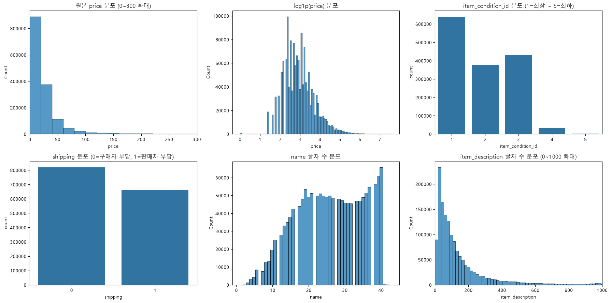

### 2.3 결측치 현황

세 컬럼(`category_name`, `brand_name`, `item_description`)에 결측치가 존재하며, 그 비중은 컬럼마다 크게 다르다. `item_description`과 `category_name`은 각각 0.0004%, 0.43%로 무시할 수 있는 수준이지만, `brand_name`은 전체의 42.68%(632,682건)가 비어 있어 절반에 가까운 상품이 브랜드 정보를 갖고 있지 않다. 이는 무시하고 지나칠 수 있는 규모가 아니므로, 어떻게 다루느냐에 따라 모델 성능에 미치는 영향이 크다.

소현은 결측치를 단순히 제거하거나 채우고 끝내는 대신, "브랜드·카테고리·설명이 동시에 몇 개나 비어 있는가"라는 결측 개수 자체와 가격 사이의 관계를 살펴보았다. 그 결과 결측된 정보가 많을수록(즉 상품 등록 정보가 부실할수록) 평균 판매 가격이 낮게 형성되는 경향이 뚜렷하게 나타났다. 이는 결측 여부 자체가 노이즈가 아니라 가격을 설명하는 하나의 신호가 될 수 있음을 보여주는 근거이며, 이후 전처리 단계에서 결측치를 삭제하지 않고 별도 범주로 유지하는 방향의 근거로 이어진다.

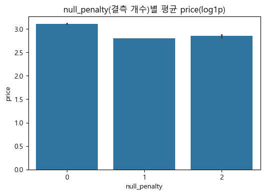

한편 용우와 진희는 서로 다른 각도에서 `brand_name`의 특이점을 짚었다. 용우는 `brand_name`이 비어 있더라도 `item_description` 텍스트 안에 실제 브랜드명이 언급되어 있는 경우가 상당수 있다는 점을 확인했고, 진희는 실제로 다수의 상품에서 `brand_name` 값 자체가 `"AND"`라는 브랜드로 등록되어 있음을 발견했다. `AND`는 영어의 접속사와 형태가 같아 이후 텍스트 정제 단계에서 불용어(stopword)로 함께 제거될 위험이 있는 값으로, 결측치 못지않게 데이터 특유의 주의가 필요한 지점임을 시사한다. 두 관찰 모두 "결측/텍스트가 뒤섞인 브랜드 정보를 어떻게 정리할 것인가"라는 3장의 전처리 설계로 이어진다.

### 2.4 카테고리 계층 구조

`category_name`은 `"Men/Tops/T-shirts"`처럼 `/`로 구분된 대분류/중분류/소분류 3단계 계층 구조를 갖는다. 5명 모두 이를 `cat_dae`(대분류)/`cat_jung`(중분류)/`cat_so`(소분류) 3개 컬럼으로 분리했으며, 고유값 개수는 대분류 11개, 중분류 114개, 소분류 871개로 전원 동일하게 확인했다. 결측치(`category_name`이 NaN인 6,327건)는 3단계 모두 별도 범주로 처리해, 계층 분리 이후에도 정보 손실 없이 다룰 수 있도록 했다.

혜현은 대분류(`cat_dae`)별 거래 건수와 평균 로그 가격을 하나의 이중축 그래프로 겹쳐 그려, 어떤 카테고리가 거래량이 많은지와 어떤 카테고리가 상대적으로 비싼지를 동시에 비교했다. 대분류 사이에 거래 건수와 평균 가격의 순위가 서로 어긋나는 경우가 있어(거래량이 많다고 해서 평균 가격도 높은 것은 아님), 카테고리 피처가 거래량 편향과 가격 편향을 동시에 담고 있음을 확인할 수 있다.

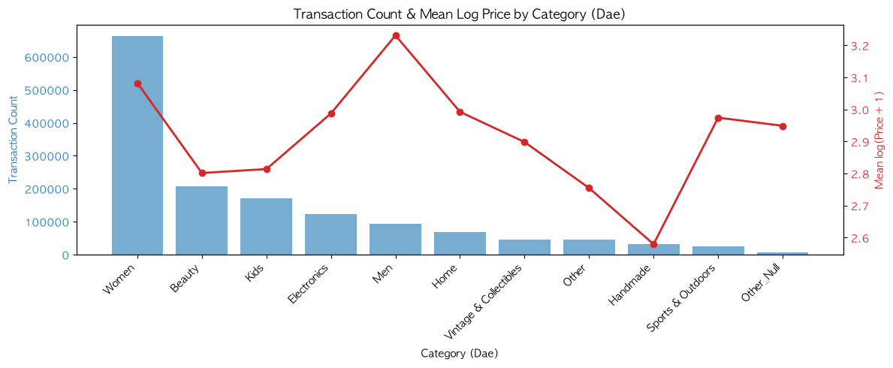

소현은 이를 보완해 대분류별 로그 가격의 분포 자체(중앙값뿐 아니라 사분위 구간과 산포)를 박스플롯으로 함께 확인했다. 평균만으로는 드러나지 않는, 카테고리 내부의 가격 편차(같은 카테고리 안에서도 저가 상품과 고가 상품이 얼마나 넓게 퍼져 있는지)를 함께 살펴야 이후 카테고리 피처의 중요도를 올바르게 해석할 수 있다는 판단에서다.

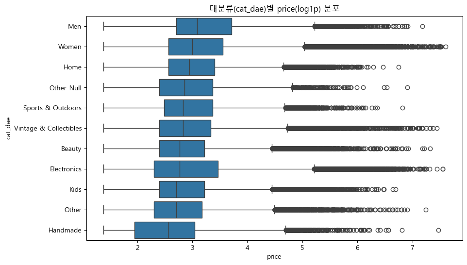

### 2.5 브랜드와 수치형 피처의 관계

브랜드는 결측치를 제외하면 4,808개의 고유 값을 가지며, 상위 브랜드로는 PINK, Nike, Victoria's Secret 등 의류·패션 브랜드가 큰 비중을 차지한다. 유경은 결측치가 아닌 상위 15개 브랜드를 추려 브랜드별 로그 가격 분포를 박스플롯으로 비교했는데, 브랜드마다 상자의 위치(가격 수준)와 높이(가격 편차)가 뚜렷하게 갈렸다. 즉 상자가 높고 짧은 브랜드는 가격이 대체로 높고 균일하게 형성되는 프리미엄 브랜드에 가깝고, 상자가 길게 퍼진 브랜드는 취급 상품군이 다양해 가격대 자체가 넓게 분산되어 있다. 이는 브랜드명이 카테고리 못지않게 가격을 설명하는 유의미한 피처가 될 수 있음을 뒷받침한다.

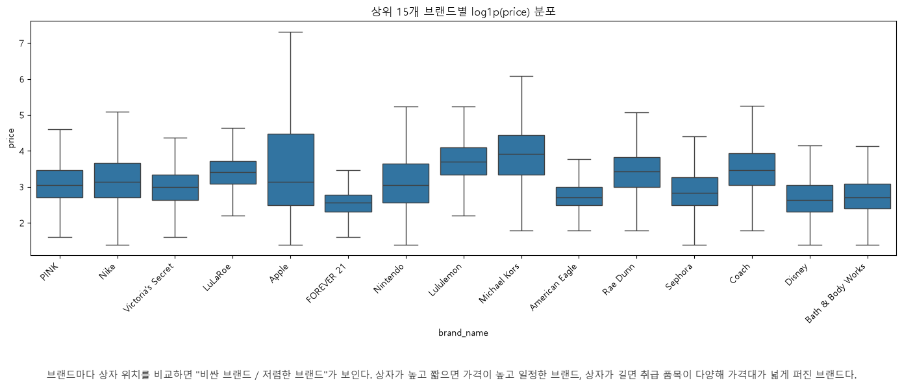

유경은 여기에 더해 `item_condition_id`, `shipping`, `name`/`item_description` 글자 수, 원본·로그 `price`를 모두 포함한 수치형 피처 간 상관관계를 히트맵으로 확인했다. 상품 상태 등급이나 배송비 부담 여부 같은 개별 수치형 피처와 가격 사이의 선형 상관관계는 예상보다 크지 않았는데, 이는 가격을 결정하는 정보 대부분이 카테고리·브랜드·텍스트 같은 범주형·비정형 피처에 담겨 있고, 수치형 피처는 보조적인 신호에 가깝다는 것을 시사한다. 이 관찰은 이후 모델링 단계에서 텍스트·범주형 피처의 벡터화 방식(카운트/희소 인코딩 등)에 공을 들여야 하는 이유와도 맞닿아 있다.

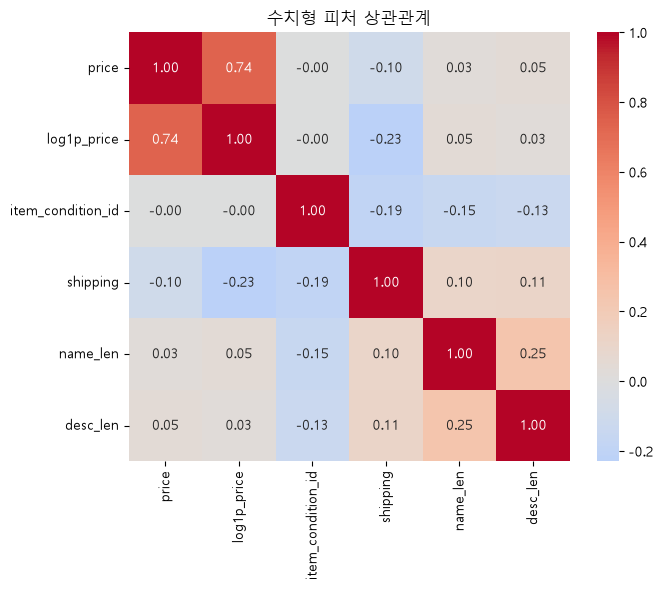

### 2.6 소결

원본 데이터는 148만여 건의 대규모 거래 기록이지만, 실질적으로 모델이 활용할 수 있는 정보는 상품 상태·배송비 같은 몇 개의 수치형 피처, 11~871개 수준의 계층적 카테고리, 4,808개에 달하는 브랜드, 그리고 자유 형식의 상품명·설명 텍스트로 요약된다. 가격은 소수 고가 상품이 꼬리를 이루는 우측 왜도 분포이며 `log1p` 변환이 사실상 모든 팀원의 공통 출발점이었고, `brand_name`의 높은 결측 비율(42.68%)과 카테고리의 계층 구조는 이후 전처리에서 반드시 다뤄야 할 두 축으로 확인되었다. 이 장에서 확인한 분포·결측·계층 구조상의 특징들은 3장(데이터 전처리)에서 각 팀원이 채택한 결측치 처리, 이상치 제거, 텍스트 정제 방식의 직접적인 근거가 된다.

---

## 3. 데이터 전처리

### 3.1 공통 전처리 파이프라인

5명 모두 동일한 원본 데이터(`mercari_train.tsv`, 1,482,535행 8열)에서 출발했고, 세부 구현은 다르지만 다음 절차는 팀 공통 규칙으로 합의되어 전원 동일하게 적용했다.

1. **가격 이상치 제거** — `price == 0`(무료 나눔·오입력으로 판단)과 `price ≥ 2000`(달러, Mercari 실제 등록 상한 정책 기준) 행을 제거했다. 0원 행은 874건, 2000달러 이상 행은 소수(수~수십 건) 수준이었다. 용우만 `price <= 2000`으로 경계값 2000을 포함시켰고, 나머지 4명은 `price < 2000`으로 2000 자체도 제외해 경계 처리에 미세한 차이가 있다.
2. **`train_id` 컬럼 제거 및 중복 행 제거** — `train_id`는 단순 일련번호라 가격 예측에 무의미하므로 제거하고, 완전히 동일한 행을 `drop_duplicates()`로 정리했다. 혜현은 `train_id`를 제외한 7개 컬럼(가격 포함) 조합 기준으로 중복 49건을 먼저 제거한 뒤 이상치를 필터링하는 순서를 택했고, 나머지는 이상치 제거 → 컬럼 삭제 → 중복 제거 순서를 택했다. 순서 차이에도 최종 행 수는 1,481,60x 대로 5명 모두 거의 일치한다(소현 1,481,603 / 용우 1,481,609 / 유경 1,481,603 / 진희 1,481,603 / 혜현 1,481,603).
3. **타깃 로그 변환(`log1p`)** — 2.2에서 확인한 `price`의 우측 왜도와 RMSLE 지표 특성에 따라 전원이 `np.log1p(price)`를 타깃으로 사용했다. 이후 모델은 log 공간에서 학습하고 필요 시 `expm1`로 원가격을 복원하는 방식을 공유한다.
4. **카테고리 3단계 분할** — `category_name`을 `/` 기준으로 대/중/소분류 3개 컬럼으로 나눴다(소현 `cat_dae/jung/so`, 용우 `cat_main/sub/sub2`, 유경 `cat_dae/jung/so`, 혜현 `cat_dae/jung/so`). 대분류 11종, 중분류 114종, 소분류 861~871종으로 팀원 간 거의 동일하게 집계되어 파싱 로직이 사실상 같음을 서로 확인했다. 진희만 이 단계를 생략하고 `category_name`을 `/`를 공백으로 치환한 뒤 상품명·브랜드와 하나의 텍스트로 합쳐 TF-IDF에 직접 흘려보냈다.
5. **결측치 처리** — `brand_name`(약 63만 건, 전체의 42.7%), `category_name`(6,327건), `item_description`(6건)에 결측이 있었다. 소현·유경·혜현은 세 컬럼 모두 `'Other_Null'` 문자열로 채워 "정보 없음" 자체를 하나의 범주/토큰으로 남겼다. 용우는 단순 대체 대신 `item_description` 원문에서 정규식으로 브랜드명을 역매칭해 결측을 실제 브랜드로 복원한 뒤, 그래도 못 채운 값만 `'Unknown'`으로 통일했다(§3.2, §3.3 참고). 진희는 별도 대체 없이 텍스트 결합 시 `fillna('')`만 적용했다.
6. **텍스트 정제(`name`, `item_description`)** — 소문자화 → 영문자/숫자/공백 외 문자 제거(정규식) → `word_tokenize` 토큰화 → 불용어 제거 순으로 처리했다. 이 정제 함수는 팀 공통 템플릿을 공유해 5개 노트북의 구현이 거의 동일하다. 특히 두 가지 규칙이 공통으로 지켜졌다: (a) `no/not/nor/never`(용우·유경·진희·혜현은 `without`까지 5개) 등 부정어는 의미를 뒤집을 수 있어 불용어 목록에서 제외했고, (b) 가격 등 개인정보 마스킹 토큰 `[rm]`이 정제 후 의미 없는 `rm` 잔여 토큰으로 남는 문제를 막기 위해 `rm`을 불용어로 추가했다. 유일한 예외는 소현의 정규식으로, 다른 4명이 `[^a-z0-9\s]`(숫자 보존)을 쓴 것과 달리 소현은 `[^a-z\s]`(숫자까지 제거)를 사용했다 — 이 차이의 실제 영향은 §3.3에서 다룬다.
7. **Train/Test 분리 후 fit** — 벡터라이저·인코더는 train에만 `fit`하고 test에는 `transform`만 적용해 정보 누수를 막는 원칙을 5명 모두 지켰다(용우·유경·진희·혜현은 최초 분할 이후 곧바로 이를 적용했고, 소현은 초반 버전(§9~16)에서는 전체 데이터에 벡터라이저를 먼저 fit한 뒤 뒤늦게 `train_test_split`을 수행했으나, 최종 채택 버전(§19~22, 2-stage 검증)에서는 train/valid/test 3-way 분리 후 fold별로 다시 fit하도록 개선했다).

### 3.2 팀원별 차이 — 피처 표현 방식 비교

같은 원본 컬럼을 서로 다른 벡터화·인코딩 전략으로 표현했다. 핵심 차이를 정리하면 다음과 같다.

| 항목 | 소현 | 용우 | 유경 | 진희 | 혜현 |
|---|---|---|---|---|---|
| `name` 벡터화 | CountVectorizer(max 20,000) / v2: ngram(1,2) | TfidfVectorizer(max 30,000, ngram 1-2) | CountVectorizer(max 30,000, ngram 1-3) | — (product_text에 통합) | CountVectorizer(제한 없음 → 93,451차원) |
| `item_description` 벡터화 | TfidfVectorizer(max 30,000, 커스텀 토큰 analyzer) / v2: 유니그램+바이그램 직접 생성 | TfidfVectorizer(max 50,000, ngram 1-2) | TfidfVectorizer(max 50,000, ngram 1-3) | TfidfVectorizer(max 200,000, ngram 1-2, product_text와 별도) | TfidfVectorizer(max 50,000, ngram 1-2) |
| 카테고리 인코딩 | OneHotEncoder(핸들unknown=ignore) / v2: LabelEncoder+LGBM native categorical | OneHotEncoder(핸들unknown=ignore) | LabelBinarizer(sparse) | 미분할, TF-IDF 텍스트에 흡수 | LabelBinarizer(sparse) |
| 브랜드 결측 처리 | `'Other_Null'` 상수 대체 | description 정규식 역매칭 후 잔여만 `'Unknown'` | `'Other_Null'` 상수 대체 | `fillna('')`로 텍스트 결합 | `'Other_Null'` 상수 대체 |
| 파생(엔지니어링) 피처 | `null_penalty`(결측 개수), 이름/설명 길이, `has_brand`, `brand_te`/`cat_so_te`(타깃 인코딩, fold 내 계산) | 없음(6개 원본 피처 + 텍스트/카테고리 벡터만 사용) | 없음 | `product_text_len/word_count`, `description_len/word_count`(4개 길이 피처, StandardScaler) | 없음 |
| 수치형 스케일링 | 신규 피처만 StandardScaler(§17 이후) | `item_condition_id`만 StandardScaler | 원본 그대로 사용(스케일링 없음) | 길이 피처 4개 StandardScaler | 원본 그대로 사용(스케일링 없음) |

이처럼 범주형 인코딩은 OneHotEncoder(소현·용우)와 LabelBinarizer(유경·혜현)로 갈렸고, 텍스트는 CountVectorizer와 TfidfVectorizer를 컬럼별로 다르게 조합했다. 대체로 "`name`(짧은 텍스트)은 등장 빈도가 중요하니 CountVectorizer, `item_description`(긴 텍스트)은 문서 길이 편차가 크니 TF-IDF"라는 논리를 공유하지만, 용우·혜현은 `name`에도 TF-IDF/무제한 CountVectorizer를 적용해 접근이 갈렸다. 진희는 유일하게 `name`/`brand_name`/`category_name`을 하나의 `product_text`로 병합해 카테고리 인코딩 자체를 생략한 것이 가장 큰 구조적 차이다.

### 3.3 전처리 전/후 비교 근거

**(1) 브랜드 결측치 처리 효과 — 용우.** 원본 `brand_name`은 1,481,609건 중 632,295건(약 42.7%)이 결측이었다. 용우는 train에서 학습한 브랜드 사전으로 `item_description` 원문을 정규식 역매칭해 결측 중 상당수를 실제 브랜드명으로 복원했고, 그래도 못 찾은 값만 `'Unknown'`으로 남겼다. 그 결과 "값이 있는" 행 비율이 약 57%(850K)에서 약 84%(124만)로 늘었고, 남은 `Unknown`은 약 25만 건으로 줄었다.

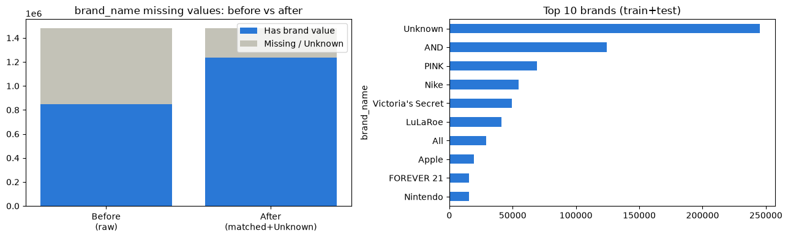

**(2) 최종 피처 구성 — 용우.** 결측 처리·벡터화·인코딩을 모두 마친 뒤 최종 피처 행렬은 `description TF-IDF`(50,000) > `name TF-IDF`(30,000) > `brand/category one-hot`(5,527) > `shipping`/`item_condition_id`(각 1) 순으로 구성되며, 총 85,529차원 중 텍스트 피처가 93% 이상을 차지한다. 이는 다른 팀원의 결과에서도 공통적으로 관찰되는 패턴으로(예: 소현 55,807차원 중 텍스트 5만 차원, 혜현 148,976차원 중 텍스트 14만 차원), 이 문제가 소수의 정형 변수보다 비정형 텍스트에서 대부분의 가격 신호를 얻는 구조임을 보여준다.

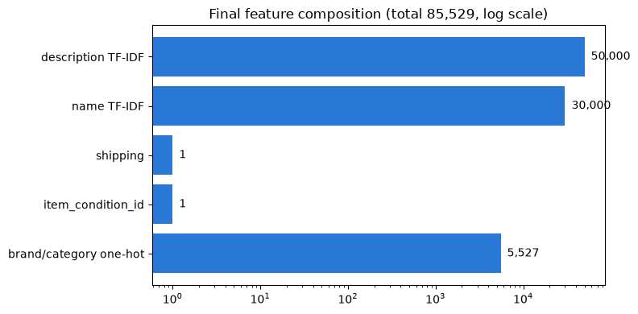

**(3) 텍스트 정제 결과 — 유경·혜현.** 정제 파이프라인(소문자화·특수문자 제거·불용어 제거)을 거친 뒤 `name`/`item_description`에서 실제로 가장 많이 등장한 토큰을 확인하면, `new`, `size`, `no description yet`, `brand new`, `used`, `free` 등 상품 상태·거래 조건을 나타내는 단어가 상위에 오른다. 특히 `no description yet`, `description yet` 같은 구는 원래 결측/기본 문구였던 `item_description`이 정제 후에도 하나의 고빈도 신호로 남아 있음을 보여주며, 이는 §3.1에서 부정어(`no`)를 불용어에서 제외한 설계가 실제로 의미를 보존했음을 뒷받침한다.

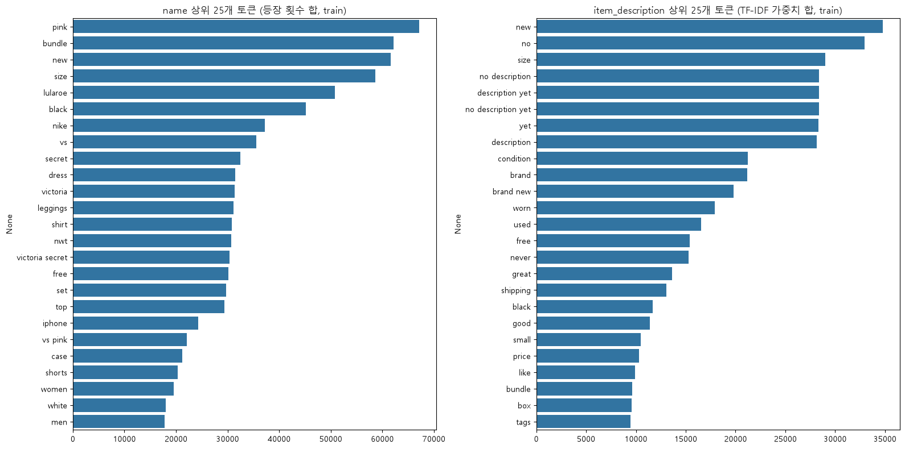

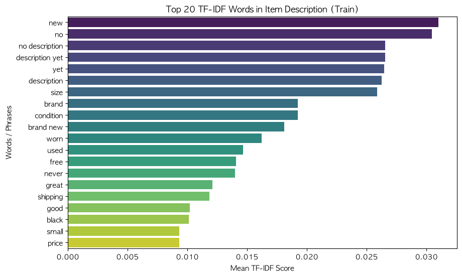

**(4) 정규식(숫자 보존 여부) 선택의 모델 성능 영향 — 유경·용우 교차 검증.** §3.1에서 언급한 대로 소현만 숫자를 제거하는 정규식(`[^a-z\s]`)을 썼고 나머지 4명은 숫자를 보존했다(`[^a-z0-9\s]`). 유경과 용우는 이 선택이 실제 성능에 미치는 영향을 각자 독립적으로 Ridge A/B 테스트로 정량 검증했다.

| 검증자 | 조건 | Ridge RMSLE | 비고 |
|---|---|---|---|
| 유경(17만 표본) | 숫자 보존 `[^a-z0-9\s]` | 0.48463 | 어휘 5,550개 보존 |
| 유경(17만 표본) | 숫자 제거 `[^a-z\s]` | 0.48787 | 사이즈·용량 등 5,550개 토큰 소실/뭉개짐 |
| 용우(전체 데이터) | 숫자 보존 | 0.45597 | |
| 용우(전체 데이터) | 숫자 제거 | 0.45892 | |

두 사람 모두 독립적으로 "숫자 보존이 근소하게(RMSLE 기준 0.3~0.7%) 더 유리하다"는 동일한 결론에 도달했다. 이는 "4gb", "32gb", "사이즈 1X/3X"처럼 숫자가 실제로 가격에 영향을 주는 정보를 담고 있다는 가설을 뒷받침하는 근거이며, 소현의 노트북만 이 검증 이전의 규칙(숫자 제거)을 그대로 쓰고 있어 팀 내에서 유일하게 다른 선택으로 남아 있다.

**(5) 카테고리 파싱 방식 비교 — 유경.** `category_name`은 일부 값에서 소분류 자체에 `/`가 포함돼 4~5조각으로 쪼개진다(예: `Electronics/Computers & Tablets/iPad/Tablet/eBook Readers`). 유경은 `split('/')`(앞 3조각만 사용)과 `split('/', maxsplit=2)`(뒷부분까지 소분류에 보존)를 비교했고, 두 방식의 결과가 달라지는 행은 4,385건으로 전체 1,481,612행의 0.30%에 불과했다. 손실되는 하위 카테고리 간 평균 가격 차이도 표준편차 대비 미미해(예: eBook Readers $75.8 vs eBook Access $69.7), 최종적으로 더 단순한 `split('/')`를 채택했다.

### 3.4 전처리 유형 분류 — "고정 적용" vs "여러 방법 시도·비교"

report.md의 지침에 따라 5개 노트북을 두 유형으로 구분하면 다음과 같다.

| 유형 | 팀원 | 채택한 최종 전처리 방법 요약 |
|---|---|---|
| **동일 전처리 고정 적용** | 용우 | 이상치 제거 → 카테고리 3분할 → description 역매칭 기반 브랜드 결측 복원 → 숫자 보존 텍스트 정제 → TF-IDF(ngram 1-2)/OneHot 파이프라인을 `pickle`로 저장해 Ridge·LightGBM에 동일하게 적용. 정제 규칙(숫자 보존)만 사전에 A/B로 검증하고 이후에는 단일 파이프라인을 고정 사용. |
| | 진희 | `name`+`brand_name`+`category_name`을 `product_text`로 결합 후 TF-IDF(ngram 1-2)만 적용하는 단일 파이프라인을 고정하고, Ridge의 alpha만 바꿔가며 실험(카테고리 별도 분할·브랜드 결측 대체는 시도하지 않음). |
| | 혜현 | 이상치 제거 → 카테고리 3분할 → `Other_Null` 결측 대체 → 숫자 보존 텍스트 정제 → CountVec/TfidfVec+LabelBinarizer 파이프라인을 고정하여 Ridge(설명 포함/제외 비교), LightGBM(3차 재튜닝), 앙상블에 모두 동일하게 재사용. |
| **여러 전처리 방법 시도·비교** | 소현 | ① OneHotEncoder+CountVec/TfidfVec 유니그램 조합과 ② LabelEncoder+LGBM 네이티브 categorical+n-gram 조합을 직접 비교(RMSLE 0.49220 → 0.47363)한 뒤, 여기에 길이 피처·타깃 인코딩 등 신규 피처를 추가한 ③ 조합을 최종 채택. Ridge alpha도 11개 값을 그리드 탐색. |
| | 유경 | `category_name` 파싱 방식(`split()` vs `split(maxsplit=2)`)을 직접 비교해 영향이 미미함(0.30%)을 확인하고 단순한 방식을 채택했고, 텍스트 정제 시 숫자 보존 여부도 A/B 비교(0.48463 vs 0.48787)해 숫자 보존 방식을 채택. |

용우·혜현도 텍스트 정제 규칙(숫자 보존 여부)이나 피처 포함 여부(설명글 포함/제외)를 실험했지만, 이는 "하나의 최종 파이프라인을 정하기 위한 사전 검증/피처 단위 ablation"의 성격이 강해 이후 전체 파이프라인 자체는 고정해 재사용했다는 점에서 소현·유경의 "여러 전처리 기법을 순차적으로 실험·비교"하는 유형과는 구분했다.

---

## 4. 모델링

### 4.1 팀원별 사용 모델 및 튜닝 전략

3장에서 정리한 각자의 최종 전처리 파이프라인과 피처 표현 위에서, 5명 모두 회귀 타깃(`log1p(price)`)에 대해 최소 Ridge 회귀를 베이스라인으로 채택했고, 이후 LightGBM·Lasso·FM_FTRL 등으로 확장했다. 평가지표는 전원 RMSLE(= log 공간에서의 RMSE)를 사용했다.

| 팀원 | 사용 모델 | 하이퍼파라미터 튜닝 방식 |
|---|---|---|
| 소현 | Ridge, LightGBM(2가지 피처 조합), FM_FTRL(FTRL-proximal + FM 상호작용항을 numpy/scipy로 직접 구현) | Ridge alpha 11개 로그 그리드(0.01~1000) 및 2단계 그리드(1/3/10); LightGBM은 `n_estimators` 상한을 1200(early stopping 100라운드)→2000(체크포인트 이어학습)으로 확장; FM_FTRL은 최대 60epoch, patience=8 조기 종료; 세 모델의 예측을 0.05 단위 그리드서치로 블렌딩 |
| 용우 | Ridge, LightGBM | Ridge alpha 1~5 그리드(5개 값); LightGBM은 `lgb.train` + `early_stopping`(30/50라운드), `FAST_LGBM_CHECK` 스위치로 150라운드(빠른 검증)와 2000라운드(전체 학습)를 전환 |
| 유경 | Ridge, Lasso, LightGBM | Ridge alpha 1~5 그리드; Lasso는 alpha=0.001 단일값으로 학습 후 과소적합 원인을 별도로 진단; LightGBM은 `n_estimators=200` 기본값으로 1회 학습 |
| 진희 | Ridge | alpha 0.1/0.5/1.0/2.0/3.0/5.0의 6개 값을 그리드 탐색(최종 채택본은 alpha=1.0 기준 결과를 보고) |
| 혜현 | Ridge, LightGBM, Ridge+LightGBM 가중 앙상블 | Ridge alpha 0.1~5(6개 값) × 설명글 포함/제외 비교(총 12개 조합); LightGBM은 `n_estimators`·`learning_rate`·`num_leaves`·`min_child_samples`·`colsample_bytree`·정규화항을 3단계에 걸쳐 수동 재조정(200→1000→3000→4000라운드, `early_stopping` 30→50→60라운드)하며 반복 개선; 앙상블 가중치는 0.45(Ridge):0.55(LightGBM)로 수동 설정 |

### 4.2 모델별 성능 비교

**Ridge.** 모든 팀원이 alpha를 바꿔가며 최적값을 탐색했다. 최적 alpha는 팀마다 1~5 범위에서 갈렸는데(소현 3, 용우 3, 유경 5, 진희 1, 혜현 3~4), 이는 사용한 피처 개수·벡터화 방식(특히 `max_features`, ngram 범위)이 서로 달라 정규화에 필요한 강도도 함께 달라졌기 때문으로 해석된다.

| 팀원 | 최적 alpha | 해당 alpha의 RMSLE | 비교 alpha 구간에서의 RMSLE 변화 |
|---|---|---|---|
| 소현 | 3 | 0.47067 | alpha 0.01→1000 구간에서 0.47256(0.01) → 0.47067(3, 최저) → 0.52934(1000)로 U자형 |
| 용우 | 3 | 0.45447 | 1(0.45597) → 3(0.45447, 최저) → 5(0.45468) |
| 유경 | 5 | 0.4560 | 1(0.4576) → 5(0.4560, 5개 중 최저, 완만한 개선) |
| 진희 | 1(채택 기준) | 0.4331 | 0.1~5.0 그리드를 실행했으나 그리드 셀 출력이 보존되지 않아 alpha=1.0 결과만 확인 가능(노트북 파일명 자체가 이 값을 반영해 `ridgefixfeature(0.4331)`로 명명됨) |
| 혜현 | 3~4 | 0.4593(설명 포함) | 0.1(0.4685) → 3(0.4593) → 4(0.4591, 근소 최저) → 5(0.4591) |

**LightGBM.** 라운드 수·정규화 강도에 따라 팀 간 편차가 크게 나타났다. 소현·혜현처럼 early stopping과 라운드 수를 여러 단계로 늘려간 경우 RMSLE가 뚜렷하게 개선된 반면, 용우처럼 빠른 검증 모드(150라운드)로 실행한 경우 오히려 Ridge보다 낮은 성능을 보였다.

| 팀원 | 설정 | RMSLE | 비고 |
|---|---|---|---|
| 소현 | OneHot+유니그램(v1), 200라운드 | 0.49220 | Ridge(0.47067)보다 낮은 성능 |
| 소현 | LabelEncoder native categorical + n-gram(v2), 200라운드 | 0.47363 | 피처 표현 방식만 바꿔 Ridge 근접 |
| 소현 | 신규 피처 추가 + 튜닝, 1200라운드(early stop) | 0.42881 | |
| 소현 | 동일 설정, 2000라운드(체크포인트 이어학습) | 0.42388 | 1200라운드 대비 추가 개선 |
| 용우 | 150라운드(FAST_LGBM_CHECK=True, early stop 미도달) | 0.52045 | Ridge(0.45597)보다 14.1% 낮은 성능 — 라운드 부족이 원인으로 추정 |
| 용우 | (참고) 과거 2000라운드 전체 실행 기록 | valid RMSE 0.45122까지 하락 | Ridge baseline(0.45892)보다 근소 우위, 학습곡선 이미지로 별도 보존 |
| 유경 | 200라운드 기본값 | 0.5104 | Ridge(0.4560)·LGBM 모두 대비 성능 낮음(튜닝 미실시) |
| 혜현 | 200라운드 기본값 | 0.4507 | |
| 혜현 | 1차 튜닝, 1000라운드, early stop 30 | 0.4422 | |
| 혜현 | 2차 튜닝, 최대 3000라운드, lr 0.05, leaves 127 | 진행 로그상 2300라운드 시점 valid RMSE 0.4381 | 로그 마지막 구간까지 개선 지속 중 |
| 혜현 | 3차 튜닝, 최대 4000라운드, lr 0.03, leaves 255 + 정규화(reg_alpha/lambda) | 최종 0.42909 | 4명의 LGBM 단일 모델 중 최저 RMSLE 기록 |

**Lasso(유경).** alpha=0.001로 학습한 결과 RMSLE 0.6082로 Ridge(0.456x)·LightGBM(0.5104)보다 크게 낮은 성능을 보였다. 유경은 이를 수렴 실패가 아니라 "L1 정규화가 83,486개 피처 중 152개(0.2%)만 남기고 나머지를 0으로 만드는 과소적합"으로 진단했다 — 이 문제의 가격 신호가 소수의 강한 피처가 아니라 수만 개의 단어·브랜드·카테고리 더미에 얇게 분산돼 있어, 계수를 축소만 하는 L2(Ridge)가 구조적으로 더 적합하다는 결론이다.

**FM_FTRL(소현).** Kaggle 공개 커널에서 쓰인 FM_FTRL을 `wordbatch` 패키지 설치가 불가능한 환경 제약으로 직접 구현했다. 60epoch 학습 시 RMSLE가 0.58017(1epoch)에서 0.44945(50epoch)까지 꾸준히 감소했고, valid 기준 최적 epoch을 patience=8로 조기 종료해 결정한 뒤, test에서는 재모니터링 없이 그 epoch 수만큼만 고정 재학습해(0.44584) leakage를 방지했다.

**앙상블/블렌드.** 소현과 혜현 두 팀원이 여러 모델을 결합했다. 소현은 Ridge+LightGBM+FM_FTRL 3모델을 valid set에서 0.05 단위로 그리드서치한 가중치(ridge=0.0, lgbm=0.65, fm=0.35)로 블렌딩해 test RMSLE 0.42114(LGBM 1200라운드 기준)를 얻었고, LGBM을 2000라운드로 확장한 뒤 동일 가중치를 재사용해 최종 0.41778까지 개선했다(11번 섹션 LGBM 최초 baseline 대비 약 14.4% 개선). 혜현은 Ridge(0.4593)와 LightGBM(0.4507, 1차 튜닝 이전 기준)을 0.45:0.55로 수동 가중 평균해 RMSLE 0.44006을 기록했다.

### 4.3 시각화 근거

**LightGBM 학습 곡선(용우).** 과거 2000라운드 전체 실행 기록을 보면 train/valid RMSE가 완만하게 계속 하락하며 약 1300라운드 부근에서 Ridge baseline(0.45892)과 교차한다. 이는 LightGBM이 라운드 수가 충분히 확보돼야 선형 모델을 능가할 수 있음을 보여주는 근거이며, 같은 팀원의 본 실행(FAST_LGBM_CHECK=True, 150라운드)이 Ridge보다 낮은 성능(0.52045)을 보인 이유를 설명해 준다.

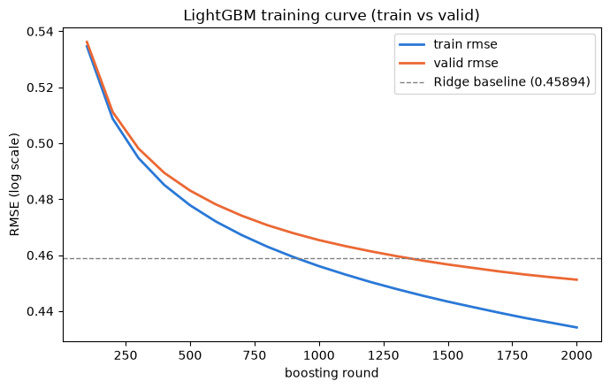

**LightGBM 피처 중요도(용우).** gain 기준 상위 피처는 `shipping`, `name__lularoe`(브랜드 토큰), `cat_sub_Shoes`, `desc__authentic`/`desc__box`(설명 토큰), `item_condition_id` 순으로, 정형 변수(배송비·상품상태)와 텍스트 파생 피처가 함께 상위권을 차지한다.

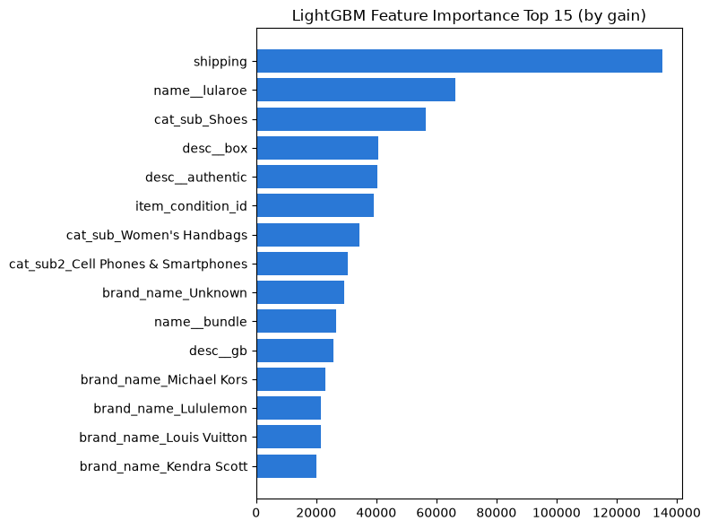

**Ridge 회귀계수(유경).** alpha=5.0 기준으로 가격을 가장 크게 올리는 피처는 `limbs`, `David Yurman`, `carat`, `tyme`, `14k`처럼 고가 주얼리·브랜드·저장용량 관련 토큰이며, 가격을 가장 크게 낮추는 피처는 `envelope`, `controller skin`, `brass metal`, `dust bag`처럼 저가 액세서리·소모품 관련 토큰이다. 이는 Ridge가 학습한 가중치가 실제 상품 카테고리의 가격 통념과 부합함을 보여준다.

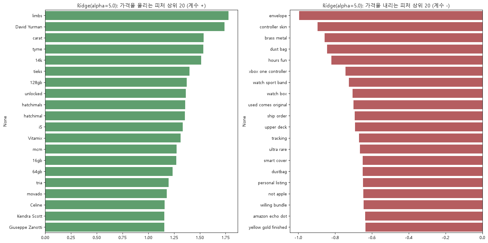

**LightGBM 피처 중요도(유경).** `item_condition_id`, `bundle`(묶음판매 토큰), `Cell Phones & Smartphones`, `Other_Null`(브랜드 결측), `lularoe` 순으로 중요도가 높게 나타나 용우의 결과와 상당 부분 겹친다 — 서로 다른 벡터화·인코딩을 썼음에도 `shipping`/`item_condition_id` 같은 정형 변수와 특정 고빈도 브랜드·카테고리가 공통적으로 중요 피처로 확인된다는 점은 두 팀원의 결과가 교차 검증된 것으로 볼 수 있다.

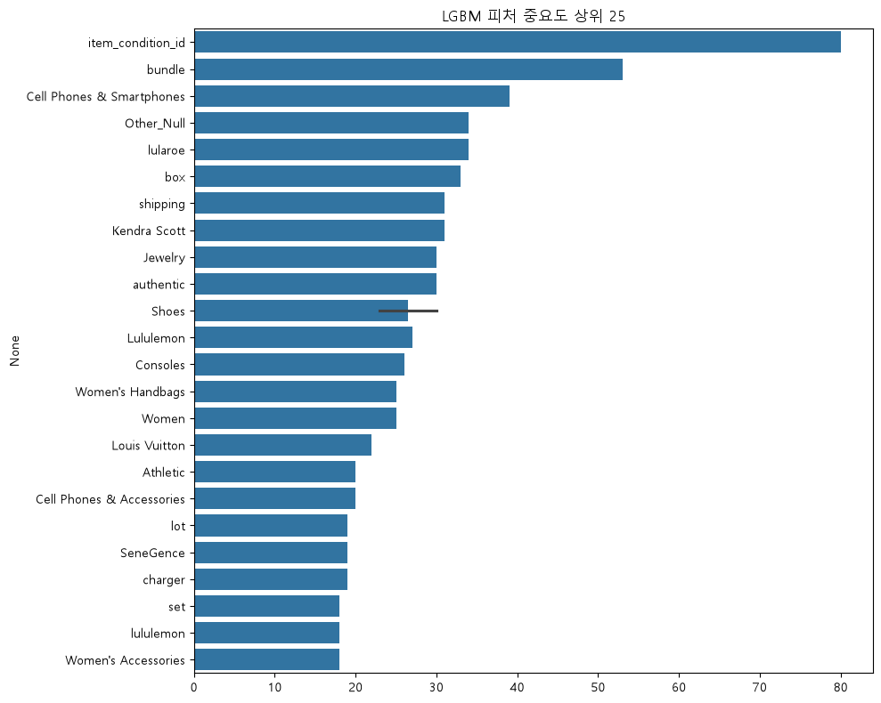

### 4.4 종합

정리하면 Ridge는 5명 모두에게서 안정적인 베이스라인(RMSLE 0.43~0.47)으로 확인되었고, LightGBM은 라운드 수와 정규화 튜닝의 충실도에 따라 Ridge를 능가하기도(소현 0.423, 혜현 0.429), 못 미치기도(용우 0.520, 유경 0.510) 했다. Lasso는 유경의 실험에서 뚜렷한 과소적합을 보였고, 소현·혜현은 서로 다른 모델을 블렌딩해 단일 모델보다 더 나은 결과를 얻었다. 이 결과들이 갖는 의미와 팀 전체에 공통되는 시사점은 6장 결론에서 종합해 다룬다.

---

## 5. 결과

### 5.1 팀원별 최종 성능 한눈에 비교

다섯 명 모두 동일한 문제(로그 변환된 `price`를 RMSLE로 평가)를 풀었지만, 전처리·피처 구성·모델 선택 조합을 각자 다르게 가져갔고 그 결과 최종 RMSLE에도 뚜렷한 차이가 났다. 아래 표는 각자가 도달한 최종(채택) 모델을 기준으로 정리한 것이다.

| 담당자 | 최종 채택 모델/구성 | 최종 RMSLE | 핵심 특징 |
|---|---|---|---|
| **소현** | Ridge + LightGBM(2000라운드 튜닝) + FM_FTRL(60epoch) 가중 블렌드 (ridge 0 / lgbm 0.65 / fm 0.35), leakage-free 2-stage 검증 | **0.41778** | 최초 LGBM baseline(0.49220) 대비 약 15.1% 개선. hstack 구성 실험 → Ridge/LGBM 비교 → alpha 튜닝 → vocab 실험 → 새 피처 → FM_FTRL 직접 구현 → 2단계 블렌딩까지 가장 깊은 파이프라인 |
| **혜현** | LightGBM 단일 모델 (3차 정밀 튜닝: lr=0.03, num_leaves=255, reg_alpha/lambda 적용) | **0.4291** | Ridge+LGBM 앙상블(0.4401)보다도 단일 튜닝 모델이 더 우수 |
| **진희** | Ridge(alpha=1.0) + product_text/item_description 통합 피처 + 길이·단어수 피처 + StandardScaler | **0.43313** (≈0.4331) | TF-IDF `max_features`를 100k→150k→200k로 늘려가며 비교, name/brand/category를 하나의 `product_text`로 통합 |
| **유경** | Ridge(alpha=5) | **0.4560** | 같은 피처로 Lasso(0.6082, 과소적합)·LGBM(튜닝 전, 0.5104)과 비교해 Ridge가 가장 우수함을 확인 |
| **용우** | Ridge(alpha=3, 숫자 보존 텍스트 클렌징) | **0.45447** (≈0.4545) | LightGBM은 빠른 검증 모드(150라운드)만 실행해 0.52045로 Ridge에 못 미침(전체 라운드 미실행) |

다섯 모델 모두 동일한 Mercari 데이터셋·동일한 RMSLE 지표를 사용했지만 정확한 train/test 분할 방식, 피처 캡(vocab 크기), 텍스트 정제 규칙이 서로 달라 절대 수치를 1:1로 비교하기보다는 "같은 문제에 대한 서로 다른 접근이 어떤 개선 방향으로 이어졌는가"를 보는 것이 이 표의 핵심 의도다. 이어지는 절에서는 소현의 파이프라인을 중심 스토리로 삼아 성능 개선 과정을 상세히 서술하고, 이어서 나머지 팀원들의 접근을 정리한다.

### 5.2 소현 — 3갈래 전략 실험에서 leakage-free 2-stage 블렌딩까지

소현의 노트북은 하나의 전처리 파이프라인(가격 이상치 제거 → 로그 변환 → 카테고리 3단계 분할 → 결측치를 `Other_Null`로 명시적 카테고리화 → 텍스트 클렌징) 위에서, 이후 모델링 단계를 세 갈래 전략으로 나누어 순차적으로 실험한 것이 특징이다.

**전략 ① hstack 구성 방식 바꿔보기.** 동일한 벡터화 결과물(name/description/category/수치형)을 어떻게 조합·인코딩하느냐에 따라 결과가 얼마나 달라지는지 실험했다. 우선순위 피처로 먼저 학습하고 잔차를 나머지 피처로 보정하는 "단계적(잔차) LGBM"(B안)은 오히려 원본보다 성능이 나빠졌다(RMSLE 0.49735). 반면 범주형을 원-핫 대신 LGBM 네이티브 `categorical_feature`로, 텍스트를 유니그램 대신 n-gram(1,2)으로 바꾼 버전은 LightGBM RMSLE를 0.49220 → 0.47363으로 약 3.8% 끌어올렸다. 즉 "사람이 우선순위를 강제하는 방식"은 실패했고 "모델 구조에 맞는 인코딩으로 바꾸는 방식"이 유효했다.

**전략 ② Ridge vs LightGBM 베이스라인 비교.** 같은 hstack 피처(`X_features`, 약 5.6만 차원)에 대해 Ridge(alpha=3)는 RMSLE 0.47067, LightGBM(튜닝 전)은 0.49220으로 Ridge가 확실히 우수했다. 고차원 희소 텍스트 벡터가 신호의 핵심인 이 데이터 구조에서는 선형 모델이 트리 모델보다 유리하다는 것을 보여준 결과다.

**전략 ③ Ridge alpha 튜닝.** `[0.01, 1000]` 범위로 그리드서치한 결과 alpha=3이 이미 최적값이었다(RMSLE 0.47067, 변화 없음). 아래는 이 alpha 스윕 결과를 시각화한 것이다.

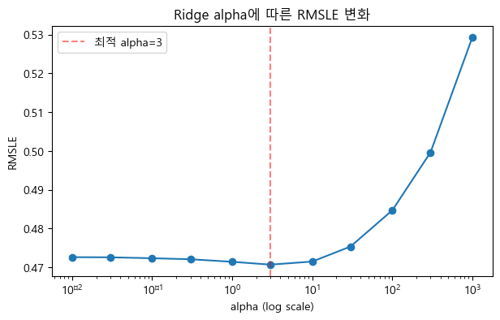

*Ridge의 정규화 강도(alpha)를 바꿔가며 RMSLE를 측정한 결과, alpha가 너무 작으면 과소 규제로, 너무 크면(alpha=1000일 때 0.52934) 과도 규제로 텍스트 피처 계수가 눌려 성능이 나빠지는 명확한 U자형 곡선이 나타났다.*

세 전략을 통해 얻은 이 시점의 최고 성능은 Ridge(0.47067)였지만, 여기서 멈추지 않고 이후 심화 실험을 이어갔다.

**vocab 크기 민감도 실험.** `max_features` 캡(name 20k/desc 30k)을 없애고 실제 어휘 크기(최대 약 200만 차원)까지 확장해봤지만 RMSLE는 거의 변화가 없었다(0.47320 → 0.47293, 노이즈 수준). 캡을 더 키우는 것은 무의미하다는 결론을 실측으로 확인했다.

**새 피처 엔지니어링.** 상품명/설명 길이 피처, 브랜드 존재 여부, 그리고 브랜드·소분류별 평균 로그 가격을 학습 데이터에서만 통계 내는 target encoding(스무딩 k=10 적용, leakage 방지)을 추가했다. LGBM은 이 새 피처로 0.47320 → 0.47022로, Ridge보다 약 3배 큰 개선을 얻었다. 비선형 트리 모델이 target encoding이 만드는 신호를 더 잘 활용한 것으로 해석된다.

**FM_FTRL 직접 구현.** Kaggle 상위 공개 커널이 사용한 `wordbatch`(FTRL+FM_FTRL+LightGBM 블렌드)는 이 환경(Python 3.13, C 컴파일러 없음)에서 설치가 불가능해, 같은 알고리즘(FTRL-proximal 선형항 + FM 2차 상호작용항)을 numpy/scipy로 직접 구현했다. 미니배치 단위 sparse 행렬곱으로 벡터화해 148만 행 규모에서도 epoch당 수 초 수준으로 학습이 가능했다.

**2-stage leakage-free 검증 및 블렌딩.** 최종적으로는 test set을 마지막에 딱 한 번만 사용하는 2단계 구조(Stage 1: train으로 학습 → valid로 하이퍼파라미터·블렌드 가중치 결정, Stage 2: train+valid 전체로 재학습 → test로 단 한 번 평가)를 세웠다. 각 모델은 자신에게 유리한 피처 표현을 그대로 사용했다(Ridge/FM_FTRL은 원-핫+유니그램, LGBM은 라벨인코딩+n-gram). 튜닝된 LGBM(1200라운드) RMSLE는 0.42881까지 내려갔고, valid에서 찾은 최적 블렌드 가중치(ridge=0, lgbm=0.65, fm=0.35)를 적용하자 RMSLE 0.42114를 기록했다. 흥미로운 점은 최적 블렌드에서 Ridge 가중치가 0으로 수렴했다는 것 — 초반 시점에는 Ridge가 LGBM보다 우수했지만, LGBM을 제대로 튜닝한 뒤로는 역전되어 더 이상 블렌드에 기여하지 않았다.

**최종 확장.** LGBM이 1200라운드 상한에서 "조기 종료 조건을 만족하지 못하고" 끝난 점을 확인하고, 이미 학습된 부스터를 이어 학습(체크포인트 방식)해 2000라운드까지 확장했다. 그 결과 LGBM 단독 RMSLE는 0.42388, 기존 블렌드 가중치를 그대로 재사용한 최종 블렌드는 **RMSLE 0.41778**을 기록했다. 처음 시도한 LGBM baseline(0.49220)에서 여기까지, 약 15.1%의 개선이다.

### 5.3 용우 — 텍스트 정제 규칙과 alpha 튜닝 중심의 Ridge 파이프라인

용우는 name/description을 TF-IDF(ngram 1~2)로, 범주형(브랜드/카테고리)을 원-핫 인코딩으로 처리해 총 85,529차원의 피처를 구성했다. 눈에 띄는 실험은 텍스트 클렌징 정규식에서 숫자를 지울지 보존할지를 실제로 A/B 테스트했다는 점이다.

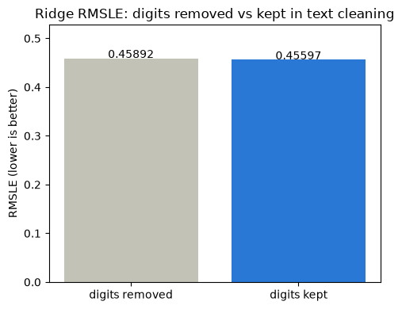

*"4gb", "32gb"처럼 사이즈·용량 정보를 담은 숫자를 정규식에서 지우지 않고 보존한 버전이 RMSLE를 0.45892 → 0.45597로 0.00295 개선했다. iPhone 14 pro 256gb 같은 표현에서 숫자가 가격 신호로 작동한다는 것을 실측으로 확인한 사례다.*

이후 alpha를 1~5로 스윕해 alpha=3에서 최적점(RMSLE 0.45447)을 찾았다.

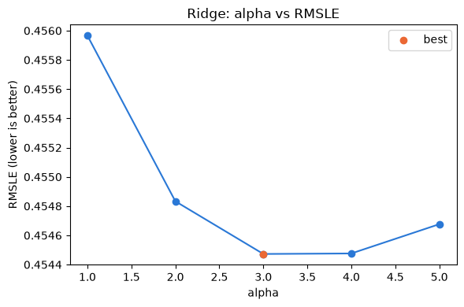

LightGBM도 시도했지만, 노트북 안에 "전체 실행(Run All)을 할 때마다 97분씩 기다리지 않기 위한" 빠른 검증 스위치가 있어 150라운드로 제한한 결과 RMSLE 0.52045로 Ridge보다 낮은 성능에 그쳤다(노트북 내 하드코딩된 2000라운드 풀 학습 로그 참고 시 최종적으로는 0.45122까지 접근 가능했을 것으로 추정되나 실행 시간 제약으로 실제 실행되지는 않았다).

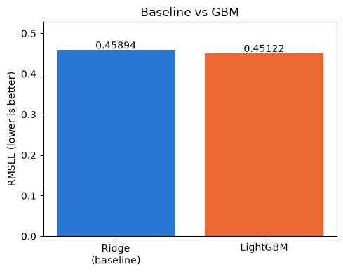

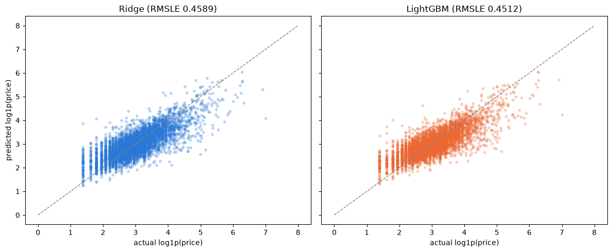

*Ridge와 LightGBM(빠른 검증 버전)의 예측-실제 산점도 비교. 두 모델 모두 대각선 주변에 몰려있지만 Ridge 쪽이 더 조밀하다.*

### 5.4 유경 — Ridge/Lasso/LGBM 3파전 비교와 오차 진단

유경은 브랜드/카테고리를 `LabelBinarizer`로, name/description을 각각 CountVectorizer/TfidfVectorizer(ngram 1~3)로 처리해 총 85,521차원 피처를 구성한 뒤, Ridge(alpha 5종)·Lasso·LGBM을 같은 조건에서 나란히 비교했다.

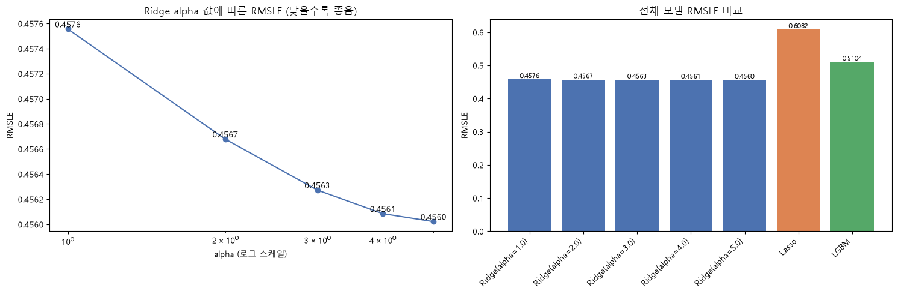

*Ridge는 alpha=5.0에서 RMSLE 0.4560으로 최저를 기록했다. 반면 Lasso(0.6082)는 Ridge는 물론 LGBM(0.5104)보다도 크게 뒤처졌다.*

Lasso가 유독 나쁜 이유를 별도로 진단한 부분이 눈에 띈다. 표본 25만 행으로 재현한 결과 Lasso는 83,486개 피처 중 단 152개(0.2%)만 0이 아닌 계수로 남기고 나머지를 전부 0으로 만들었다. 이 문제의 신호가 소수 피처에 몰려 있지 않고 수천 개의 단어·브랜드·카테고리에 얇게 퍼져 있는 구조라서, "계수를 정확히 0으로 만드는" L1 규제가 오히려 유용한 신호까지 대거 제거해 과소적합을 일으킨 것으로 분석했다.

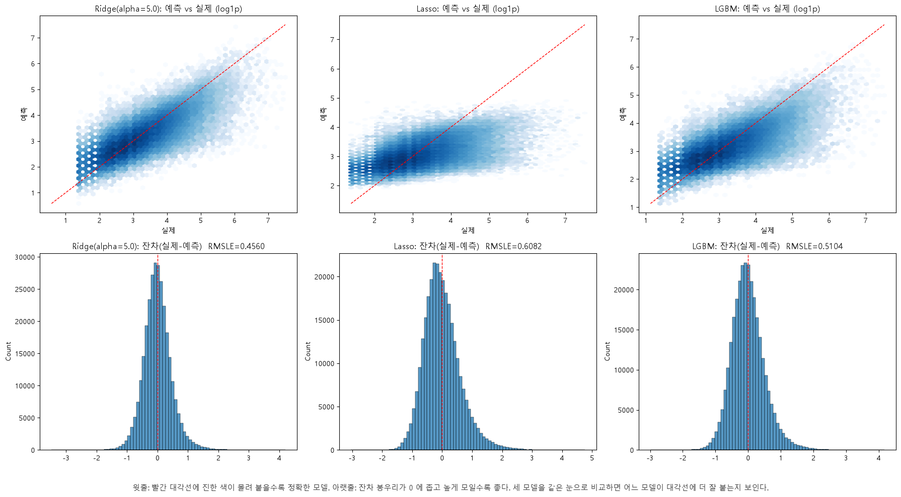

*Ridge/Lasso/LGBM 세 모델의 예측-실제 hexbin과 잔차 히스토그램. Lasso의 잔차 봉우리가 가장 넓게 퍼져 있어 앞선 분석(과소적합)을 시각적으로도 뒷받침한다.*

최고 성능 모델(Ridge)의 오차를 대분류 카테고리별로 쪼개본 분석도 진행했다.

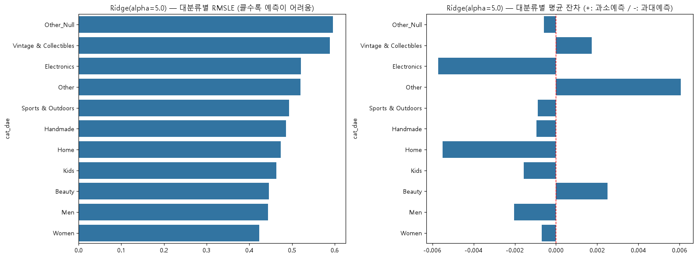

*Vintage & Collectibles, Electronics 등 상대적으로 표본이 적거나 가격 편차가 큰 카테고리에서 RMSLE가 높게(예측이 어렵게) 나타났고, Women처럼 표본이 많은 카테고리는 RMSLE가 가장 낮았다(0.4232).*

### 5.5 진희 — product_text 통합과 TF-IDF 스케일 실험

진희(채택본 `ridgefixfeature(0.4331)`)의 접근은 name/brand_name/category_name을 하나의 `product_text`로, name/item_description을 결합한 `item_description`으로 재구성한 뒤 TF-IDF(ngram 1~2)를 적용한 것이 핵심이다. 이렇게 하면 브랜드나 카테고리가 결측이어도 상품명에서 유사한 정보를 모델이 간접적으로 학습할 여지가 생긴다.

가장 성능에 크게 기여한 실험은 TF-IDF `max_features`를 단계적으로 늘려본 것이다: 100,000 → 150,000 → 200,000으로 늘릴 때 RMSLE가 0.438358 → 0.435788 → 0.434032로 꾸준히 개선됐지만, 개선폭 자체는 0.00257 → 0.00176으로 점점 줄어드는 수확체감 패턴이 뚜렷했다(이는 소현이 별도로 진행한 vocab 크기 민감도 실험에서 "캡을 키워도 성능이 평평해진다"고 확인한 결론과도 방향이 일치한다). 이후 product_text/item_description의 길이·단어 수를 파생 피처로 추가하고 StandardScaler로 스케일링한 결과 RMSLE가 0.434032 → 0.433132로 추가 개선되어 최종 **0.43313**을 채택했다.

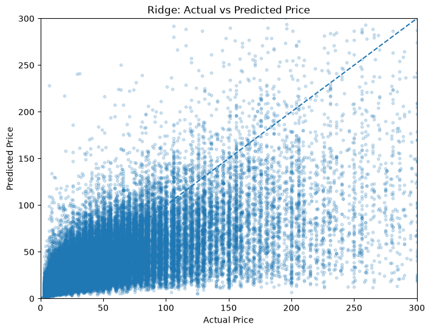

*최종 Ridge 모델의 실제 가격 대 예측 가격 산점도(0~300달러 구간). 저가~중가 구간에서는 대각선에 가깝게 몰려 있으나 고가 구간으로 갈수록 예측이 실제보다 낮게 편향되는 경향이 관찰된다.*

이 외에도 문자 단위 n-gram(character 3~5gram) TF-IDF를 시도했으나 RMSLE 0.898로 단어 단위보다 크게 나빠져 채택하지 않았고, LGBM(n_estimators 최대 4000)도 시도했으나 얼리스토핑에 도달하지 못한 채 RMSLE 0.43~0.44대에 머물러 Ridge를 넘어서지 못했다.

### 5.6 혜현 — 단계적 튜닝으로 앙상블을 넘어선 LightGBM

혜현은 Ridge와 LightGBM을 각각 학습한 뒤 가중 평균 앙상블(Ridge 0.45 : LightGBM 0.55)로 RMSLE 0.4401을 달성했고, 이후 LightGBM만 세 차례에 걸쳐 단계적으로 정밀 튜닝했다.

| 단계 | 주요 설정 | RMSLE |
|---|---|---|
| 설명글 제외 Ridge (baseline) | alpha=3 | 0.4932 |
| 설명글 포함 Ridge (튜닝) | alpha 0.1~5 스윕 후 alpha=3 채택 | 0.4593 |
| LightGBM (튜닝 전) | n_estimators=200, num_leaves=125 | 0.4507 |
| Ridge + LightGBM 앙상블 | 가중 평균 0.45:0.55 | 0.4401 |
| LightGBM 1차 튜닝 | 조기 종료 도입, lr=0.15 | 0.4422 |
| LightGBM 2차 튜닝 | lr=0.05, num_leaves=127, 서브샘플링 | 0.4353 |
| LightGBM 3차 튜닝 | lr=0.03, num_leaves=255, L1/L2 정규화 | **0.4291** |

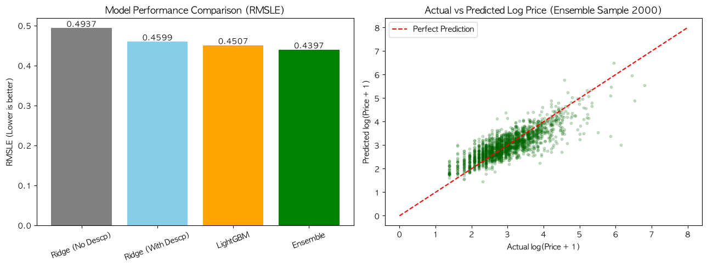

*네 개 모델(Ridge 제외/포함, LightGBM, 앙상블)의 RMSLE 막대그래프와 앙상블 예측의 실제값 대비 산점도. 이 시점에서는 앙상블(0.4401)이 최고 성능이었으나, 이후 LightGBM을 세 차례 정밀 튜닝하면서 단일 모델(0.4291)이 앙상블을 앞질렀다.*

주목할 점은 마지막 3차 튜닝에서 조기 종료 조건에 아직 도달하지 못한 채 시간 제약으로 멈췄다는 것 — 소현의 파이프라인에서 1200라운드 상한을 2000라운드로 확장해 추가 개선을 얻은 것과 같은 맥락으로, LightGBM에게 더 많은 학습 예산을 준다면 추가 개선 여지가 남아있었을 가능성을 시사한다.

---

## 6. 결론

다섯 명이 각자 다른 전처리·피처·모델 조합으로 같은 문제를 풀었지만, 결과를 모아보면 몇 가지 공통된 결론에 자연스럽게 수렴했다.

**첫째, 고차원 희소 텍스트 피처에는 정규화된 선형모델이 잘 맞는다.** 소현·용우·유경·진희·혜현 모두 8만~15만 차원의 TF-IDF/원-핫 피처 위에서 Ridge를 기본 베이스라인으로 사용했고, 대부분의 경우 Ridge가 튜닝 전 LightGBM보다 우수했다(유경: 0.4560 vs 0.5104, 혜현: 0.4593 vs 0.4507로 근소하게 LGBM이 앞선 예외도 있었으나 전반적으로 Ridge가 견고했다). 반대로 Lasso(L1 규제)는 유경의 실험에서 명확히 실패했는데, 이는 이 문제의 가격 신호가 소수의 강한 피처가 아니라 수만 개의 단어·브랜드·카테고리에 얇게 퍼져 있는 구조이기 때문이다. 계수를 축소만 하는 L2(Ridge)가 이 구조에 훨씬 유리했고, 계수를 0으로 만드는 L1(Lasso)은 유의미한 신호까지 대거 제거해 과소적합을 일으켰다.

**둘째, 전처리와 피처 엔지니어링이 모델 선택이나 하이퍼파라미터 튜닝보다 자주 더 큰 지렛대였다.** 소현의 실험에서 hstack 구성 방식 변경(카테고리 네이티브 인코딩 + n-gram)은 LGBM을 3.8% 개선했지만, 이후 새 피처(길이·target encoding)와 FM_FTRL·2-stage 블렌딩을 더한 구간에서는 15.1%라는 훨씬 큰 개선이 나왔다. 진희는 TF-IDF 어휘 크기를 단계적으로 늘려가며 성능이 개선되지만 그 폭이 점점 줄어드는 수확체감 패턴을 확인했고, 소현은 별도로 어휘 캡을 아예 없애는 실험까지 진행해 "일정 크기를 넘으면 vocab을 더 키워도 성능에 미치는 영향이 거의 없다"는 결론에 도달했다. 두 사람이 서로 다른 노트북에서 독립적으로 같은 결론에 이르렀다는 점은 이 통찰의 신뢰도를 높여준다. 용우의 실험에서는 정규식 하나(숫자를 지울지 보존할지)가 RMSLE를 0.7%가량 흔들었고, 진희는 name/brand/category를 하나의 텍스트로 통합하는 피처 설계만으로 의미 있는 개선을 얻었다. 결측치를 단순 삭제 대신 `'Other_Null'`이라는 명시적 카테고리로 채우는 방식(소현, 진희, 혜현이 공통으로 채택)도 "값이 없다"는 사실 자체를 모델이 활용 가능한 신호로 바꾼 사례다.

**셋째, 모델 구조에 맞는 인코딩 선택이 트리 모델의 성능을 크게 좌우했다.** LightGBM은 원-핫 인코딩보다 라벨 인코딩 + `categorical_feature` 네이티브 지정 방식을 썼을 때, 그리고 충분한 학습 예산(조기 종료 도달 전 상한에 걸리지 않을 만큼의 라운드 수)과 L1/L2 정규화·서브샘플링을 함께 적용했을 때 Ridge를 뛰어넘는 성능을 냈다(소현: 최종 LGBM 0.42388, 혜현: 3차 튜닝 LGBM 0.4291). 반대로 튜닝이 충분하지 않은 상태(용우의 150라운드 빠른 검증, 유경의 기본 파라미터)에서는 LightGBM이 Ridge보다 낮은 성능에 머물렀다. 즉 "Ridge가 항상 낫다"가 아니라 "제대로 튜닝된 LightGBM이 결국 Ridge를 앞선다"는 것이 더 정확한 결론이며, 이는 소현과 혜현이 각자 독립적으로 도달한 지점이기도 하다.

**넷째, 서로 다른 표현을 가진 모델을 블렌딩하는 것이 단일 모델의 한계를 넘는 가장 확실한 방법이었다.** 혜현의 Ridge+LightGBM 앙상블은 개별 모델보다 낮은 오차를 기록했고, 소현은 여기서 한 걸음 더 나아가 Ridge·LightGBM·FM_FTRL(직접 구현) 세 모델을 leakage 없는 2단계 검증 구조 위에서 가중치 그리드서치로 결합해 최종 RMSLE 0.41778을 달성했다. 흥미로운 것은 LightGBM을 충분히 튜닝한 뒤에는 최적 블렌드에서 Ridge의 기여도가 0으로 수렴했다는 점 — 개별 모델의 성능이 개선될수록 블렌딩에서 그 모델이 차지하는 역할도 달라진다는 것을 보여준다.

**다섯째, 검증 구조 설계(data leakage 방지) 자체가 하나의 성능 요소였다.** 모든 팀원이 train에만 벡터라이저/인코더를 fit하는 원칙은 공통으로 지켰지만, 소현은 여기서 더 나아가 test set을 정말 마지막에 딱 한 번만 사용하는 2단계(train→valid 튜닝, train+valid→test 최종평가) 구조를 만들었다. 이는 "성능이 좋아 보이는 것"과 "실제로 새 데이터에 일반화되는 것"을 구분하기 위한 장치였고, 유경이 느낀점에서 언급했듯 "좋아 보이는 것과 실제로 효과가 있는 것은 다르다"는 팀 전체의 문제의식과 맞닿아 있다.

종합하면, 이번 프로젝트에서 팀이 얻은 가장 큰 배움은 특정 알고리즘의 우열이 아니라 **"문제의 데이터 구조(고차원 희소 텍스트)를 이해하고 그에 맞는 피처 표현과 검증 절차를 설계하는 것이, 어떤 단일 모델을 쓰느냐보다 결과에 훨씬 크게 기여한다"**는 것이었다.

---

## 7. 회고

앞선 장들이 다섯 명의 노트북을 하나의 흐름으로 종합한 것이라면, 이 장은 각 팀원이 프로젝트를 마치며 개인적으로 남긴 소감을 그대로 옮긴 것이다.

### 소현

전처리를 마친 뒤 곧바로 하이퍼파라미터 튜닝에 매달리기보다, 좋은 feature vector를 만드는 데 집중하는 방향을 처음부터 의도적으로 택했다. "Garbage in, garbage out" — 아무리 튜닝을 정교하게 해도 feature 자체가 충분한 예측력을 갖지 못하면 한계가 뚜렷하다고 봤기 때문이다. 실제로 LGBM이 원본 sparse 표현(0.49220)에서 native categorical + n-gram(0.47363)으로 바꾼 것만으로 크게 개선된 것을 보고, 모델 하나를 정해 하이퍼파라미터를 극한까지 파는 대신 좋은 `X_features`를 만든 뒤 Ridge와 LGBM의 성능을 함께 확인하는 절차로 전략을 다시 짰다. Ridge는 선형모델이라 apple·iphone·128gb 같은 조건들을 단순히 더하는 역할만 할 수 있지만, 실제 가격은 "Apple×iPhone"처럼 조합에 따라 달라지므로 이 조합 효과를 잡으려면 LightGBM(트리 분기) 쪽이 유리하다는 것도 실험으로 확인했다. FM_FTRL을 캐글 공개 커널(Wordbatch, Anttip)에서 아이디어를 얻어 직접 구현하고, validation set에서 최적 블렌드 비율을 탐색해 최종 LGBM RMSLE 0.41778을 달성한 과정 전체가, 데이터 구조를 파악하는 데서 시작해 그에 맞는 feature 설계를 고민하는 것이 모델 파라미터 하나하나를 조정하는 것보다 근본적으로 중요하다는 확신으로 이어졌다.

### 용우

데이터를 살펴보며 여러 가설을 세워 전처리하는 과정에서 생각할 거리가 많았다. 어떤 정답이 정해져 있는 문제가 아니었기에, 얻을 수 있는 정보를 최대한 끌어내며 진행했고, 그 과정에서 데이터의 형태에 따라 써야 하는 함수와 자료형이 달라진다는 것을 체감했다. 가장 크게 고민한 지점은 두 모델을 비교하며 마주한 선택이었다 — 빠르지만 점수가 낮은 모델을 쓸 것인가, 시간이 오래 걸리더라도 더 나아질 여지가 있는 모델에 시간을 투자할 것인가. 실무나 서비스 관점에서 생각해봤을 때 시간이 오래 걸리더라도 더 정확하게 예측해주는 모델을 선택하는 것이 낫겠다는 결론에 이르렀다. 이후에는 item_description 외에 상품명(name)에서도 브랜드 이름을 추출해 브랜드 사전에 추가로 매칭하는 방향을 시도해보고 있는데, 매칭되는 브랜드명이 늘어날수록 잘못된 브랜드를 잘못 가져와 오탐이 늘어날 위험도 함께 커진다는 점을 유의하며 진행 중이다.

### 유경

가장 크게 남은 배움은 "좋아 보이는 것"과 "실제로 효과가 있는 것"이 다르다는 점이었다. category_name을 몇 조각으로 나눌지, 정규식에서 숫자를 남길지 같은 사소해 보이는 선택도 직접 데이터로 비교해 보기 전에는 판단하기 어려웠다 — 실제로 카테고리 분리 방식은 결과에 거의 영향이 없었던 반면, 숫자 보존은 RMSLE를 꾸준히 약 0.7% 낮췄다. 모델 쪽에서는 화려한 모델보다 문제 구조에 맞는 모델이 중요하다는 것을 체감했다. 8만 개가 넘는 희소한 텍스트 피처에서는 계수를 조금씩 줄이는 Ridge가 가장 잘 맞았고, 반대로 Lasso는 규제가 세게 걸려 피처의 99% 이상을 0으로 만들어 버려 오히려 과소적합했다. LGBM도 튜닝 없이는 Ridge를 넘지 못했다. 지표를 다루면서 RMSLE가 "log를 씌운 상태에서의 RMSE"라는 것을 정확히 이해하는 것도 은근히 중요했다 — 타깃을 이미 log1p 했는데 여기에 또 log를 씌우면 이중 계산이 된다는 점을 정리하며, 지표 정의를 대충 넘기면 안 된다는 것을 배웠다. 아쉬운 점은 데이터가 커서 전체로 교차검증을 제대로 돌리지 못한 것, 그리고 텍스트 임베딩이나 모델 앙상블까지는 시도하지 못한 것이다. 다만 잔차 분포와 카테고리별 오차를 시각화해보니 어느 구간에서 모델이 약한지는 감을 잡을 수 있었다.

### 진희

이번에 텍스트 전처리를 다양하게 시도하며 점수를 어떻게 높일지 계속 체크해봤다. 릿지나 LGBM처럼 비교적 단순한 모델을 썼기 때문에 오히려 하이퍼파라미터와 피처 구성 하나하나에 더 집중할 수 있었다. 그 결과 아주 작은 차이로 그친 실험도 있었고, 큰 차이로 효율을 확인한 실험도 있었다 — 예를 들어 단어 단위 대신 글자 단위(character n-gram) TF-IDF를 시도해봤지만 오히려 더 안 좋은 결과(RMSLE 0.898)를 가져왔다. 가장 가치 있었다고 생각하는 작업은 데이터 전처리였다. 전처리가 곧 학습이 잘되고 안 되고를 결정짓는다고 느꼈고, 그래서 name·brand·category를 통합한 `product_text`와 상품명을 포함한 `item_description`을 만든 것을 가장 중요한 선택으로 꼽는다. 다만 그 성능을 실제로 최대한 끌어내는 데는 결국 max_features나 min_df 같은 모델 파라미터 조정이 함께 필요했고, 조금씩 조정할 때마다 미세하게 개선되는 과정을 반복하며 결국 이 두 축(피처 설계 + 파라미터 조정)에 집중할 수밖에 없었다. 팀원들과 서로의 노트북을 공유하고 설명하는 과정도 스스로를 되짚어보는 데 크게 도움이 됐다. 아쉬운 기억으로는, 글자 단위 TF-IDF를 체크하던 두 번째 파일이 저장되지 않아 유실된 일이 있었다 — 이후로는 중간 실험 결과를 더 자주 저장해두는 습관이 필요하다고 느꼈다.

### 혜현

이번 메르카리 프로젝트를 통해 비정형 텍스트 피처 엔지니어링과 대용량 데이터 파이프라인 최적화의 중요성을 깊이 체감했다. 상품명에는 CountVectorizer를, 본문 설명글에는 TfidfVectorizer(ngram 1~2)를 데이터 성격에 맞게 차별 적용해 문맥과 핵심 키워드를 효과적으로 피처화하려 했다. 특히 140만 건에 달하는 대규모 희소 데이터를 다루면서, train/test 분할 전에 벡터화를 해버리면 생길 수 있는 데이터 누수를 막기 위해 엄격한 사전 분할과 fit/transform 분리를 지켰다. 또한 모델링 전에 희소 행렬을 한 번만 결합하고 메모리를 즉시 반환하도록 설계해 연산 효율과 안정성을 높였다. 모델링 단계에서는 희소 행렬 연산에 최적화된 Ridge(solver='lsqr')로 먼저 기준 성능을 다진 뒤, LightGBM을 단계별로 정밀 튜닝해나갔다. 조기 종료와 피처·데이터 서브샘플링, L1/L2 복합 정규화를 순차적으로 적용하며 고차원 희소 피처의 과적합을 방지하고 비선형 패턴을 학습시켰고, 그 결과 3차 정밀 튜닝을 거친 LightGBM 단일 모델이 앞서 만든 Ridge+LightGBM 앙상블(0.4401)까지 넘어서는 최저 RMSLE(0.4291)를 달성했다. 이 과정에서 데이터 구조와 알고리즘 특성에 맞춘 하이퍼파라미터 최적화가 실제로 얼마나 큰 힘을 발휘하는지를 크게 실감할 수 있었다.

