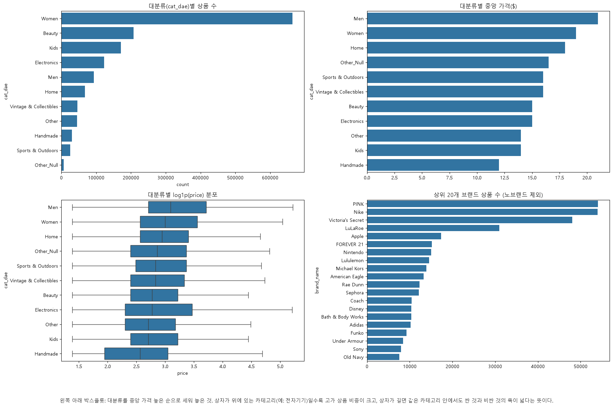
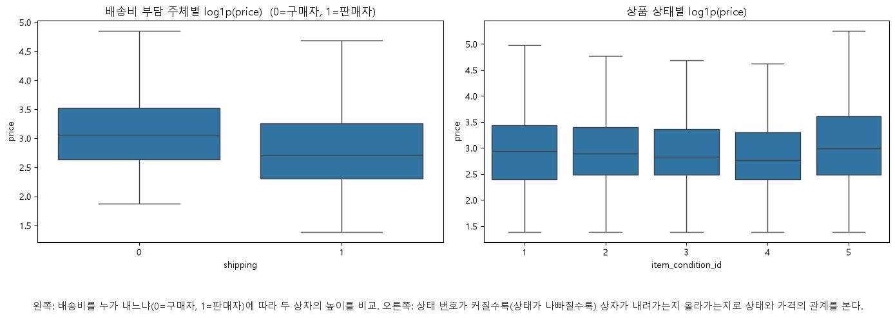
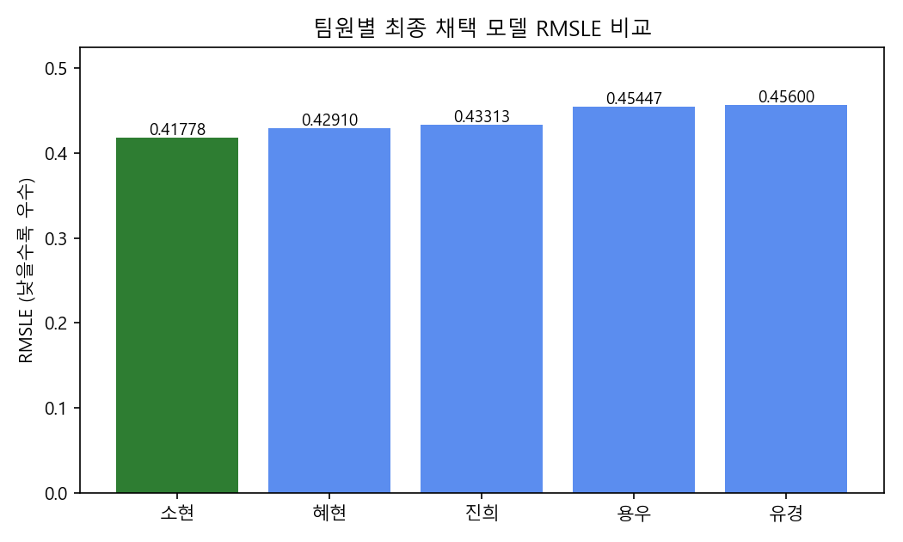
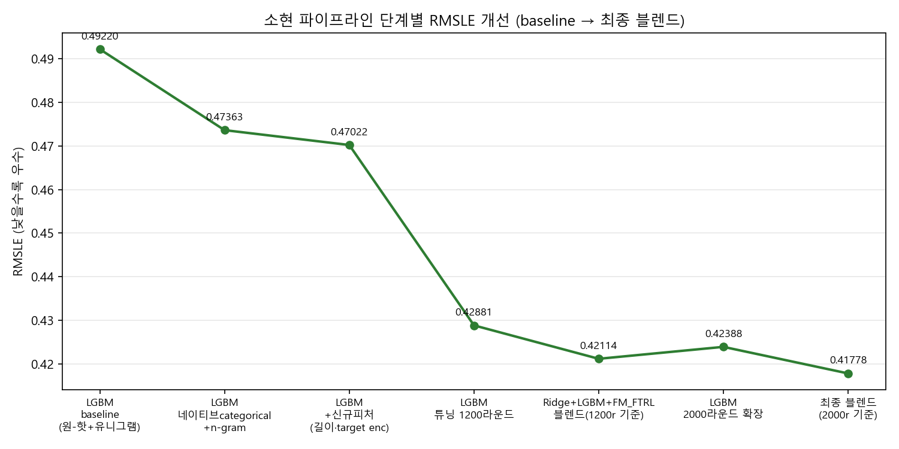

# Mercari Price Suggestion 팀 프로젝트 보고서

## 0. 초록

본 프로젝트는 미국 C2C 중고거래 플랫폼 Mercari의 상품 정보(상품명·카테고리·브랜드·상태·배송비 부담·설명 텍스트)로부터 적정 판매가(`price`)를 예측하는 회귀 문제를 다룬다. 데이터는 `mercari_train.tsv` 1,482,535건·8개 컬럼으로, 정형·비정형 정보가 혼재되어 있으며 평가지표는 RMSLE(Root Mean Squared Logarithmic Error)이다. 소현·용우·유경·진희·혜현 5명이 동일한 원본 데이터로부터 각자 독립적으로 EDA→전처리→Feature Engineering→모델링→하이퍼파라미터 튜닝 전체 파이프라인을 설계·수행한 뒤 결과를 통합했다. Ridge가 5명 모두에게서 견고한 베이스라인(RMSLE 0.43~0.47)으로 확인되었고, 충분히 튜닝된 LightGBM은 이를 상회했다(소현 0.42388, 혜현 0.4291). 최고 성능은 소현이 Ridge·LightGBM·FM_FTRL(직접 구현) 3개 모델을 leakage-free 2단계 검증 구조 위에서 가중 블렌딩해 얻은 **RMSLE 0.41778**이다. 이는 최초 LightGBM baseline(0.49220) 대비 약 15.1% 개선된 수치다. 핵심 결론은 고차원 희소 텍스트 피처를 다루는 이 문제에서 알고리즘 선택 자체보다 **데이터 구조에 맞는 피처 표현 설계와 leakage 없는 검증 절차**가 성능에 더 크게 기여했다는 것이다.

5명의 최종 RMSLE는 0.41778(소현)~0.4560(유경) 구간에 분포했으며(8장), 순위와 무관하게 여러 팀원의 노트북에서 독립적으로 반복 확인된 공통 패턴이 있다: 가격 신호가 소수의 강한 피처가 아니라 수만 개의 희소 피처(단어·브랜드·카테고리)에 얇게 분산되어 있어 L2 정규화(Ridge)가 L1(Lasso)보다 구조적으로 유리했고, 텍스트 정제 시 숫자를 보존하는 편이 근소하게 유리했으며(용우·유경 교차검증), TF-IDF 어휘 크기를 키울수록 개선 폭이 점차 줄어드는 수확체감 패턴이 나타났다(진희·소현 교차검증). LightGBM은 충분한 학습 라운드와 정규화가 뒷받침될 때만 Ridge를 앞질렀고, 서로 다른 표현을 가진 모델을 블렌딩하는 것이 단일 모델의 한계를 넘는 가장 확실한 방법이었다(8.5절에서 7가지 공통 인사이트로 종합했다).

---

### 목차

- **0. [초록](#초록)**
- **1. [서론](#서론)**
    - 1.1 [연구 배경 및 필요성](#연구-배경-및-필요성)
    - 1.2 [과제 목적 및 평가지표](#과제-목적-및-평가지표)
    - 1.3 [팀 진행 방식](#팀-진행-방식)
    - 1.4 [데이터 개요 및 보고서 구성](#데이터-개요-및-보고서-구성)
- **2. [데이터 소개](#데이터-소개)**
    - 2.1 [데이터 개요](#데이터-개요)
    - 2.2 [타깃 변수(price) 분포](#타깃-변수price-분포)
- **3. [탐색적 데이터 분석(EDA)](#탐색적-데이터-분석eda)**
    - 3.1 [가격 이상치 및 데이터 전반 개관](#가격-이상치-및-데이터-전반-개관)
    - 3.2 [결측치 현황과 가격의 관계](#결측치-현황과-가격의-관계)
    - 3.3 [카테고리 계층 구조](#카테고리-계층-구조)
    - 3.4 [브랜드와 수치형 피처의 관계](#브랜드와-수치형-피처의-관계)
    - 3.5 [소결](#소결)
- **4. [데이터 전처리](#데이터-전처리)**
    - 4.1 [공통 전처리 파이프라인](#공통-전처리-파이프라인)
    - 4.2 [전처리 전/후 비교 근거](#전처리-전후-비교-근거)
    - 4.3 [전처리 유형 분류](#전처리-유형-분류-고정-적용-vs-여러-방법-시도비교)
- **5. [Feature Engineering](#feature-engineering)**
    - 5.1 [팀원별 피처 표현 방식 비교](#팀원별-피처-표현-방식-비교)
    - 5.2 [소현 — 파생 피처·vocab 실험](#소현-파생-피처-및-어휘vocab-크기-실험)
    - 5.3 [용우 — 결측 브랜드 복원](#용우-결측-브랜드-복원과-재사용-가능한-전처리-아티팩트)
    - 5.4 [유경 — 텍스트 길이 기반 벡터화](#유경-텍스트-길이-기반-벡터화-전략과-희소성-점검)
    - 5.5 [진희 — product_text 통합](#진희-product_textitem_description-통합과-min_dfand-브랜드-처리)
    - 5.6 [혜현 — 희소 행렬 효율화](#혜현-희소-행렬-효율화와-설명글-포함제외-4-조합-사전결합)
- **6. [분석 방법 및 모델링](#분석-방법-및-모델링)**
    - 6.1 [팀원별 사용 모델 개요](#팀원별-사용-모델-개요)
    - 6.2 [모델 해석 — 피처 중요도·회귀계수](#모델-해석-피처-중요도와-회귀계수)
- **7. [하이퍼파라미터 최적화](#하이퍼파라미터-최적화)**
    - 7.1 [Ridge alpha 튜닝](#ridge-alpha-튜닝)
    - 7.2 [LightGBM 튜닝](#lightgbm-튜닝)
- **8. [모델 성능 비교 및 분석](#모델-성능-비교-및-분석)**
    - 8.1 [팀 전체 최종 성능 종합 비교](#팀-전체-최종-성능-종합-비교)
    - 8.2 [최고 성능 모델 분석](#최고-성능-모델-분석)
    - 8.3 [모델 계열별 성능 분석](#모델-계열별-성능-분석)
    - 8.4 [최적화·Feature Engineering 효과](#최적화-및-feature-engineering-효과-분석)
    - 8.5 [팀 전체 공통 인사이트](#팀-전체-공통-인사이트)
- **9. [팀원별 실험 상세](#팀원별-실험-상세)**
    - 9.1 [소현 — FM_FTRL·2-stage 블렌딩](#소현-fm_ftrl-직접-구현과-leakage-free-2-stage-블렌딩)
    - 9.2 [용우 — 텍스트 정제·alpha 튜닝](#용우-텍스트-정제-규칙과-alpha-튜닝-중심의-ridge-파이프라인)
    - 9.3 [유경 — Ridge/Lasso/LGBM 비교](#유경-ridgelassolgbm-3파전-비교와-오차-진단)
    - 9.4 [진희 — TF-IDF 스케일 실험](#진희-product_text-통합과-tf-idf-스케일-실험)
    - 9.5 [혜현 — 단계적 튜닝](#혜현-단계적-튜닝으로-앙상블을-넘어선-lightgbm)
- **10. [결론 및 회고](#결론-및-회고)**
    - 10.1 [종합 결론](#종합-결론)
    - 10.2 [팀원별 느낀점 및 피드백](#팀원별-느낀점-및-피드백)

## 1. 서론

### 1.1 연구 배경 및 필요성

중고거래 플랫폼에서 판매자가 상품을 등록할 때 가장 막막해하는 지점은 "이 물건을 얼마에 올려야 하는가"이다. 같은 카테고리, 같은 브랜드라도 상태·설명 문구·배송비 부담 주체에 따라 적정가는 크게 달라지고, 이를 판매자 개인의 감에만 맡기면 지나치게 낮은 가격에 손해를 보거나 지나치게 높은 가격에 거래가 성사되지 않는 문제가 반복된다. 본 프로젝트는 미국의 C2C 중고거래 플랫폼 Mercari가 실제로 겪었던 이 문제, 즉 상품 정보만으로 적정 판매 가격을 자동 제안하는 문제(Mercari Price Suggestion Challenge)를 다룬다. 상품명, 카테고리, 브랜드, 상품 상태, 배송비 부담 주체, 상품 설명 등 정형·비정형 정보가 뒤섞인 데이터로부터 가격이라는 연속형 목표 변수를 예측하는 회귀 문제이며, 텍스트·범주형·수치형 피처를 함께 다뤄야 한다는 점에서 실무적인 난이도를 갖는다.

### 1.2 과제 목적 및 평가지표

본 프로젝트의 목적은 상품 메타데이터와 설명 텍스트만으로 판매 가격을 예측하는 회귀 모델을 설계·비교하는 것이다. 평가지표로는 RMSLE(Root Mean Squared Logarithmic Error)를 사용한다. RMSLE는 예측값과 실제값에 각각 로그를 취한 뒤 오차를 측정하므로, 5달러짜리 상품에서 2달러 차이가 나는 것과 200달러짜리 상품에서 2달러 차이가 나는 것을 서로 다른 무게로 평가한다. 즉 절대적인 오차 금액보다 상대적인 오차 비율에 민감한 지표이며, 이 지표의 특성은 이후 데이터 소개와 전처리 단계에서 타깃 변수 `price`에 `log1p` 변환을 적용하는 근거와 직접 맞닿아 있다.

### 1.3 팀 진행 방식

본 프로젝트는 소현, 용우, 유경, 진희, 혜현 5명으로 구성된 팀이 진행했다. 팀원 각자가 동일한 원본 데이터로부터 데이터 탐색(EDA), 전처리, 모델링, 하이퍼파라미터 튜닝까지의 전체 파이프라인을 독립적으로 설계·수행한 뒤, 서로의 접근 방식과 결과를 비교하고 하나의 보고서로 통합하는 방식을 택했다. 이는 하나의 정답 파이프라인을 정해두고 분업하는 대신, 결측치 처리·이상치 기준·피처 구성·모델 선택 등 각 단계에서 서로 다른 판단이 최종 성능에 어떤 영향을 미치는지를 팀 차원에서 비교·검증하기 위함이다.

### 1.4 데이터 개요 및 보고서 구성

사용한 데이터는 `mercari_train.tsv`로, 총 1,482,535건의 상품 등록 기록과 8개 컬럼(`train_id`, `name`, `item_condition_id`, `category_name`, `brand_name`, `price`, `shipping`, `item_description`)으로 구성되어 있다. `train_id`는 단순 일련번호이므로 실질적인 예측 피처는 상품명, 상품 상태, 3단계 카테고리, 브랜드, 배송비 부담 주체, 상품 설명 텍스트의 6가지이며, 목표 변수는 `price`이다(상세 통계는 2장 참고).

이 보고서의 흐름은 다음과 같다. 먼저 데이터의 구조와 통계적 특성을 파악하고(2장), 탐색적 분석으로 결측·계층·상관 구조를 확인해 전처리 방향의 근거를 마련한다(3장). 이어서 결측치·이상치·텍스트 정제 등 전처리를 적용하고(4장), 팀원별 피처 표현(벡터화·인코딩·파생 피처) 설계를 비교한다(5장). 이 피처 위에서 Ridge·LightGBM·Lasso·FM_FTRL 등 서로 다른 계열의 모델을 학습·해석하고(6장), 하이퍼파라미터를 최적화한다(7장). 이어서 팀 전체 성능을 종합 비교하고 모델 계열·최적화 효과·공통 인사이트를 분석한 뒤(8장), 팀원별 실험 과정을 상세히 서술하고(9장), 팀 공통 결론과 개인 회고로 마무리한다(10장). 각 장은 팀원 5명의 개별 노트북에서 공통으로 확인된 내용은 한 번만 종합하고, 팀원마다 서로 다르게 접근하거나 고유하게 발견한 지점은 누가 어떤 관점을 더했는지 밝히며 서술한다.

## 2. 데이터 소개

### 2.1 데이터 개요

`mercari_train.tsv`는 tab으로 구분된 텍스트 파일이며, `pandas.read_csv(sep='\t')`로 불러오면 (1,482,535, 8) 크기의 데이터프레임이 된다. 각 컬럼의 자료형과 결측치 현황은 다음과 같다.

| 컬럼 | 자료형 | 설명 | 결측 건수 | 결측 비율 |
|---|---|---|---:|---:|
| `train_id` | int64 | 상품 등록 일련번호(식별자) | 0 | 0% |
| `name` | object | 상품명(자유 텍스트) | 0 | 0% |
| `item_condition_id` | int64 | 상품 상태 등급(1=새것 ~ 5=낡음) | 0 | 0% |
| `category_name` | object | 카테고리(대/중/소분류, `/`로 구분) | 6,327 | 0.43% |
| `brand_name` | object | 브랜드명 | 632,682 | 42.68% |
| `price` | float64 | 판매 가격(달러, 목표 변수) | 0 | 0% |
| `shipping` | int64 | 배송비 부담 주체(0=구매자, 1=판매자) | 0 | 0% |
| `item_description` | object | 상품 설명(자유 텍스트) | 6 | 0.0004% |

수치형 컬럼(`item_condition_id`, `price`, `shipping`)의 기술 통계는 `describe()` 결과 기준으로 다음과 같다.

| 통계량 | item_condition_id | price ($) | shipping |
|---|---:|---:|---:|
| count | 1,482,535 | 1,482,535 | 1,482,535 |
| mean | 1.91 | 26.74 | 0.45 |
| std | 0.90 | 38.59 | 0.50 |
| min | 1 | 0.00 | 0 |
| 25% | 1 | 10.00 | 0 |
| 50% | 2 | 17.00 | 0 |
| 75% | 3 | 29.00 | 1 |
| max | 5 | 2,009.00 | 1 |

`item_condition_id`는 중앙값이 2(양호)로 새것보다는 사용감이 있는 상품이 다소 많고, `shipping`은 구매자 부담(0)이 절반을 약간 웃돈다. 5명 모두 원본 데이터를 불러온 직후 이 세 통계표를 동일하게 확인했으며, 그 결과 역시 서로 완전히 일치한다.

### 2.2 타깃 변수(price) 분포

`price`의 분포를 그대로 살펴보면 대부분의 상품이 10~30달러대에 몰려 있고, 소수의 고가 상품이 오른쪽으로 긴 꼬리를 만드는 전형적인 우측 왜도(right-skewed) 형태를 보인다. 5명 전원이 독립적으로 같은 결론에 도달했다: 이런 분포를 그대로 회귀 타깃으로 사용하면 고가 상품 소수에 모델이 끌려가기 쉽고, 평가지표인 RMSLE 자체가 로그 스케일 오차를 측정하는 지표이므로 타깃을 `np.log1p(price)`로 미리 변환해두면 일반적인 회귀모델의 RMSE 최소화가 곧 RMSLE 최소화와 같아진다는 이점이 있다. 로그 변환 후 분포는 좌우 대칭에 가까운 종 모양으로 완화되어, 이후 모든 팀원이 모델 학습 시 `log1p(price)`를 타깃으로 사용하고 예측 후 `expm1`로 원 스케일을 복원하는 방식을 공통으로 채택했다.

## 3. 탐색적 데이터 분석(EDA)

### 3.1 가격 이상치 및 데이터 전반 개관

가격 데이터를 살펴보는 과정에서 함께 발견된 데이터 품질 이슈가 있다. `price == 0`인 행이 874건(전체의 0.06%) 존재하는데, 이는 "무료 나눔"에 가까워 가격 예측이라는 문제 정의와 맞지 않는다. 또한 최댓값이 2,009달러로 Mercari의 실제 등록 가격 상한(2,000달러) 정책을 벗어나는 극소수의 이상치도 확인된다. 이 값들을 어떻게 처리했는지는 4장(데이터 전처리)에서 다루며, 여기서는 로그 변환 이전 단계에서 이런 이상치가 분포의 왜도를 한층 더 키우는 요인이라는 점만 짚어둔다.

유경은 여기서 한 걸음 더 나아가, `price`와 `log1p(price)` 뿐 아니라 `item_condition_id`, `shipping`, 상품명 글자 수(`name` length), 상품 설명 글자 수(`item_description` length)까지 한 화면에 놓고 원시 데이터의 전체 윤곽을 6분할 그래프로 정리했다. 아래 그림은 그 결과로, 가격 분포의 왜도뿐 아니라 상품 상태·배송비 구성비, 텍스트 필드의 길이 분포까지 한눈에 보여준다.


*원시 데이터 6개 변수(price, log1p(price), item_condition_id, shipping, name 길이, item_description 길이)의 분포 개관.*

### 3.2 결측치 현황과 가격의 관계

세 컬럼(`category_name`, `brand_name`, `item_description`)에 결측치가 존재하며, 그 비중은 컬럼마다 크게 다르다. `item_description`과 `category_name`은 각각 0.0004%, 0.43%로 무시할 수 있는 수준이지만, `brand_name`은 전체의 42.68%(632,682건)가 비어 있어 절반에 가까운 상품이 브랜드 정보를 갖고 있지 않다. 이는 무시하고 지나칠 수 있는 규모가 아니므로, 어떻게 다루느냐에 따라 모델 성능에 미치는 영향이 크다.

소현은 결측치를 단순히 제거하거나 채우고 끝내는 대신, "브랜드·카테고리·설명이 동시에 몇 개나 비어 있는가"라는 결측 개수 자체(`null_penalty`)와 가격 사이의 관계를 살펴보았다. 실제 분포는 다음과 같다.

| `null_penalty`(결측 개수) | 행 수 | 비율 |
|---|---:|---:|
| 0개(결측 없음) | 846,446 | 57.1% |
| 1개 결측 | 631,706 | 42.6% |
| 2개 결측 | 3,451 | 0.23% |

세 컬럼(`brand_name`/`category_name`/`item_description`)이 동시에 전부 결측인 행은 사실상 없었다 — `category_name`(0.43%)과 `item_description`(0.0004%) 결측 자체가 워낙 드물어, 대부분의 "1개 결측"은 `brand_name` 단독 결측이고 "2개 결측"은 그 드문 두 컬럼이 겹친 극소수 사례에 가깝다. 그 결과 결측된 정보가 많을수록(즉 상품 등록 정보가 부실할수록) 평균 판매 가격이 낮게 형성되는 경향이 뚜렷하게 나타났다. 이는 결측 여부 자체가 노이즈가 아니라 가격을 설명하는 하나의 신호가 될 수 있음을 보여주는 근거이며, 이후 전처리 단계에서 결측치를 삭제하지 않고 별도 범주로 유지하는 방향의 근거로 이어진다.


*`null_penalty`(브랜드·카테고리·설명이 결측이었던 개수, 0~2)별 평균 log1p(price). 결측 개수가 많을수록 평균 가격이 낮아지는 경향이 뚜렷하다.*

한편 용우와 진희는 서로 다른 각도에서 `brand_name`의 특이점을 짚었다. 용우는 `brand_name`이 비어 있더라도 `item_description` 텍스트 안에 실제 브랜드명이 언급되어 있는 경우가 상당수 있다는 점을 확인했고(이 관찰은 이후 4.2절에서 결측의 84%를 복원하는 실제 전처리로 이어진다), 진희는 실제로 다수의 상품(1,933건, 5.5절)에서 `brand_name` 값 자체가 `"AND"`라는 브랜드로 등록되어 있음을 발견했다. `AND`는 영어의 접속사와 형태가 같아 이후 텍스트 정제 단계에서 불용어(stopword)로 함께 제거될 위험이 있는 값으로, 결측치 못지않게 데이터 특유의 주의가 필요한 지점임을 시사한다. 두 관찰 모두 "결측/텍스트가 뒤섞인 브랜드 정보를 어떻게 정리할 것인가"라는 4장의 전처리 설계로 이어진다.

참고로 `price == 0` 행 제거 기준(4.1절)도 팀원마다 정확한 건수가 미묘하게 갈렸다 — 소현·용우·유경·진희 4명은 874건을 확인했지만, 혜현은 자신의 노트북에서 826건으로 집계했다. 필터링 시점(중복 제거 전/후)의 차이로 보이며, 최종 채택 방법(`price > 0`) 자체는 5명 모두 동일했다.

### 3.3 카테고리 계층 구조

`category_name`은 `"Men/Tops/T-shirts"`처럼 `/`로 구분된 대분류/중분류/소분류 3단계 계층 구조를 갖는다. 5명 모두 이를 `cat_dae`(대분류)/`cat_jung`(중분류)/`cat_so`(소분류) 3개 컬럼으로 분리했으며, 고유값 개수는 대분류 11개, 중분류 114개, 소분류 871개로 전원 동일하게 확인했다. 결측치(`category_name`이 NaN인 6,327건)는 3단계 모두 별도 범주로 처리해, 계층 분리 이후에도 정보 손실 없이 다룰 수 있도록 했다.

혜현은 대분류(`cat_dae`)별 거래 건수와 평균 로그 가격을 하나의 이중축 그래프로 겹쳐 그려, 어떤 카테고리가 거래량이 많은지와 어떤 카테고리가 상대적으로 비싼지를 동시에 비교했다. 대분류 사이에 거래 건수와 평균 가격의 순위가 서로 어긋나는 경우가 있어(거래량이 많다고 해서 평균 가격도 높은 것은 아님), 카테고리 피처가 거래량 편향과 가격 편향을 동시에 담고 있음을 확인할 수 있다.


*대분류(cat_dae)별 거래 건수(막대)와 평균 log1p(price)(선)를 겹쳐 그린 이중축 그래프.*

소현은 이를 보완해 대분류별 로그 가격의 분포 자체(중앙값뿐 아니라 사분위 구간과 산포)를 박스플롯으로 함께 확인했다. 평균만으로는 드러나지 않는, 카테고리 내부의 가격 편차(같은 카테고리 안에서도 저가 상품과 고가 상품이 얼마나 넓게 퍼져 있는지)를 함께 살펴야 이후 카테고리 피처의 중요도를 올바르게 해석할 수 있다는 판단에서다.


*대분류(cat_dae)별 log1p(price) 분포 박스플롯.*

유경은 여기서 한 걸음 더 나아가 "거래량 순위"와 "가격 순위"를 나란히 비교했다.



*좌상단: 대분류별 상품 수. 우상단: 대분류별 중앙 가격($). 좌하단: 대분류별 log1p(price) 분포(중앙 가격 순 정렬). 우하단: 노브랜드를 제외한 상위 20개 브랜드 상품 수.*

두 순위는 실제로 크게 어긋난다. 거래량 1위는 `Women`(약 66만 건)이지만 중앙 가격 1위는 `Men`(약 $21)이고, `Women`은 중앙 가격 기준으로는 2위(약 $19)에 그친다. 반대로 거래량이 가장 적은 축에 속하는 `Sports & Outdoors`(약 2만 건)는 중앙 가격이 낮은 편(하위 5위)이라, "거래량이 적으면 희소해서 비쌀 것"이라는 직관과도 어긋난다. 즉 카테고리라는 하나의 피처 안에 "얼마나 자주 거래되는가"와 "얼마에 거래되는가"라는 서로 독립적인 두 축의 정보가 섞여 있다는 것을 혜현의 이중축 그래프에 이어 다시 한번 정량적으로 확인한 셈이다. 우하단 패널의 브랜드 상품 수 순위(PINK·Nike·Victoria's Secret·LuLaRoe·Apple 순)도 3.4절에서 다룰 "상위 15개 브랜드 가격 분포"(유경, 가격 기준 순위)와 나란히 놓고 비교할 만하다 — 거래량 상위 브랜드가 반드시 고가 브랜드는 아니라는 점에서, 카테고리와 마찬가지로 브랜드 역시 "얼마나 자주 팔리는가"와 "얼마에 팔리는가"가 분리된 신호다.

### 3.4 브랜드와 수치형 피처의 관계

브랜드는 결측치를 제외하면 4,808개의 고유 값을 가지며, 상위 브랜드로는 PINK, Nike, Victoria's Secret 등 의류·패션 브랜드가 큰 비중을 차지한다. 유경은 결측치가 아닌 상위 15개 브랜드를 추려 브랜드별 로그 가격 분포를 박스플롯으로 비교했는데, 브랜드마다 상자의 위치(가격 수준)와 높이(가격 편차)가 뚜렷하게 갈렸다. 즉 상자가 높고 짧은 브랜드는 가격이 대체로 높고 균일하게 형성되는 프리미엄 브랜드에 가깝고, 상자가 길게 퍼진 브랜드는 취급 상품군이 다양해 가격대 자체가 넓게 분산되어 있다. 이는 브랜드명이 카테고리 못지않게 가격을 설명하는 유의미한 피처가 될 수 있음을 뒷받침한다.


*결측치를 제외한 상위 15개 브랜드의 log1p(price) 분포 박스플롯.*

유경은 여기에 더해 `item_condition_id`, `shipping`, `name`/`item_description` 글자 수, 원본·로그 `price`를 모두 포함한 수치형 피처 간 상관관계를 히트맵으로 확인했다.


*item_condition_id, shipping, 텍스트 길이, price/log1p(price) 간 상관관계 히트맵.*

히트맵에서 `log1p(price)`와의 상관계수만 절댓값 기준으로 추려보면 다음과 같다.

| 변수 | log1p(price)와의 상관계수 |
|---|---:|
| `shipping` | -0.23 |
| `name_len`(상품명 글자 수) | +0.05 |
| `desc_len`(설명 글자 수) | +0.03 |
| `item_condition_id` | -0.00 |

`shipping`(배송비를 판매자가 부담하는지)이 수치형 피처 중에서는 가장 뚜렷한 상관을 보이는데, 이는 판매자가 배송비를 떠안는 상품일수록 상품 가격 자체를 낮게 책정하는 경향과 부합한다. 반면 `item_condition_id`(상품 상태 등급)는 상관이 거의 0에 가까워, 상태 등급만으로는 가격을 설명하기 어렵다는 것을 보여준다.

유경은 이 두 피처를 박스플롯으로도 직접 확인했다.



*왼쪽: 배송비를 누가 내느냐(0=구매자, 1=판매자)에 따른 두 상자의 높이 비교. 오른쪽: 상태 번호가 커질수록(상태가 나빠질수록) 상자가 내려가는지 올라가는지로 상태와 가격의 관계를 본다.*

`shipping`은 상관계수(-0.23)와 일관되게 중앙값이 뚜렷이 갈린다(구매자 부담 시 log1p(price) 중앙값 약 3.05, 판매자 부담 시 약 2.71). 반면 `item_condition_id`는 1(새것)에서 4(사용감 있음)까지는 중앙값이 완만히 낮아지다가(2.93→2.88→2.82→2.75) 5(가장 낡음)에서 오히려 다시 높아진다(2.98) — 이 비단조적(non-monotonic)인 패턴이야말로 `item_condition_id`와 가격의 **선형** 상관계수가 거의 0으로 나온 이유다. 실제로는 상태가 가격에 영향을 주지만 그 관계가 일직선이 아니라서, 단순 상관계수 하나만으로는 "상태는 가격과 무관하다"고 성급히 결론 내릴 수 없다는 것을 보여주는 사례다.

상품 상태 등급이나 배송비 부담 여부 같은 개별 수치형 피처와 가격 사이의 선형 상관관계는 이처럼 전반적으로 크지 않았는데, 이는 가격을 결정하는 정보 대부분이 카테고리·브랜드·텍스트 같은 범주형·비정형 피처에 담겨 있고, 수치형 피처는 보조적인 신호에 가깝다는 것을 시사한다. 이 관찰은 이후 5장(Feature Engineering)에서 텍스트·범주형 피처의 벡터화 방식에 공을 들여야 하는 이유와도 맞닿아 있으며, 6.2절에서 확인한 LightGBM 피처 중요도에서도 `shipping`이 상위권에 오른 것과 일관된다.

### 3.5 소결

원본 데이터는 148만여 건의 대규모 거래 기록이지만, 실질적으로 모델이 활용할 수 있는 정보는 상품 상태·배송비 같은 몇 개의 수치형 피처, 11~871개 수준의 계층적 카테고리, 4,808개에 달하는 브랜드, 그리고 자유 형식의 상품명·설명 텍스트로 요약된다. 가격은 소수 고가 상품이 꼬리를 이루는 우측 왜도 분포이며 `log1p` 변환이 사실상 모든 팀원의 공통 출발점이었고, `brand_name`의 높은 결측 비율(42.68%)과 카테고리의 계층 구조는 이후 전처리에서 반드시 다뤄야 할 두 축으로 확인되었다. 이 장에서 확인한 분포·결측·계층 구조상의 특징들은 4장(데이터 전처리)에서 각 팀원이 채택한 결측치 처리, 이상치 제거, 텍스트 정제 방식의 직접적인 근거가 된다.

## 4. 데이터 전처리

### 4.1 공통 전처리 파이프라인

5명 모두 동일한 원본 데이터(`mercari_train.tsv`, 1,482,535행 8열)에서 출발했고, 세부 구현은 다르지만 다음 절차는 팀 공통 규칙으로 합의되어 전원 동일하게 적용했다.

1. **가격 이상치 제거** — `price == 0`(무료 나눔·오입력으로 판단)과 `price ≥ 2000`(달러, Mercari 실제 등록 상한 정책 기준) 행을 제거했다. 0원 행은 874건, 2000달러 이상 행은 소수(수~수십 건) 수준이었다. 용우만 `price <= 2000`으로 경계값 2000을 포함시켰고, 나머지 4명은 `price < 2000`으로 2000 자체도 제외해 경계 처리에 미세한 차이가 있다.
2. **`train_id` 컬럼 제거 및 중복 행 제거** — `train_id`는 단순 일련번호라 가격 예측에 무의미하므로 제거하고, 완전히 동일한 행을 `drop_duplicates()`로 정리했다. 혜현은 `train_id`를 제외한 7개 컬럼(가격 포함) 조합 기준으로 중복 49건을 먼저 제거한 뒤 이상치를 필터링하는 순서를 택했고, 나머지는 이상치 제거 → 컬럼 삭제 → 중복 제거 순서를 택했다. 순서 차이에도 최종 행 수는 1,481,60x 대로 5명 모두 거의 일치한다(소현 1,481,603 / 용우 1,481,609 / 유경 1,481,603 / 진희 1,481,603 / 혜현 1,481,603).
3. **타깃 로그 변환(`log1p`)** — 2.2에서 확인한 `price`의 우측 왜도와 RMSLE 지표 특성에 따라 전원이 `np.log1p(price)`를 타깃으로 사용했다. 이후 모델은 log 공간에서 학습하고 필요 시 `expm1`로 원가격을 복원하는 방식을 공유한다.
4. **카테고리 3단계 분할** — `category_name`을 `/` 기준으로 대/중/소분류 3개 컬럼으로 나눴다(소현 `cat_dae/jung/so`, 용우 `cat_main/sub/sub2`, 유경 `cat_dae/jung/so`, 혜현 `cat_dae/jung/so`). 대분류 11종, 중분류 114종, 소분류 861~871종으로 팀원 간 거의 동일하게 집계되어 파싱 로직이 사실상 같음을 서로 확인했다. 진희만 이 단계를 생략하고 `category_name`을 `/`를 공백으로 치환한 뒤 상품명·브랜드와 하나의 텍스트로 합쳐 TF-IDF에 직접 흘려보냈다.
5. **결측치 처리** — `brand_name`(약 63만 건, 전체의 42.7%), `category_name`(6,327건), `item_description`(6건)에 결측이 있었다. 소현·유경·혜현은 세 컬럼 모두 `'Other_Null'` 문자열로 채워 "정보 없음" 자체를 하나의 범주/토큰으로 남겼다. 용우는 단순 대체 대신 `item_description` 원문에서 정규식으로 브랜드명을 역매칭해 결측을 실제 브랜드로 복원한 뒤, 그래도 못 채운 값만 `'Unknown'`으로 통일했다(§4.2 참고). 진희는 별도 대체 없이 텍스트 결합 시 `fillna('')`만 적용했다.
6. **텍스트 정제(`name`, `item_description`)** — 소문자화 → 영문자/숫자/공백 외 문자 제거(정규식) → `word_tokenize` 토큰화 → 불용어 제거 순으로 처리했다. 이 정제 함수는 팀 공통 템플릿을 공유해 5개 노트북의 구현이 거의 동일하다. 특히 두 가지 규칙이 공통으로 지켜졌다: (a) `no/not/nor/never`(용우·유경·진희·혜현은 `without`까지 5개) 등 부정어는 의미를 뒤집을 수 있어 불용어 목록에서 제외했고, (b) 가격 등 개인정보 마스킹 토큰 `[rm]`이 정제 후 의미 없는 `rm` 잔여 토큰으로 남는 문제를 막기 위해 `rm`을 불용어로 추가했다. 유일한 예외는 소현의 정규식으로, 다른 4명이 `[^a-z0-9\s]`(숫자 보존)을 쓴 것과 달리 소현은 `[^a-z\s]`(숫자까지 제거)를 사용했다 — 이 차이의 실제 영향은 §4.2에서 다룬다.
7. **Train/Test 분리 후 fit** — 벡터라이저·인코더는 train에만 `fit`하고 test에는 `transform`만 적용해 정보 누수를 막는 원칙을 5명 모두 지켰다(용우·유경·진희·혜현은 최초 분할 이후 곧바로 이를 적용했고, 소현은 초반 실험 버전에서는 전체 데이터에 벡터라이저를 먼저 fit한 뒤 뒤늦게 `train_test_split`을 수행했으나, 최종 채택 버전(9장 2-stage 검증)에서는 train/valid/test 3-way 분리 후 fold별로 다시 fit하도록 개선했다).

### 4.2 전처리 전/후 비교 근거

**(1) 브랜드 결측치 처리 효과 — 용우.** 원본 `brand_name`은 1,481,609건 중 632,295건(약 42.7%)이 결측이었다. 용우는 train에서 학습한 브랜드 사전으로 `item_description` 원문을 정규식 역매칭해 결측 중 상당수를 실제 브랜드명으로 복원했고, 그래도 못 찾은 값만 `'Unknown'`으로 남겼다. 그 결과 "값이 있는" 행 비율이 약 57%(850K)에서 약 84%(124만)로 늘었고, 남은 `Unknown`은 약 25만 건으로 줄었다.


*정규식 역매칭 전/후 brand_name 결측 비율 변화.*

**(2) 텍스트 정제 결과 — 유경·혜현.** 정제 파이프라인(소문자화·특수문자 제거·불용어 제거)을 거친 뒤 `name`/`item_description`에서 실제로 가장 많이 등장한 토큰을 확인하면, `new`, `size`, `no description yet`, `brand new`, `used`, `free` 등 상품 상태·거래 조건을 나타내는 단어가 상위에 오른다. 특히 `no description yet`, `description yet` 같은 구는 원래 결측/기본 문구였던 `item_description`이 정제 후에도 하나의 고빈도 신호로 남아 있음을 보여주며, 이는 §4.1에서 부정어(`no`)를 불용어에서 제외한 설계가 실제로 의미를 보존했음을 뒷받침한다.


*정제 후 name/item_description 상위 빈도 토큰(유경).*


*item_description TF-IDF 상위 20개 단어(혜현).*

**(3) 정규식(숫자 보존 여부) 선택의 모델 성능 영향 — 유경·용우 교차 검증.** §4.1에서 언급한 대로 소현만 숫자를 제거하는 정규식(`[^a-z\s]`)을 썼고 나머지 4명은 숫자를 보존했다(`[^a-z0-9\s]`). 유경과 용우는 이 선택이 실제 성능에 미치는 영향을 각자 독립적으로 Ridge A/B 테스트로 정량 검증했다.

| 검증자 | 조건 | Ridge RMSLE | 비고 |
|---|---|---|---|
| 유경(17만 표본) | 숫자 보존 `[^a-z0-9\s]` | 0.48463 | 어휘 5,550개 보존 |
| 유경(17만 표본) | 숫자 제거 `[^a-z\s]` | 0.48787 | 사이즈·용량 등 5,550개 토큰 소실/뭉개짐 |
| 용우(전체 데이터) | 숫자 보존 | 0.45597 | |
| 용우(전체 데이터) | 숫자 제거 | 0.45892 | |

두 사람 모두 독립적으로 "숫자 보존이 근소하게(RMSLE 기준 0.3~0.7%) 더 유리하다"는 동일한 결론에 도달했다. 이는 "4gb", "32gb", "사이즈 1X/3X"처럼 숫자가 실제로 가격에 영향을 주는 정보를 담고 있다는 가설을 뒷받침하는 근거이며, 소현의 노트북만 이 검증 이전의 규칙(숫자 제거)을 그대로 쓰고 있어 팀 내에서 유일하게 다른 선택으로 남아 있다.

**(4) 카테고리 파싱 방식 비교 — 유경.** `category_name`은 일부 값에서 소분류 자체에 `/`가 포함돼 4~5조각으로 쪼개진다(예: `Electronics/Computers & Tablets/iPad/Tablet/eBook Readers`). 유경은 `split('/')`(앞 3조각만 사용)과 `split('/', maxsplit=2)`(뒷부분까지 소분류에 보존)를 비교했고, 두 방식의 결과가 달라지는 행은 4,385건으로 전체 1,481,612행의 0.30%에 불과했다. 손실되는 하위 카테고리 간 평균 가격 차이도 표준편차 대비 미미해(예: eBook Readers $75.8 vs eBook Access $69.7), 최종적으로 더 단순한 `split('/')`를 채택했다.

### 4.3 전처리 유형 분류 — "고정 적용" vs "여러 방법 시도·비교"

5개 노트북의 전처리 접근은 크게 두 유형으로 나뉜다. 하나는 하나의 전처리 파이프라인을 처음부터 확정해두고 이후 모든 모델에 동일하게 재사용하는 **고정 적용형**이고, 다른 하나는 이상치 기준·피처 구성·텍스트 정제 규칙 등 여러 대안을 직접 비교한 뒤 최종안을 선택하는 **시도·비교형**이다. 용우·진희·혜현이 전자, 소현·유경이 후자에 가깝다.

**고정 적용형.** 용우는 이상치 제거 → 카테고리 3분할 → description 역매칭 기반 브랜드 결측 복원 → 숫자 보존 텍스트 정제 → TF-IDF(ngram 1-2)/원-핫 인코딩까지 이어지는 파이프라인 하나를 구성한 뒤, 이를 `pickle`로 저장해 Ridge와 LightGBM 두 모델에 동일하게 적용했다(5.3절). 사전에 A/B로 검증한 것은 텍스트 정제 규칙(숫자 보존 여부, 4.2절)뿐이었고, 이 결정이 확정된 뒤로는 파이프라인 자체를 바꾸지 않았다. 진희는 `name`·`brand_name`·`category_name`을 하나의 `product_text`로 결합하는 방식을 처음부터 채택하고, 그 위에서 TF-IDF의 `max_features`(100k→150k→200k)와 `min_df` 같은 벡터화 파라미터만 조정했다(5.5절). 카테고리를 별도로 분할하거나 브랜드 결측을 따로 복원하는 대안은 시도하지 않고, "텍스트 통합"이라는 하나의 설계를 고정한 채 그 위에서 Ridge alpha와 벡터화 파라미터를 반복적으로 튜닝하는 방식을 택했다. 혜현은 이상치 제거 → 카테고리 3분할 → `Other_Null` 결측 대체 → 숫자 보존 텍스트 정제 → CountVectorizer/TfidfVectorizer+LabelBinarizer 인코딩까지 하나의 파이프라인을 확정한 뒤, 이 동일한 피처 위에서 Ridge(설명글 포함/제외 비교), LightGBM(3차에 걸친 정밀 재튜닝), 앙상블까지 모든 실험을 재사용했다(5.6절·7.2절). 전처리 자체를 여러 번 바꾸는 대신, 고정된 피처 위에서 모델과 하이퍼파라미터 쪽 실험에 집중한 경우다.

**시도·비교형.** 소현은 hstack 구성 방식 자체를 여러 버전으로 만들어 비교했다 — 원-핫+유니그램 조합과 LabelEncoder+LGBM 네이티브 categorical+n-gram 조합을 직접 비교해 RMSLE 0.49220→0.47363의 차이를 확인했고(8.4절), 여기에 길이 피처·타깃 인코딩 같은 신규 피처를 추가한 세 번째 조합까지 순차적으로 시도한 뒤 최종안을 채택했다. Ridge alpha도 11개 값을 그리드로 탐색해(7.1절), 전처리·피처 구성·하이퍼파라미터 세 축 모두에서 여러 안을 비교하는 방식을 취했다. 유경도 두 갈래를 직접 비교했다 — `category_name` 파싱 방식(`split()` vs `split(maxsplit=2)`)을 비교해 영향이 미미함(0.30%)을 확인하고 더 단순한 방식을 선택했고(4.2절), 텍스트 정제 시 숫자 보존 여부도 A/B로 비교(0.48463 vs 0.48787)해 숫자 보존 쪽을 채택했다. 두 실험 모두 "더 나은 대안이 있는지 직접 검증한 뒤 선택"하는 방식이라는 점에서 소현과 같은 유형으로 분류했다.

다만 용우·혜현도 텍스트 정제 규칙(숫자 보존 여부)이나 피처 포함 여부(설명글 포함/제외)를 실험하긴 했다. 이는 "하나의 최종 파이프라인을 정하기 위한 사전 검증"의 성격이 강해 이후 전체 파이프라인 자체는 고정해 재사용했다는 점에서, 소현·유경처럼 여러 전처리 기법을 순차적으로 실험·비교하는 유형과는 구분했다.

**시도·비교형 사례 — 유경의 `category_name` 파싱 방식 비교.** "시도·비교형"이 실제로 어떤 모습인지 유경의 노트북 주석을 그대로 옮기면 다음과 같다. `category_name`은 보통 `"대분류/중분류/소분류"` 3단계지만, 일부 소분류 이름 자체에 `/`가 들어있어 4~5조각으로 쪼개지는 경우가 있다(예: `"Electronics/Computers & Tablets/iPad/Tablet/eBook Readers"`).

```python
# [시도했지만 채택하지 않은 방법] category_name.split('/', 2)로 소분류 뒷부분까지 보존
#
# split('/', 2) (maxsplit=2)를 쓰면 소분류가 이렇게 남는다:
#   cat_so = "iPad/Tablet/eBook Readers"
# 반면 그냥 split('/') + zip(*...) (기존 코드)는 앞 3조각만 취하므로:
#   cat_so = "iPad" 만 남고 뒷부분("Tablet/eBook Readers")은 사라진다
#   (zip은 가장 짧은 3조각에 길이를 맞추고 4~5번째 조각을 잘라내기 때문)

def split_cat(category_name):
    try:
        return category_name.split('/')       # 기존 방식: 앞 3조각만 사용
    except:
        return ['Other_Null', 'Other_Null', 'Other_Null']
```

실제 데이터로 두 방식의 차이를 직접 검증한 결과는 다음과 같다(주석 원문 기준):

- 두 방식의 결과가 달라지는 행은 **4,385건, 전체 1,481,612건의 0.30%**
- `Other_Null`(카테고리 결측) 다음으로 흔한 케이스지만 그마저도 6,314건(0.43%) 수준
- 손실되는 하위 카테고리 간 가격 차이도 표준편차 대비 미미함(예: `eBook Readers` 평균 $75.8 vs `eBook Access` 평균 $69.7 — 차이 $6이지만 가격 표준편차가 ~$100 규모라 통계적으로 미미)
- `name`/`item_description` 텍스트 처리 단계에서 `"kindle"`, `"case"` 같은 단어가 어차피 텍스트 피처로 이미 들어가 있어, 카테고리에서 일부가 손실되어도 다른 경로로 일부 보완됨
- 결론: **maxsplit=2의 효과가 미미하고 코드 의도도 불명확해 채택하지 않음** — 기존처럼 `split('/')`을 그대로 사용

이 사례는 "여러 방법을 시도·비교"한다는 것이 실제로는 어떤 작업인지 잘 보여준다 — 대안을 코드로 직접 구현해보고, 그 대안이 실제로 바꾸는 행의 수·비율·가격 영향을 전부 정량적으로 측정한 뒤에야 "차이가 미미하니 기존 방식을 유지한다"는 결론에 도달했다. 이는 4.2절(4)에서 이미 요약한 결과(0.30%)의 실제 판단 근거이기도 하다.

**대비되는 사례 — 소현의 hstack 네이티브 categorical 비교(실험 후 실제로 채택한 경우).** 유경의 사례가 "실험했지만 기각한" 경우라면, 소현의 hstack 구성 비교는 "실험해서 실제로 채택까지 이어진" 경우다. 소현은 범주형 컬럼(`brand_name`/`cat_dae`/`cat_jung`/`cat_so`)을 원-핫 인코딩 대신 정수 라벨로 바꿔 LightGBM의 `categorical_feature` 파라미터로 직접 넘기는 대안을 시도했다.

```python
# 범주형 컬럼: OneHotEncoder 대신 LabelEncoder로 정수 라벨화
# -> LGBM categorical_feature로 넘겨 원-핫(4,808+11+114+871=5,804차원) 대신
#    컬럼 4개로 표현
from sklearn.preprocessing import LabelEncoder

cat_label_encoders = {}
cat_label_df = pd.DataFrame(index=mercari_df.index)
for col in CAT_COLS:
    le = LabelEncoder()
    cat_label_df[col] = le.fit_transform(mercari_df[col])
    cat_label_encoders[col] = le

X_cat_label = csr_matrix(cat_label_df.values.astype(float))
```

원-핫 인코딩은 트리 모델 입장에서 "이 브랜드인가 아닌가"를 컬럼 4,808개로 쪼개놓은 것이라, 분기 하나가 데이터 전체의 극히 일부만 가르는 비효율이 생긴다는 것이 이 대안을 시도한 이유였다. 실제로 텍스트도 유니그램 대신 n-gram(1,2)으로 함께 바꾼 결과, LightGBM RMSLE가 0.49220 → 0.47363으로 약 3.8% 개선됐다(8.4절). 유경의 사례와 이 사례를 나란히 보면, "시도·비교형"이라고 해서 항상 새 대안이 채택되는 것도, 항상 기각되는 것도 아니라 **실측 결과가 실제로 그 방향을 결정한다**는 공통점이 드러난다 — 두 사람 모두 "그럴듯해 보이는" 대안을 직접 구현하고 정량적으로 측정한 뒤에야 유지·교체 여부를 판단했다.

## 5. Feature Engineering

### 5.1 팀원별 피처 표현 방식 비교

같은 원본 컬럼을 서로 다른 벡터화·인코딩 전략으로 표현했다. 핵심 차이를 정리하면 다음과 같다.

| 항목 | 소현 | 용우 | 유경 | 진희 | 혜현 |
|---|---|---|---|---|---|
| `name` 벡터화 | CountVectorizer(max 20,000) / v2: ngram(1,2) | TfidfVectorizer(max 30,000, ngram 1-2) | CountVectorizer(max 30,000, ngram 1-3) | — (product_text에 통합) | CountVectorizer(제한 없음 → 93,451차원) |
| `item_description` 벡터화 | TfidfVectorizer(max 30,000, 커스텀 토큰 analyzer) / v2: 유니그램+바이그램 직접 생성 | TfidfVectorizer(max 50,000, ngram 1-2) | TfidfVectorizer(max 50,000, ngram 1-3) | TfidfVectorizer(max 200,000, ngram 1-2, product_text와 별도) | TfidfVectorizer(max 50,000, ngram 1-2) |
| 카테고리 인코딩 | OneHotEncoder(핸들unknown=ignore) / v2: LabelEncoder+LGBM native categorical | OneHotEncoder(핸들unknown=ignore) | LabelBinarizer(sparse) | 미분할, TF-IDF 텍스트에 흡수 | LabelBinarizer(sparse) |
| 브랜드 결측 처리 | `'Other_Null'` 상수 대체 | description 정규식 역매칭 후 잔여만 `'Unknown'` | `'Other_Null'` 상수 대체 | `fillna('')`로 텍스트 결합 | `'Other_Null'` 상수 대체 |
| 파생(엔지니어링) 피처 | `null_penalty`(결측 개수), 이름/설명 길이, `has_brand`, `brand_te`/`cat_so_te`(타깃 인코딩, fold 내 계산) | 없음(6개 원본 피처 + 텍스트/카테고리 벡터만 사용) | 없음 | `product_text_len/word_count`, `description_len/word_count`(4개 길이 피처, StandardScaler) | 없음 |
| 수치형 스케일링 | 신규 피처만 StandardScaler | `item_condition_id`만 StandardScaler | 원본 그대로 사용(스케일링 없음) | 길이 피처 4개 StandardScaler | 원본 그대로 사용(스케일링 없음) |

이처럼 범주형 인코딩은 OneHotEncoder(소현·용우)와 LabelBinarizer(유경·혜현)로 갈렸고, 텍스트는 CountVectorizer와 TfidfVectorizer를 컬럼별로 다르게 조합했다. 대체로 "`name`(짧은 텍스트)은 등장 빈도가 중요하니 CountVectorizer, `item_description`(긴 텍스트)은 문서 길이 편차가 크니 TF-IDF"라는 논리를 공유하지만, 용우·혜현은 `name`에도 TF-IDF/무제한 CountVectorizer를 적용해 접근이 갈렸다. 진희는 유일하게 `name`/`brand_name`/`category_name`을 하나의 `product_text`로 병합해 카테고리 인코딩 자체를 생략한 것이 가장 큰 구조적 차이다.

결측 처리·벡터화·인코딩을 모두 마친 뒤 최종 피처 행렬 차원은 팀원마다 크게 갈렸다(용우 85,529차원, 소현 55,807차원, 혜현 148,976차원 등). 공통적으로 텍스트 피처(name+description)가 전체 차원의 90% 이상을 차지해, 이 문제가 소수의 정형 변수보다 비정형 텍스트에서 대부분의 가격 신호를 얻는 구조임을 보여준다.

### 5.2 소현 — 파생 피처 및 어휘(vocab) 크기 실험

소현은 5.1의 기본 벡터화·인코딩 위에 추가로 두 갈래 실험을 진행했다.

**vocab 크기 민감도 실험.** `max_features` 캡(name 20k/desc 30k)을 없애고 실제 어휘 크기(최대 약 200만 차원)까지 확장해봤지만 RMSLE는 거의 변화가 없었다(0.47320 → 0.47293, 노이즈 수준). 캡을 더 키우는 것은 무의미하다는 결론을 실측으로 확인했다. 이는 진희가 §5.1과 별개로 진행한 TF-IDF 어휘 크기 실험(100k→150k→200k로 늘릴수록 개선폭이 점점 줄어드는 수확체감 패턴, §9.4 참고)과도 방향이 일치한다.

**새 피처 엔지니어링.** 상품명/설명 길이 피처, 브랜드 존재 여부, 그리고 브랜드·소분류별 평균 로그 가격을 학습 데이터에서만 통계 내는 target encoding(스무딩 k=10 적용, leakage 방지)을 추가했다. LGBM은 이 새 피처로 0.47320 → 0.47022로, Ridge보다 약 3배 큰 개선을 얻었다. 비선형 트리 모델이 target encoding이 만드는 신호를 더 잘 활용한 것으로 해석된다. 이 피처들을 반영한 최종 모델 결과는 9장에서 다룬다.

### 5.3 용우 — 결측 브랜드 복원과 재사용 가능한 전처리 아티팩트

용우는 name/item_description 벡터화, brand_name/category 원-핫 인코딩 등 모든 전처리 객체를 학습 시점에 train에서만 `fit`한 뒤, 4.2절에서 다룬 브랜드 사전과 동일한 방식으로 "재사용을 위해 fit된 객체 자체를 보존"하는 전략을 취했다. 최종적으로는 카테고리 3분할 → 브랜드 결측치 채우기(원문 description 매칭) → 텍스트 클렌징 → 인코딩/벡터화/스케일링까지 전체 파이프라인을 하나의 아티팩트로 묶어 저장했는데, 본인이 코드 주석에 남긴 대로 "새 상품 데이터가 들어와도 이 파일 하나만 불러와 `preprocess_new_data()`에 통과시키면 학습 때와 동일한 형식의 feature가 나온다"는 재현성을 목표로 한 설계다.

`OneHotEncoder(handle_unknown='ignore')`는 학습 때 못 본 카테고리를 0벡터로 처리하는데, 이미 브랜드 결측치 복원 단계에서 `restrict_to_known`으로 'Unknown'으로 통일해둔 값 위에 이중 안전장치를 더한 것이라고 명시했다.

해석 단계에서는 hstack 결합 순서(category → 수치형 → shipping → name → description)를 그대로 활용해, Ridge 계수를 6개 컬럼 그룹(brand_name/category/item_condition_id/shipping/name/description)으로 묶어 그룹별 대표 가중치를 확인했다(6.2절 피처 중요도 해석과 연결된다).

### 5.4 유경 — 텍스트 길이 기반 벡터화 전략과 희소성 점검

유경은 텍스트 정제 각 단계(소문자화, 특수문자 제거, 공백 정리, 토큰화, 불용어 제거)의 필요성을 코드 주석으로 상세히 남겼는데, 숫자를 보존하기로 한 결정은 실제 사례에서 나왔다고 밝혔다 — 초기에 영문자만 남기는 정규식(`[^a-z\s]`)을 썼을 때 "The pale pink is a 1X, and I also have a 3X" 같은 문장에서 사이즈 표기 `1X`/`3X`가 모두 의미 없는 `x`로 뭉개져 구분이 안 되는 문제를 발견했고, 이를 계기로 `[^a-z0-9\s]`로 바꿔 숫자를 보존했다(이 선택의 실제 성능 효과는 4.2절의 A/B 비교 참고).

벡터화 방식 선택에도 근거를 남겼다 — `name`은 평균 26자의 짧은 텍스트라 CountVectorizer, `item_description`은 평균 146자의 긴 텍스트라 TfidfVectorizer를 각각 적용했다(다른 팀원들도 대체로 이 논리를 공유했다, 5.1절 참고). 벡터화 이후에는 상위 빈출 토큰과 함께 "토큰 수 대비 실제 사용 밀도"(희소성)를 별도로 확인해, 고차원 sparse 행렬이 실제로 얼마나 성기게 채워지는지 점검했다.

해석 단계에서는 hstack 순서(수치형 → cat_dae → cat_jung → cat_so → brand → name → description)를 기준으로 Ridge와 Lasso가 실제로 0이 아닌 값으로 남긴 계수 개수를 비교해, Lasso의 과소적합 원인(8.3절)을 이 순서 정보를 활용해 직접 진단했다.

### 5.5 진희 — product_text/item_description 통합과 min_df·AND-브랜드 처리

진희의 피처 엔지니어링은 `name`/`brand_name`/`category_name`을 하나의 `product_text`로, `name`/`item_description`을 결합한 `item_description`으로 재구성하는 것에서 출발했다(4.1·5.1절 참고). teamexcelsheet에 본인이 직접 남긴 통합 의도는 세 가지다 — (1) 텍스트에서 반복 등장하는 브랜드·특징 단어로 중요도를 자연스럽게 학습시킬 수 있고, (2) `brand_name`이 결측이어도 `name`에 포함된 브랜드 정보로 보완할 수 있으며, (3) `product_text` 자체가 상품 정보를 압축적으로 담아 설명이 부실한 상품도 다른 텍스트로 보완할 수 있다는 것이다. 다만 이 통합에는 "기존의 명확한 구분(카테고리 등)이 사라진다", "제목과 설명이 상이하면 오히려 파악이 어려워진다"는 단점도 본인이 직접 명시했다.

이 과정에서 발견한 세부 이슈도 있다. `brand_name`이 `AND`인 상품 1,933건이 불용어 `and`와 동일한 토큰으로 처리되는 문제를 확인하고, `brand_name`에서만 `AND`를 `brand_and`로 치환해 불용어 제거를 피했다(`name`의 `and`는 "pink and black"처럼 일반 접속사와 구분이 어려워 변환 대상에서 제외했다). alpha=2.0 기준 RMSLE가 0.4343549 → 0.4343427로 미세하게 개선됐다(개선폭은 작지만 방향은 일관됐다).

TF-IDF `min_df`(희귀 단어 제거 기준) 실험도 진행했다 — 기준값(`product_text`/`item_description` 모두 `min_df=3`)이 0.434032로 가장 좋았고, 두 값을 모두 5로 올리면 0.435096으로 악화됐다. 특히 `product_text`의 `min_df`만 5로 올렸을 때(0.435099)가 `item_description`만 5로 올렸을 때(0.434074)보다 훨씬 크게 나빠져, `product_text`의 희귀 단어(특정 브랜드·상품명)가 `item_description`의 희귀 단어보다 가격 예측에 더 중요하다는 것을 확인했다.

### 5.6 혜현 — 희소 행렬 효율화와 설명글 포함/제외 4-조합 사전결합

혜현은 범주형 인코딩에 `LabelBinarizer(sparse_output=True)`를 선택했는데, 원-핫 인코딩 결과를 밀집 행렬이 아닌 희소 행렬로 반환해 148만 행 규모의 데이터에서도 메모리를 절약하기 위함이라고 코드 주석에 명시했다. 결측치는 소현·진희와 마찬가지로 `Other_Null` 고정 문자열로 채워, "값이 없다"는 정보 자체를 모델이 활용 가능한 범주/토큰으로 전달했다.

피처 결합 단계에서는 "설명글 포함 vs 제외" 두 조합을 비교하기 위해, train/test 각각에 대해 4개의 결합 희소 행렬(설명글 포함/제외 × train/test)을 미리 한 번씩만 hstack으로 만들어두고 개별 행렬은 즉시 메모리에서 제거(`gc.collect()`)하는 방식을 취했다. 이는 Ridge·LightGBM·앙상블이 모델마다 hstack을 반복 호출하지 않고 동일한 결합 행렬을 재사용하도록 해, 대용량 데이터에서 연산과 메모리를 모두 아끼기 위한 설계라고 밝혔다.

## 6. 분석 방법 및 모델링

### 6.1 팀원별 사용 모델 개요

4~5장에서 정리한 각자의 최종 전처리 파이프라인과 피처 표현 위에서, 5명 모두 회귀 타깃(`log1p(price)`)에 대해 최소 Ridge 회귀를 베이스라인으로 채택했고, 이후 LightGBM·Lasso·FM_FTRL 등으로 확장했다. 평가지표는 전원 RMSLE(= log 공간에서의 RMSE)를 사용했다. 구체적인 튜닝 범위와 결과 수치는 7장에서 다룬다.

| 팀원 | 사용 모델 | 선택/구현 개요 |
|---|---|---|
| 소현 | Ridge, LightGBM(2가지 피처 조합), FM_FTRL(FTRL-proximal + FM 상호작용항을 numpy/scipy로 직접 구현) | Kaggle 공개 커널의 FM_FTRL 아이디어를 `wordbatch` 설치 불가 환경 제약으로 직접 구현; Ridge·LightGBM·FM_FTRL 3모델 블렌딩까지 확장 |
| 용우 | Ridge, LightGBM | `lgb.train` + early stopping, 빠른 검증/전체 학습 스위치 구성 |
| 유경 | Ridge, Lasso, LightGBM | 세 모델을 동일 조건에서 나란히 비교해 정규화 방식(L1 vs L2)의 차이를 진단 |
| 진희 | Ridge | product_text/item_description 통합 피처 위에서 alpha 그리드 중심 실험 |
| 혜현 | Ridge, LightGBM, Ridge+LightGBM 가중 앙상블 | 설명글 포함/제외 비교, LightGBM 3단계 정밀 재튜닝, 최종 가중 앙상블 구성 |

### 6.2 모델 해석 — 피처 중요도와 회귀계수

**LightGBM 피처 중요도(용우).** gain 기준 상위 피처는 `shipping`, `name__lularoe`(브랜드 토큰), `cat_sub_Shoes`, `desc__authentic`/`desc__box`(설명 토큰), `item_condition_id` 순으로, 정형 변수(배송비·상품상태)와 텍스트 파생 피처가 함께 상위권을 차지한다. 트리 모델은 분기 횟수(gain)를 기준으로 중요도를 매기기 때문에, 값의 종류가 적어(`shipping`은 0/1) 분기 기준으로 자주 선택되는 정형 변수가 수만 개 텍스트 피처 중 개별 단어보다 상위권에 오르기 쉽다는 특성이 반영된 결과이기도 하다.


*LightGBM gain 기준 피처 중요도 상위 15개(용우).*

**Ridge 그룹별 가중치(용우).** 용우는 Ridge 계수(`coef_`)를 hstack에 결합한 순서 그대로 6개 컬럼 그룹(brand_name/category/item_condition_id/shipping/name/description)으로 나눠, 그룹별 가중치 합(Σ|coef|)과 피처 1개당 평균 가중치(mean|coef|)를 함께 확인했다.

| 그룹 | 피처 수 | 가중치 합 Σ\|coef\| | 피처당 평균 \|coef\| |
|---|---:|---:|---:|
| description | 50,000 | 8,617.9 | 0.172 |
| name | 30,000 | 5,964.2 | 0.199 |
| brand_name | 4,536 | 887.1 | 0.196 |
| category | 991 | 155.7 | 0.157 |
| shipping | 1 | 0.185 | 0.185 |
| item_condition_id | 1 | 0.087 | 0.087 |

가중치 합만 보면 피처 수가 압도적으로 많은 `description`·`name`이 크게 앞서지만, 피처 1개당 평균 가중치로 다시 보면 `description`(0.172)·`name`(0.199)·`brand_name`(0.196)이 비슷한 수준이고, 단일 피처인 `shipping`(0.185)도 이들과 맞먹는 평균 가중치를 갖는다. 반면 `item_condition_id`(0.087)만 뚜렷하게 낮은데, 이는 3.4절 상관계수 분석에서 `item_condition_id`와 `log1p(price)`의 상관계수가 -0.00으로 6개 수치형 피처 중 가장 낮았던 것과 정확히 일치하는 결과다 — 서로 다른 두 분석(상관계수, Ridge 가중치)이 같은 결론(상품 상태 등급 하나만으로는 가격을 거의 설명하지 못한다)에 독립적으로 도달한 셈이다.

**Ridge 회귀계수(유경).** alpha=5.0 기준으로 가격을 가장 크게 올리는 피처는 `limbs`, `David Yurman`, `carat`, `tyme`, `14k`처럼 고가 주얼리·브랜드·저장용량 관련 토큰이며, 가격을 가장 크게 낮추는 피처는 `envelope`, `controller skin`, `brass metal`, `dust bag`처럼 저가 액세서리·소모품 관련 토큰이다. 이는 Ridge가 학습한 가중치가 실제 상품 카테고리의 가격 통념과 부합함을 보여준다. `14k`(순금 함량 표기)처럼 숫자+단위가 결합된 토큰이 상위권에 오른 것은, 4.2절에서 확인한 "숫자 보존이 근소하게 유리했다"는 A/B 비교 결과의 구체적인 근거이기도 하다.


*alpha=5.0 Ridge 모델의 상위/하위 회귀계수(유경).*

**LightGBM 피처 중요도(유경).** `item_condition_id`, `bundle`(묶음판매 토큰), `Cell Phones & Smartphones`, `Other_Null`(브랜드 결측), `lularoe` 순으로 중요도가 높게 나타나 용우의 결과와 상당 부분 겹친다 — 서로 다른 벡터화·인코딩을 썼음에도 `shipping`/`item_condition_id` 같은 정형 변수와 특정 고빈도 브랜드·카테고리가 공통적으로 중요 피처로 확인된다는 점은 두 팀원의 결과가 교차 검증된 것으로 볼 수 있다. `Other_Null`(브랜드 결측을 나타내는 토큰)이 상위권에 오른 것도 주목할 만한데, 이는 3.2절에서 확인한 "결측 개수가 많을수록 평균 가격이 낮다"는 관찰(소현의 `null_penalty` 분석)이 유경의 LightGBM에서도 독립적으로 재확인된 것이다.


*LightGBM 피처 중요도 상위 25개(유경).*

**Ridge 회귀계수(진희) — 유경과의 교차검증.** 진희는 `product_text`(name+brand_name+category_name 통합)·`item_description`을 TF-IDF로 벡터화한 뒤, Ridge 학습이 끝난 계수를 컬럼명과 함께 데이터프레임으로 만들어 직접 정렬해봤다. 코드와 실제 상위 결과는 다음과 같다.

```python
coef_df = pd.DataFrame({
    'feature': feature_names,
    'coef': ridge.coef_
})

# 가격을 가장 크게 낮추는 피처 20개
negative_features = coef_df.sort_values('coef', ascending=True).head(20)

# 가격을 가장 크게 올리는 피처 20개
positive_features = coef_df.sort_values('coef', ascending=False).head(20)
```

가격을 가장 크게 올리는 상위 피처는 `desc_14k`(2.45), `desc_10k`(1.91), `desc_128gb`(1.85), `desc_unlocked`(1.80), `desc_limbs`(1.80), `desc_64gb`(1.63), `desc_16gb`(1.61), `desc_32gb`(1.56)처럼 **금 순도(14k/10k)나 저장 용량(128gb/64gb/32gb/16gb) 같은 숫자+단위 조합 토큰이 대부분을 차지**했다. 가격을 가장 크게 낮추는 피처는 `product_dust bag`(-2.07), `product_charger`(-1.44), `product_sticker`(-1.44), `desc_envelope`(-1.20), `desc_controller skin`(-0.94)처럼 저가 액세서리·포장재 관련 토큰이었다.

이 결과를 6.2절 앞부분의 유경 결과와 나란히 놓으면 두 가지가 겹친다. 첫째, `limbs`가 진희·유경 두 사람 모두의 Ridge 상위 양(+) 계수에 독립적으로 등장했다 — 서로 다른 노트북, 다른 피처 구성(진희는 `product_text` 통합, 유경은 원본 컬럼 분리)에서도 같은 토큰이 최상위로 뽑힌 것이다. 둘째, `envelope`/`controller skin` 계열의 저가 소모품 토큰도 두 사람의 하위(-) 계수 목록에 함께 등장했다. 셋째, 진희의 결과에서 `14k`/`10k`/`128gb` 같은 숫자+단위 토큰이 대거 상위권을 차지한 것은, 4.2절(3)에서 유경·용우가 A/B 테스트로 확인한 "숫자 보존이 근소하게 유리하다"는 결론에 **구체적으로 어떤 숫자가 가격 신호로 작동하는지**를 보여주는 직접적인 사례다.

용우·유경·진희 세 사람의 해석을 종합하면, `shipping`/`item_condition_id` 같은 소수의 정형 변수, `lularoe`/`limbs` 같은 특정 고빈도 브랜드·카테고리 토큰, 그리고 `14k`/`128gb` 같은 숫자+단위 조합 토큰이 서로 다른 벡터화·인코딩 방식(용우: TF-IDF+원-핫, 유경: CountVec/TfidfVec+LabelBinarizer, 진희: product_text 통합 TF-IDF)에서도 공통으로 상위권에 등장한다. 이는 세 사람이 독립적으로 구성한 피처셋임에도 모델이 실제로 의존하는 신호의 종류는 비슷하다는 것을 보여주며, 5장(Feature Engineering)에서 확인한 "텍스트 피처가 전체 차원의 90% 이상"이라는 구조적 특징과도 일관된다. 또한 용우의 Ridge 그룹별 가중치 분석과 3.4절의 상관계수 분석이 `item_condition_id`에 대해 같은 결론(설명력이 거의 없음)에 독립적으로 도달했다는 점은, 서로 다른 팀원이 서로 다른 방법으로 검증했음에도 일관된 결과가 나왔다는 점에서 이 관찰의 신뢰도를 높여준다.

## 7. 하이퍼파라미터 최적화

### 7.1 Ridge alpha 튜닝

모든 팀원이 alpha를 바꿔가며 최적값을 탐색했다. 최적 alpha는 팀마다 1~5 범위에서 갈렸는데(소현 3, 용우 3, 유경 5, 진희 1, 혜현 3~4), 이는 사용한 피처 개수·벡터화 방식(특히 `max_features`, ngram 범위)이 서로 달라 정규화에 필요한 강도도 함께 달라졌기 때문으로 해석된다.

소현은 다른 팀원들이 쓴 1~5 범위의 촘촘한 그리드 대신, `[0.01, 1000]`을 아우르는 훨씬 넓은 로그 스케일 그리드를 탐색했다. 의도는 "혹시 1~5보다 훨씬 작거나 훨씬 큰 alpha에서 더 나은 지점이 있는 건 아닌지"를 먼저 넓게 확인한 뒤 필요하면 좁혀가는 것이었다.

```python
# alpha 그리드 탐색 (로그 스케일로 넓게: 과소규제~과대규제 양쪽 극단을 모두 포함)
alphas = [0.01, 0.03, 0.1, 0.3, 1, 3, 10, 30, 100, 300, 1000]
alpha_results = []

for a in alphas:
    ridge_a = Ridge(solver='lsqr', fit_intercept=False, alpha=a)
    ridge_a.fit(X_train_a, y_train_a)
    preds_a = ridge_a.predict(X_test_a)
    score = rmsle(y_test_a, preds_a)
    alpha_results.append((a, score))
    print(f'alpha={a:>7}: RMSLE={score:.5f}')

# 최적 alpha 확인 + 시각화
best_alpha, best_rmsle = min(alpha_results, key=lambda x: x[1])
```

11개 값을 전부 실측한 결과, 극단값(0.01·1000) 모두 alpha=3보다 뚜렷이 나빴다 — 특히 alpha=1000에서는 RMSLE가 0.52934까지 치솟아, 1~5 범위 밖을 볼 필요가 없다는 것을 직접 확인했다(아래 그림의 U자형 곡선 참고). 이는 "다른 팀원들이 1~5 범위만 봐도 충분했다"는 것을 별도로 검증해준 셈이기도 하다 — 좁은 범위만 탐색했다는 것이 탐색 부족이 아니라, 실제로 그 범위 밖에 더 나은 지점이 없었다는 것을 소현의 결과가 사후적으로 뒷받침한다.

| 팀원 | 최적 alpha | 해당 alpha의 RMSLE | 비교 alpha 구간에서의 RMSLE 변화 |
|---|---|---|---|
| 소현 | 3 | 0.47067 | alpha 0.01→1000 구간에서 0.47256(0.01) → 0.47067(3, 최저) → 0.52934(1000)로 U자형 |
| 용우 | 3 | 0.45447 | 1(0.45597) → 3(0.45447, 최저) → 5(0.45468) |
| 유경 | 5 | 0.4560 | 1(0.4576) → 5(0.4560, 5개 중 최저, 완만한 개선) |
| 진희 | 1(채택 기준) | 0.4331 | 0.1~5.0 그리드를 실행했으나 그리드 셀 출력이 보존되지 않아 alpha=1.0 결과만 확인 가능(노트북 파일명 자체가 이 값을 반영해 `ridgefixfeature(0.4331)`로 명명됨) |
| 혜현 | 3~4 | 0.4593(설명 포함) | 0.1(0.4685) → 3(0.4593) → 4(0.4591, 근소 최저) → 5(0.4591) |


*소현: Ridge alpha에 따른 RMSLE. alpha가 너무 작으면 과소 규제로, 너무 크면(alpha=1000일 때 0.52934) 과도 규제로 텍스트 피처 계수가 눌려 성능이 나빠지는 U자형 곡선.*


*용우: Ridge alpha 스윕 결과, alpha=3에서 최적점(RMSLE 0.45447).*

유경의 alpha별 성능 곡선(모델 간 비교 포함)은 9.3절 그림을 함께 참고.

### 7.2 LightGBM 튜닝

라운드 수·정규화 강도에 따라 팀 간 편차가 크게 나타났다. 소현·혜현처럼 early stopping과 라운드 수를 여러 단계로 늘려간 경우 RMSLE가 뚜렷하게 개선된 반면, 용우처럼 빠른 검증 모드(150라운드)로 실행한 경우 오히려 Ridge보다 낮은 성능을 보였다.

| 팀원 | 설정 | RMSLE | 비고 |
|---|---|---|---|
| 소현 | OneHot+유니그램(v1), 200라운드 | 0.49220 | Ridge(0.47067)보다 낮은 성능 |
| 소현 | LabelEncoder native categorical + n-gram(v2), 200라운드 | 0.47363 | 피처 표현 방식만 바꿔 Ridge 근접 |
| 소현 | 신규 피처 추가 + 튜닝, 1200라운드(early stop) | 0.42881 | |
| 소현 | 동일 설정, 2000라운드(체크포인트 이어학습) | 0.42388 | 1200라운드 대비 추가 개선 |
| 용우 | 150라운드(FAST_LGBM_CHECK=True, early stop 미도달) | 0.52045 | Ridge(0.45597)보다 14.1% 낮은 성능 — 라운드 부족이 원인으로 추정 |
| 용우 | (참고) 과거 2000라운드 전체 실행 기록 | valid RMSE 0.45122까지 하락 | Ridge baseline(0.45892)보다 근소 우위, 학습곡선 이미지로 별도 보존 |
| 유경 | 200라운드 기본값 | 0.5104 | Ridge(0.4560)·LGBM 모두 대비 성능 낮음(튜닝 미실시) |
| 혜현 | 200라운드 기본값 | 0.4507 | |
| 혜현 | 1차 튜닝, 1000라운드, early stop 30 | 0.4422 | |
| 혜현 | 2차 튜닝, 최대 3000라운드, lr 0.05, leaves 127 | 진행 로그상 2300라운드 시점 valid RMSE 0.4381 | 로그 마지막 구간까지 개선 지속 중 |
| 혜현 | 3차 튜닝, 최대 4000라운드, lr 0.03, leaves 255 + 정규화(reg_alpha/lambda) | 최종 0.42909 | 4명의 LGBM 단일 모델 중 최저 RMSLE 기록 |


*과거 2000라운드 전체 실행 기록. train/valid RMSE가 완만하게 계속 하락하며 약 1300라운드 부근에서 Ridge baseline(0.45892)과 교차한다 — LightGBM이 라운드 수가 충분히 확보돼야 선형 모델을 능가할 수 있음을 보여준다.*

7.1(Ridge alpha)과 7.2(LightGBM)를 함께 보면, alpha 튜닝의 개선폭은 대체로 0.2~2.0%(혜현 예외적으로 -2.0%)에 그친 반면 LightGBM 라운드·정규화 튜닝은 -1.2%(소현)~-4.8%(혜현)로 더 큰 폭의 개선을 보였다 — 정규화 강도 하나를 조정하는 것보다 학습 예산(라운드 수) 자체를 늘리는 쪽이 이 데이터에서는 더 유효했다는 뜻이다(8.4절 표에서 전체 개선폭을 다시 비교한다). 소현·혜현의 단계별 튜닝 서사와 FM_FTRL 학습 곡선은 9장(팀원별 실험 상세)에서 상세히 다룬다.

## 8. 모델 성능 비교 및 분석

이 장은 팀원 개인의 실험 서사가 아니라 **팀 전체를 가로지르는 비교와 분석**을 다룬다. 팀원별 세부 구현 과정은 9장(팀원별 실험 상세)에서 별도로 다룬다.

### 8.1 팀 전체 최종 성능 종합 비교

다섯 명 모두 동일한 문제(로그 변환된 `price`를 RMSLE로 평가, **낮을수록 우수**)를 풀었지만, 전처리·피처 구성·모델 선택 조합을 각자 다르게 가져갔고 그 결과 최종 RMSLE에도 뚜렷한 차이가 났다. 아래 표는 각자가 도달한 최종(채택) 모델과, 각자의 파이프라인 내부에서 측정한 베이스라인 대비 개선율을 정리한 것이다.

| 순위 | 담당자 | 최종 모델/앙상블 | 최종 RMSLE | 주요 피처 표현 | 핵심 튜닝/개선 | 자체 baseline 대비 개선율 | 비교 시 주의사항 |
|---|---|---|---|---|---|---|---|
| 1 | **소현** | Ridge+LightGBM(2000라운드)+FM_FTRL(60epoch) 가중 블렌드, leakage-free 2-stage 검증 | **0.41778** | LGBM: 라벨인코딩+n-gram(v2) / Ridge·FM_FTRL: 원-핫+유니그램 | 신규 피처(target encoding 등)+FM_FTRL 직접구현+2단계 블렌딩 | LGBM v1(0.49220) 대비 **15.1%** | 5단계 순차 개선의 누적치(8.4절 참고) |
| 2 | **혜현** | LightGBM 단일(3차 정밀 튜닝) | **0.4291** | CountVec(name, 무제한)+TfidfVec(desc, ngram1-2)+LabelBinarizer | lr 0.03, num_leaves 255, L1/L2 정규화, 3단계 재튜닝 | 초기 Ridge baseline(0.4932) 대비 **13.0%** | Ridge+LGBM 앙상블(0.4401)보다도 단일모델이 우수 |
| 3 | **진희** | Ridge(alpha=1.0)+통합 product_text | **0.43313** | product_text/item_description 통합 TF-IDF(ngram1-2, 200k) | max_features 100k→200k, 길이·단어수 피처 | TF-IDF 100k(0.438358) 대비 **1.2%** | 카테고리 별도 인코딩 없이 텍스트 통합만으로 도달 |
| 4 | **유경** | Ridge(alpha=5) | **0.4560** | LabelBinarizer(카테고리)+CountVec/TfidfVec(ngram1-3) | alpha 1→5 그리드 | alpha=1(0.4576) 대비 **0.35%** | Lasso(0.6082)·LGBM 튜닝전(0.5104) 대비는 확실히 우수 |
| 5 | **용우** | Ridge(alpha=3, 숫자보존) | **0.45447** | TfidfVec(ngram1-2)+OneHotEncoder | 숫자 보존 정제+alpha 1→3 | 숫자제거+alpha1(0.45892) 대비 **0.97%** | LightGBM은 150라운드만 실행, 미완성 비교 |



*팀원별 최종 채택 모델의 RMSLE 비교(오름차순 = 성능 좋은 순, 낮을수록 우수). 소현이 5명 중 최저(최고 성능) RMSLE를 기록했다.*

다섯 모델 모두 동일한 Mercari 데이터셋·동일한 RMSLE 지표를 사용했지만 정확한 train/test 분할 방식, 피처 캡(vocab 크기), 텍스트 정제 규칙이 서로 달라 **절대 수치를 팀원 간 1:1로 비교하는 것은 완전히 공정한 비교가 아니다.** "개선율" 열은 각 팀원 자신의 파이프라인 내부에서 측정한 전/후 비교이며, 팀원 간 개선율끼리도 서로 다른 출발점·조건에서 계산된 것이라 직접 비교 대상이 아니다.

### 8.2 최고 성능 모델 분석

소현의 조합(LightGBM 2000라운드 + FM_FTRL 60epoch 블렌드)이 팀 내 최고 성능(0.41778)에 도달한 원인은 단일 요인이 아니라 다음 네 가지가 누적된 결과로 볼 수 있다.

**① 모델별로 분리된 피처 표현.** 하나의 공통 피처셋에 모든 모델을 억지로 맞추지 않고, LGBM은 라벨인코딩+n-gram, Ridge/FM_FTRL은 원-핫+유니그램을 각자에게 유리한 형태 그대로 사용했다(9.1절).

**② 단일 모델 대비 블렌딩의 실제 개선폭.** 튜닝된 LGBM 단독(0.42388) → 블렌드(0.41778)로 약 1.4%(절대 0.0061) 추가 개선됐다. 이는 혜현의 사례(이미 잘 튜닝된 LGBM 단일모델 0.4291이 그보다 앞서 만든 Ridge+LGBM 앙상블 0.4401보다 우수)와 대조적이다 — 혜현의 경우는 "튜닝이 덜 된 상태의 앙상블은 역효과"를, 소현의 경우는 "개별 모델을 최대로 끌어올린 뒤의 이종 모델 블렌딩은 추가 효과"를 보여줘, 두 사례가 상호 보완적인 시사점을 제공한다(8.3절에서 더 다룬다).

**③ Ridge 가중치가 0으로 수렴한 의미.** valid에서 찾은 최적 블렌드 가중치(ridge=0, lgbm=0.65, fm=0.35)에서 Ridge의 가중치가 0이 됐다는 것은, 초기 시점(alpha 튜닝 단계, 7.1절)에는 Ridge가 LGBM보다 우수했지만 LGBM을 제대로 튜닝한 뒤로는 Ridge가 더 이상 새로운 정보를 보태지 못했다는 뜻이다 — Ridge와 (튜닝된) LGBM+FM_FTRL이 학습하는 신호가 상당 부분 겹친다는 의미로 해석할 수 있다. 반대로 LGBM(트리 기반 비선형 상호작용)과 FM_FTRL(선형+2차 상호작용을 명시적으로 모델링)은 65:35로 둘 다 유의미한 가중치를 유지했다. 다만 두 모델의 오차 상관관계를 직접 측정한 기록은 없어, "서로 다른 오차를 보완했다"는 것은 가중치 배분에서 유추한 해석이지 직접 검증된 사실은 아니라는 점을 밝혀둔다.

**④ leakage-free 2-stage 검증의 의미.** Stage 1(train→valid로 튜닝) → Stage 2(train+valid→test 단 한 번 평가) 구조는, RMSLE 0.41778이 하이퍼파라미터·블렌드 가중치를 test에 맞춰 고른 결과가 아니라는 신뢰성을 보장한다. 이는 나머지 4명이 공통으로 지킨 "train에만 fit" 원칙(4.1절)보다 한 단계 더 엄격한 절차다.

다른 팀원 최종 결과와의 실제 격차는, 2위 혜현(0.4291) 대비 약 2.6%(절대 0.0113), 5위 용우(0.45447) 대비 약 8.1% 낮다(8.1절 표 참고).

### 8.3 모델 계열별 성능 분석

팀원 순서가 아니라 모델 계열을 가로질러 정리하면 다음과 같다.

**Ridge — 왜 여러 팀원에게 안정적인 베이스라인이었는가.** 5명 모두 Ridge를 최초 베이스라인으로 채택했고 RMSLE는 0.43~0.47 구간에 몰려 있었다(8.1절 표). 6.1·7.1절에서 확인했듯 8만~15만 차원의 고차원 희소 텍스트·원-핫 피처 위에서, L2 정규화가 다수의 약한 신호(단어·브랜드·카테고리 더미)에 계수를 분산시켜 과적합 없이 안정적으로 수렴하기 때문으로 해석된다.

**Lasso — 왜 유경의 실험에서 크게 과소적합했는가.** 유경의 Lasso(alpha=0.001)는 RMSLE 0.6082로 Ridge(0.4560)·LGBM(0.5104) 모두보다 낮은 성능을 보였다. 83,486개 피처 중 152개(0.2%)만 남기고 나머지를 0으로 만든 것이 원인으로, 이 문제의 가격 신호가 소수 강한 피처가 아니라 수만 개의 약한 피처에 분산된 구조이기 때문에 L1의 "계수를 정확히 0으로 만드는" 특성이 오히려 유효한 신호까지 제거한 것이다.

**LightGBM — 언제 Ridge를 앞질렀고 언제 뒤처졌는가.** 7.2절 표를 계열 기준으로 다시 보면, 라운드 수와 정규화를 충분히 준 경우(소현 1200~2000라운드, 혜현 3단계 4000라운드)에는 각각 0.42388, 0.4291까지 내려가 Ridge를 앞질렀다. 반면 라운드가 부족하거나(용우 150라운드, 0.52045) 튜닝을 하지 않은 경우(유경 200라운드 기본값, 0.5104) 모두 Ridge보다 낮은 성능에 그쳤다. 즉 LightGBM 자체의 우열이 아니라 **학습 예산과 정규화를 얼마나 투입했는가**가 Ridge 대비 승패를 갈랐다.

**앙상블이 항상 단일 모델보다 좋지는 않았던 이유.** 혜현의 Ridge+LightGBM 가중 앙상블(0.4401)은 이후 LightGBM을 3차까지 정밀 튜닝한 단일 모델(0.4291)보다 오히려 못했다(9.5절). 앙상블 시점에 결합된 두 모델(Ridge 0.4593, LGBM 튜닝 전 0.4507) 자체가 아직 최선이 아니었기 때문으로, "덜 튜닝된 두 모델을 섞는 것"이 "하나를 끝까지 튜닝하는 것"보다 못할 수 있음을 보여준다.

**최종 블렌드가 추가로 개선한 근거.** 소현의 경우는 다르다 — LightGBM을 이미 충분히 튜닝(0.42388)한 뒤에, 서로 다른 알고리즘 계열(FM_FTRL)을 추가로 블렌딩해 0.41778까지 개선했다(8.2절). 혜현의 사례와 함께 보면, **"튜닝이 덜 된 상태의 앙상블은 역효과를 낼 수 있지만, 개별 모델을 최대한 튜닝한 뒤의 이종 모델 블렌딩은 추가 개선 여지가 있다"**는 것이 두 사례에서 공통으로 확인된다.

### 8.4 최적화 및 Feature Engineering 효과 분석

각 팀원 파이프라인 내부에서 측정된 주요 개선 단계를 "변경 전 → 후 → 절대 개선폭 → 상대 개선율" 형태로 정리했다. **모든 수치는 각 팀원의 동일 조건 내부 전/후 비교이며, 팀원 간 절대 수치를 직접 비교하는 것이 아니다.**

| 항목 | 담당자 | 변경 전 → 후 (RMSLE) | 절대 개선폭 | 상대 개선율 |
|---|---|---|---:|---:|
| hstack 구성(원-핫→네이티브categorical+n-gram) | 소현 | 0.49220 → 0.47363 | -0.01857 | -3.8% |
| Ridge alpha 튜닝 | 소현 | 0.47140(1) → 0.47067(3) | -0.00073 | -0.2% |
| Ridge alpha 튜닝 | 용우 | 0.45597(1) → 0.45447(3) | -0.00150 | -0.3% |
| Ridge alpha 튜닝 | 유경 | 0.4576(1) → 0.4560(5) | -0.0016 | -0.3% |
| Ridge alpha 튜닝 | 혜현 | 0.4685(0.1) → 0.4593(3) | -0.0092 | -2.0% |
| 숫자 토큰 보존 | 용우 | 0.45892(제거) → 0.45597(보존) | -0.00295 | -0.6% |
| 숫자 토큰 보존 | 유경 | 0.48787(제거) → 0.48463(보존) | -0.00324 | -0.7% |
| TF-IDF vocab 확대(100k→200k) | 진희 | 0.438358 → 0.434032 | -0.004326 | -1.0% |
| vocab 캡 완전 제거(참고) | 소현 | 0.47320(캡) → 0.47293(무제한) | -0.00027 | -0.06%(노이즈 수준) |
| 길이·단어수 파생 피처 | 진희 | 0.434032 → 0.433132 | -0.0009 | -0.2% |
| 신규 피처(길이·target encoding) | 소현 | 0.47320 → 0.47022 (LGBM) | -0.00298 | -0.6% |
| LightGBM 라운드 확장(1200→2000) | 소현 | 0.42881 → 0.42388 | -0.00493 | -1.2% |
| LightGBM 라운드+정규화 튜닝(200→4000, 3단계) | 혜현 | 0.4507 → 0.42909 | -0.02161 | -4.8% |
| FM_FTRL 블렌딩 추가 | 소현 | 0.42881(LGBM 단독) → 0.42114(+FM_FTRL 블렌드) | -0.00767 | -1.8% |
| 블렌드 유지 + LGBM 2000라운드 재적용 | 소현 | 0.42114 → 0.41778 | -0.00336 | -0.8% |



*소현 파이프라인의 단계별 RMSLE 변화(baseline → 최종 블렌드, 낮을수록 우수). 피처 표현 교체와 라운드 확장이 가장 큰 개선폭을 보였다.*

이 표에서 확인되는 패턴은, **피처 표현 방식 자체를 바꾸는 개선(hstack 구성 교체 -3.8%, LightGBM 정규화 튜닝 -4.8%)이 하이퍼파라미터 미세조정(alpha 튜닝 대부분 -0.2~-2.0%, vocab 확대 -1.0% 내외)보다 개선폭이 크다**는 것이다. 이는 8.5절 공통 인사이트로 다시 정리한다.

### 8.5 팀 전체 공통 인사이트

다섯 팀원의 실험을 종합해 Mercari 문제에서 반복적으로 확인된 공통 결론은 다음과 같다.

1. **고차원 희소 텍스트에서는 Ridge가 강한 베이스라인이다.** 소현(0.47067 vs LGBM 튜닝전 0.49220), 용우(0.45447 vs LGBM 0.52045), 유경(0.4560 vs Lasso 0.6082/LGBM 0.5104) — 5명 중 4명에서 Ridge가 튜닝 전 LightGBM보다 우수했다(8.3절).
2. **가격 신호가 소수 피처가 아니라 다수의 희소 피처에 분산되어 있다.** 유경의 Lasso 실험(83,486개 중 152개만 생존, 8.3절)과 소현의 vocab 실험(캡을 제거해도 성능이 거의 변하지 않음, 8.4절)이 독립적으로 이 가설을 뒷받침한다.
3. **숫자 토큰이 용량·모델명·사이즈 등 가격 정보를 담고 있다.** 용우(0.45892→0.45597)와 유경(0.48787→0.48463)이 각자 독립적으로 숫자 보존이 근소하게 유리하다는 결론에 도달했다(8.4절).
4. **TF-IDF vocabulary 확대의 효과는 점차 감소한다.** 진희(100k→150k→200k, 개선폭 0.00257→0.00176로 축소)와 소현(vocab 캡을 아예 제거해도 0.47320→0.47293로 노이즈 수준)이 서로 다른 노트북에서 독립적으로 같은 결론에 도달했다(8.4절).
5. **LightGBM은 충분한 학습 라운드와 적절한 정규화가 있어야 경쟁력이 생긴다.** 소현(1200→2000라운드 확장)과 혜현(3단계 재튜닝, 4000라운드)은 충분한 예산을 투입해 Ridge를 앞질렀지만, 용우(150라운드)와 유경(기본값 미튜닝)은 그러지 못했다(8.3·8.4절).
6. **서로 다른 모델의 오차를 결합하면 블렌딩 효과가 발생하되, 결합 시점의 개별 모델 완성도가 중요하다.** 소현(잘 튜닝된 LGBM+FM_FTRL, 8.2절)은 개선됐지만, 혜현(튜닝 전 Ridge+LGBM 앙상블, 9.5절)은 이후 LGBM 단일 튜닝보다 못했다(8.3절).
7. **고가 상품 구간이나 특정 카테고리에서 예측 오차가 더 커진다.** 유경의 카테고리별 RMSLE 분석(Vintage & Collectibles·Electronics 등에서 RMSLE 높음, Women에서 최저 0.4232, 9.3절)과 진희의 실제-예측 산점도(고가 구간에서 예측이 낮게 편향, 9.4절)가 이를 보여준다.

## 9. 팀원별 실험 상세

8장이 팀 전체를 가로지르는 비교와 분석이었다면, 이 장은 각 팀원의 노트북에서 8장에 다 담기지 않은 고유한 실험 서사와 세부 구현을 정리한 부속 자료다.

### 9.1 소현 — FM_FTRL 직접 구현과 leakage-free 2-stage 블렌딩

소현의 노트북은 하나의 전처리 파이프라인(가격 이상치 제거 → 로그 변환 → 카테고리 3단계 분할 → 결측치를 `Other_Null`로 명시적 카테고리화 → 텍스트 클렌징) 위에서, hstack 구성 방식 실험(RMSLE 0.49220→0.47363)과 Ridge/LightGBM 베이스라인 비교·alpha 튜닝(최적 alpha=3, 0.47067)을 거쳤다(개선 단계별 수치는 8.4절 표·그림 참고). 이후 vocab 크기 민감도 실험과 새 피처 엔지니어링(5.2절)을 더한 뒤, 다음 두 실험으로 최종 성능에 도달했다.

**FM_FTRL 직접 구현.** Kaggle 상위 공개 커널이 사용한 `wordbatch`(FTRL+FM_FTRL+LightGBM 블렌드)는 이 환경(Python 3.13, C 컴파일러 없음)에서 설치가 불가능해, 같은 알고리즘(FTRL-proximal 선형항 + FM 2차 상호작용항)을 numpy/scipy로 직접 구현했다. 미니배치 단위 sparse 행렬곱으로 벡터화해 148만 행 규모에서도 epoch당 수 초 수준으로 학습이 가능했다. 60epoch 학습 시 RMSLE가 0.58017(1epoch)에서 0.44945(50epoch)까지 꾸준히 감소했고, valid 기준 최적 epoch을 patience=8로 조기 종료해 결정한 뒤, test에서는 재모니터링 없이 그 epoch 수만큼만 고정 재학습해(0.44584) leakage를 방지했다.

**2-stage leakage-free 검증 및 블렌딩.** 최종적으로는 test set을 마지막에 딱 한 번만 사용하는 2단계 구조(Stage 1: train으로 학습 → valid로 하이퍼파라미터·블렌드 가중치 결정, Stage 2: train+valid 전체로 재학습 → test로 단 한 번 평가)를 세웠다. 각 모델은 자신에게 유리한 피처 표현을 그대로 사용했다(Ridge/FM_FTRL은 원-핫+유니그램, LGBM은 라벨인코딩+n-gram). 튜닝된 LGBM(1200라운드) RMSLE는 0.42881까지 내려갔고, valid에서 찾은 최적 블렌드 가중치(ridge=0, lgbm=0.65, fm=0.35)를 적용하자 RMSLE 0.42114를 기록했다(이 가중치가 왜 Ridge=0으로 수렴했는지는 8.2절 참고).

**최종 확장.** LGBM이 1200라운드 상한에서 "조기 종료 조건을 만족하지 못하고" 끝난 점을 확인하고, 이미 학습된 부스터를 이어 학습(체크포인트 방식)해 2000라운드까지 확장했다. 그 결과 LGBM 단독 RMSLE는 0.42388, 기존 블렌드 가중치를 그대로 재사용한 최종 블렌드는 **RMSLE 0.41778**을 기록했다. 처음 시도한 LGBM baseline(0.49220)에서 여기까지, 약 15.1%의 개선이다.

### 9.2 용우 — 텍스트 정제 규칙과 alpha 튜닝 중심의 Ridge 파이프라인

용우는 name/description을 TF-IDF(ngram 1~2)로, 범주형(브랜드/카테고리)을 원-핫 인코딩으로 처리해 총 85,529차원의 피처를 구성했다. 눈에 띄는 실험은 텍스트 클렌징 정규식에서 숫자를 지울지 보존할지를 실제로 A/B 테스트했다는 점이다(4.2절의 유경과 교차검증 결과 참고, 아래는 용우 자신의 시각화).


*"4gb", "32gb"처럼 사이즈·용량 정보를 담은 숫자를 정규식에서 지우지 않고 보존한 버전이 RMSLE를 0.45892 → 0.45597로 0.00295 개선했다. iPhone 14 pro 256gb 같은 표현에서 숫자가 가격 신호로 작동한다는 것을 실측으로 확인한 사례다.*

이후 alpha를 1~5로 스윕해 alpha=3에서 최적점(RMSLE 0.45447)을 찾았다(7.1절 그림 참고).

LightGBM도 시도했지만, 노트북 안에 "전체 실행(Run All)을 할 때마다 97분씩 기다리지 않기 위한" 빠른 검증 스위치가 있어 150라운드로 제한한 결과 RMSLE 0.52045로 Ridge보다 낮은 성능에 그쳤다(노트북 내 하드코딩된 2000라운드 풀 학습 로그 참고 시 최종적으로는 0.45122까지 접근 가능했을 것으로 추정되나 실행 시간 제약으로 실제 실행되지는 않았다).


*Ridge와 LightGBM(빠른 검증 버전)의 RMSLE 비교.*


*Ridge와 LightGBM(빠른 검증 버전)의 예측-실제 산점도 비교. 두 모델 모두 대각선 주변에 몰려있지만 Ridge 쪽이 더 조밀하다.*

### 9.3 유경 — Ridge/Lasso/LGBM 3파전 비교와 오차 진단

유경은 브랜드/카테고리를 `LabelBinarizer`로, name/description을 각각 CountVectorizer/TfidfVectorizer(ngram 1~3)로 처리해 총 85,521차원 피처를 구성한 뒤, Ridge(alpha 5종)·Lasso·LGBM을 같은 조건에서 나란히 비교했다.


*Ridge는 alpha=5.0에서 RMSLE 0.4560으로 최저를 기록했다. 반면 Lasso(0.6082)는 Ridge는 물론 LGBM(0.5104)보다도 크게 뒤처졌다.*

Lasso가 유독 나쁜 이유를 별도로 진단한 부분이 눈에 띈다. 표본 25만 행으로 재현한 결과 Lasso는 83,486개 피처 중 단 152개(0.2%)만 0이 아닌 계수로 남기고 나머지를 전부 0으로 만들었다. 이 문제의 신호가 소수 피처에 몰려 있지 않고 수천 개의 단어·브랜드·카테고리에 얇게 퍼져 있는 구조라서, "계수를 정확히 0으로 만드는" L1 규제가 오히려 유용한 신호까지 대거 제거해 과소적합을 일으킨 것으로 분석했다.


*Ridge/Lasso/LGBM 세 모델의 예측-실제 hexbin과 잔차 히스토그램. Lasso의 잔차 봉우리가 가장 넓게 퍼져 있어 앞선 분석(과소적합)을 시각적으로도 뒷받침한다.*

최고 성능 모델(Ridge)의 오차를 대분류 카테고리별로 쪼개본 분석도 진행했다.


*Vintage & Collectibles, Electronics 등 상대적으로 표본이 적거나 가격 편차가 큰 카테고리에서 RMSLE가 높게(예측이 어렵게) 나타났고, Women처럼 표본이 많은 카테고리는 RMSLE가 가장 낮았다(0.4232).*

### 9.4 진희 — product_text 통합과 TF-IDF 스케일 실험

진희(채택본 `ridgefixfeature(0.4331)`)의 접근은 name/brand_name/category_name을 하나의 `product_text`로, name/item_description을 결합한 `item_description`으로 재구성한 뒤 TF-IDF(ngram 1~2)를 적용한 것이 핵심이다. 이렇게 하면 브랜드나 카테고리가 결측이어도 상품명에서 유사한 정보를 모델이 간접적으로 학습할 여지가 생긴다.

가장 성능에 크게 기여한 실험은 TF-IDF `max_features`를 단계적으로 늘려본 것이다: 100,000 → 150,000 → 200,000으로 늘릴 때 RMSLE가 0.438358 → 0.435788 → 0.434032로 꾸준히 개선됐지만, 개선폭 자체는 0.00257 → 0.00176으로 점점 줄어드는 수확체감 패턴이 뚜렷했다(이는 소현이 별도로 진행한 vocab 크기 민감도 실험, §5.2에서 "캡을 키워도 성능이 평평해진다"고 확인한 결론과도 방향이 일치한다). 이후 product_text/item_description의 길이·단어 수를 파생 피처로 추가하고 StandardScaler로 스케일링한 결과 RMSLE가 0.434032 → 0.433132로 추가 개선되어 최종 **0.43313**을 채택했다.


*최종 Ridge 모델의 실제 가격 대 예측 가격 산점도(0~300달러 구간). 저가~중가 구간에서는 대각선에 가깝게 몰려 있으나 고가 구간으로 갈수록 예측이 실제보다 낮게 편향되는 경향이 관찰된다.*

이 외에도 문자 단위 n-gram(character 3~5gram) TF-IDF를 시도했으나 RMSLE 0.898로 단어 단위보다 크게 나빠져 채택하지 않았고, LGBM(n_estimators 최대 4000)도 시도했으나 얼리스토핑에 도달하지 못한 채 RMSLE 0.43~0.44대에 머물러 Ridge를 넘어서지 못했다.

### 9.5 혜현 — 단계적 튜닝으로 앙상블을 넘어선 LightGBM

혜현은 Ridge와 LightGBM을 각각 학습한 뒤 가중 평균 앙상블(Ridge 0.45 : LightGBM 0.55)로 RMSLE 0.4401을 달성했고, 이후 LightGBM만 세 차례에 걸쳐 단계적으로 정밀 튜닝했다.

| 단계 | 주요 설정 | RMSLE |
|---|---|---|
| 설명글 제외 Ridge (baseline) | alpha=3 | 0.4932 |
| 설명글 포함 Ridge (튜닝) | alpha 0.1~5 스윕 후 alpha=3 채택 | 0.4593 |
| LightGBM (튜닝 전) | n_estimators=200, num_leaves=125 | 0.4507 |
| Ridge + LightGBM 앙상블 | 가중 평균 0.45:0.55 | 0.4401 |
| LightGBM 1차 튜닝 | 조기 종료 도입, lr=0.15 | 0.4422 |
| LightGBM 2차 튜닝 | lr=0.05, num_leaves=127, 서브샘플링 | 0.4353 |
| LightGBM 3차 튜닝 | lr=0.03, num_leaves=255, L1/L2 정규화 | **0.4291** |


*네 개 모델(Ridge 제외/포함, LightGBM, 앙상블)의 RMSLE 막대그래프와 앙상블 예측의 실제값 대비 산점도. 이 시점에서는 앙상블(0.4401)이 최고 성능이었으나, 이후 LightGBM을 세 차례 정밀 튜닝하면서 단일 모델(0.4291)이 앙상블을 앞질렀다.*

주목할 점은 마지막 3차 튜닝에서 조기 종료 조건에 아직 도달하지 못한 채 시간 제약으로 멈췄다는 것 — 소현의 파이프라인에서 1200라운드 상한을 2000라운드로 확장해 추가 개선을 얻은 것과 같은 맥락으로, LightGBM에게 더 많은 학습 예산을 준다면 추가 개선 여지가 남아있었을 가능성을 시사한다.

## 10. 결론 및 회고

### 10.1 종합 결론

다섯 명이 각자 다른 전처리·피처·모델 조합으로 같은 문제를 풀었지만, 결과를 모아보면 공통된 결론에 자연스럽게 수렴했다 — 그 일곱 가지는 8.5절(팀 전체 공통 인사이트)에서 팀원·수치·절 번호 근거와 함께 이미 정리했다.

검증 구조 설계(data leakage 방지) 자체도 하나의 성능 요소였다는 점은 8장에서 다루지 않았으므로 여기서 덧붙인다. 모든 팀원이 train에만 벡터라이저/인코더를 fit하는 원칙은 공통으로 지켰지만, 소현은 여기서 더 나아가 test set을 정말 마지막에 딱 한 번만 사용하는 2단계(train→valid 튜닝, train+valid→test 최종평가) 구조를 만들었다(9.1절). 이는 "성능이 좋아 보이는 것"과 "실제로 새 데이터에 일반화되는 것"을 구분하기 위한 장치였고, 유경이 느낀점에서 언급했듯 "좋아 보이는 것과 실제로 효과가 있는 것은 다르다"는 팀 전체의 문제의식과 맞닿아 있다.

종합하면, 이번 프로젝트에서 팀이 얻은 가장 큰 배움은 특정 알고리즘의 우열이 아니라 **"문제의 데이터 구조(고차원 희소 텍스트)를 이해하고 그에 맞는 피처 표현과 검증 절차를 설계하는 것이, 어떤 단일 모델을 쓰느냐보다 결과에 훨씬 크게 기여한다"**는 것이었다.

### 10.2 팀원별 느낀점 및 피드백

앞선 절이 다섯 명의 노트북을 하나의 흐름으로 종합한 것이라면, 이 절은 각 팀원이 프로젝트를 마치며 개인적으로 남긴 소감을 그대로 옮긴 것이다.

**소현.** 전처리를 마친 뒤 곧바로 하이퍼파라미터 튜닝에 매달리기보다, 좋은 feature vector를 만드는 데 집중하는 방향을 처음부터 의도적으로 택했다. "Garbage in, garbage out" — 아무리 튜닝을 정교하게 해도 feature 자체가 충분한 예측력을 갖지 못하면 한계가 뚜렷하다고 봤기 때문이다. 실제로 LGBM이 원본 sparse 표현(0.49220)에서 native categorical + n-gram(0.47363)으로 바꾼 것만으로 크게 개선된 것을 보고, 모델 하나를 정해 하이퍼파라미터를 극한까지 파는 대신 좋은 `X_features`를 만든 뒤 Ridge와 LGBM의 성능을 함께 확인하는 절차로 전략을 다시 짰다. Ridge는 선형모델이라 apple·iphone·128gb 같은 조건들을 단순히 더하는 역할만 할 수 있지만, 실제 가격은 "Apple×iPhone"처럼 조합에 따라 달라지므로 이 조합 효과를 잡으려면 LightGBM(트리 분기) 쪽이 유리하다는 것도 실험으로 확인했다. FM_FTRL을 캐글 공개 커널(Wordbatch, Anttip)에서 아이디어를 얻어 직접 구현하고, validation set에서 최적 블렌드 비율을 탐색해 최종 LGBM RMSLE 0.41778을 달성한 과정 전체가, 데이터 구조를 파악하는 데서 시작해 그에 맞는 feature 설계를 고민하는 것이 모델 파라미터 하나하나를 조정하는 것보다 근본적으로 중요하다는 확신으로 이어졌다.

**용우.** 데이터를 살펴보며 여러 가설을 세워 전처리하는 과정에서 생각할 거리가 많았다. 어떤 정답이 정해져 있는 문제가 아니었기에, 얻을 수 있는 정보를 최대한 끌어내며 진행했고, 그 과정에서 데이터의 형태에 따라 써야 하는 함수와 자료형이 달라진다는 것을 체감했다. 가장 크게 고민한 지점은 두 모델을 비교하며 마주한 선택이었다 — 빠르지만 점수가 낮은 모델을 쓸 것인가, 시간이 오래 걸리더라도 더 나아질 여지가 있는 모델에 시간을 투자할 것인가. 실무나 서비스 관점에서 생각해봤을 때 시간이 오래 걸리더라도 더 정확하게 예측해주는 모델을 선택하는 것이 낫겠다는 결론에 이르렀다. 이후에는 item_description 외에 상품명(name)에서도 브랜드 이름을 추출해 브랜드 사전에 추가로 매칭하는 방향을 시도해보고 있는데, 매칭되는 브랜드명이 늘어날수록 잘못된 브랜드를 잘못 가져와 오탐이 늘어날 위험도 함께 커진다는 점을 유의하며 진행 중이다.

**유경.** 가장 크게 남은 배움은 "좋아 보이는 것"과 "실제로 효과가 있는 것"이 다르다는 점이었다. category_name을 몇 조각으로 나눌지, 정규식에서 숫자를 남길지 같은 사소해 보이는 선택도 직접 데이터로 비교해 보기 전에는 판단하기 어려웠다 — 실제로 카테고리 분리 방식은 결과에 거의 영향이 없었던 반면, 숫자 보존은 RMSLE를 꾸준히 약 0.7% 낮췄다. 모델 쪽에서는 화려한 모델보다 문제 구조에 맞는 모델이 중요하다는 것을 체감했다. 8만 개가 넘는 희소한 텍스트 피처에서는 계수를 조금씩 줄이는 Ridge가 가장 잘 맞았고, 반대로 Lasso는 규제가 세게 걸려 피처의 99% 이상을 0으로 만들어 버려 오히려 과소적합했다. LGBM도 튜닝 없이는 Ridge를 넘지 못했다. 지표를 다루면서 RMSLE가 "log를 씌운 상태에서의 RMSE"라는 것을 정확히 이해하는 것도 은근히 중요했다 — 타깃을 이미 log1p 했는데 여기에 또 log를 씌우면 이중 계산이 된다는 점을 정리하며, 지표 정의를 대충 넘기면 안 된다는 것을 배웠다. 아쉬운 점은 데이터가 커서 전체로 교차검증을 제대로 돌리지 못한 것, 그리고 텍스트 임베딩이나 모델 앙상블까지는 시도하지 못한 것이다. 다만 잔차 분포와 카테고리별 오차를 시각화해보니 어느 구간에서 모델이 약한지는 감을 잡을 수 있었다.

**진희.** 이번에 텍스트 전처리를 다양하게 시도하며 점수를 어떻게 높일지 계속 체크해봤다. 릿지나 LGBM처럼 비교적 단순한 모델을 썼기 때문에 오히려 하이퍼파라미터와 피처 구성 하나하나에 더 집중할 수 있었다. 그 결과 아주 작은 차이로 그친 실험도 있었고, 큰 차이로 효율을 확인한 실험도 있었다 — 예를 들어 단어 단위 대신 글자 단위(character n-gram) TF-IDF를 시도해봤지만 오히려 더 안 좋은 결과(RMSLE 0.898)를 가져왔다. 가장 가치 있었다고 생각하는 작업은 데이터 전처리였다. 전처리가 곧 학습이 잘되고 안 되고를 결정짓는다고 느꼈고, 그래서 name·brand·category를 통합한 `product_text`와 상품명을 포함한 `item_description`을 만든 것을 가장 중요한 선택으로 꼽는다. 다만 그 성능을 실제로 최대한 끌어내는 데는 결국 max_features나 min_df 같은 모델 파라미터 조정이 함께 필요했고, 조금씩 조정할 때마다 미세하게 개선되는 과정을 반복하며 결국 이 두 축(피처 설계 + 파라미터 조정)에 집중할 수밖에 없었다. 팀원들과 서로의 노트북을 공유하고 설명하는 과정도 스스로를 되짚어보는 데 크게 도움이 됐다. 아쉬운 기억으로는, 글자 단위 TF-IDF를 체크하던 두 번째 파일이 저장되지 않아 유실된 일이 있었다 — 이후로는 중간 실험 결과를 더 자주 저장해두는 습관이 필요하다고 느꼈다.

**혜현.** 이번 메르카리 프로젝트를 통해 비정형 텍스트 피처 엔지니어링과 대용량 데이터 파이프라인 최적화의 중요성을 깊이 체감했다. 상품명에는 CountVectorizer를, 본문 설명글에는 TfidfVectorizer(ngram 1~2)를 데이터 성격에 맞게 차별 적용해 문맥과 핵심 키워드를 효과적으로 피처화하려 했다. 특히 140만 건에 달하는 대규모 희소 데이터를 다루면서, train/test 분할 전에 벡터화를 해버리면 생길 수 있는 데이터 누수를 막기 위해 엄격한 사전 분할과 fit/transform 분리를 지켰다. 또한 모델링 전에 희소 행렬을 한 번만 결합하고 메모리를 즉시 반환하도록 설계해 연산 효율과 안정성을 높였다. 모델링 단계에서는 희소 행렬 연산에 최적화된 Ridge(solver='lsqr')로 먼저 기준 성능을 다진 뒤, LightGBM을 단계별로 정밀 튜닝해나갔다. 조기 종료와 피처·데이터 서브샘플링, L1/L2 복합 정규화를 순차적으로 적용하며 고차원 희소 피처의 과적합을 방지하고 비선형 패턴을 학습시켰고, 그 결과 3차 정밀 튜닝을 거친 LightGBM 단일 모델이 앞서 만든 Ridge+LightGBM 앙상블(0.4401)까지 넘어서는 최저 RMSLE(0.4291)를 달성했다. 이 과정에서 데이터 구조와 알고리즘 특성에 맞춘 하이퍼파라미터 최적화가 실제로 얼마나 큰 힘을 발휘하는지를 크게 실감할 수 있었다.
