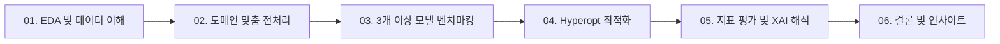

# ml-data-analysis
   

> **정형·비정형 데이터를 아우르는 실무형 머신러닝 End-to-End 데이터 분석 파이프라인**
> 
> 4개의 공개 데이터셋을 기반으로 **문제 정의 → 데이터 정제 및 피처 엔지니어링 → 다중 모델 벤치마킹 → Hyperopt 베이지안 최적화 → XAI 기반 모델 해석**에 이르는 전 과정을 모듈화하여 구현한 프로젝트입니다.

---

## 1. 프로젝트 배경 및 기획 의도
산업 현장의 데이터는 고차원 익명 데이터, 극심한 클래스 불균형, 비정형 텍스트, 가격 회귀 등 저마다 고유한 특성과 난점을 가지고 있습니다. 단일 모델 학습에 그치지 않고 각 데이터의 고유한 문제 구조에 적합한 전처리 기법(SMOTE, TF-IDF 등)과 3개 이상의 모델 벤치마킹, 그리고 Hyperopt를 활용한 정밀 튜닝 파이프라인을 직접 설계하고 검증하기 위해 기획되었습니다.

---

## 2. 해결하고자 하는 4가지 과제와 접근 방식

### [과제 1] 은행 고객 불만족 예측 (Santander Customer Satisfaction)
* **문제 정의**: 약 370개의 익명화된 피처를 기반으로 고객의 불만족(TARGET=1) 여부를 사전에 감지하는 이진 분류 과제입니다.
* **핵심 접근**:
  * 분산이 0이거나 상관계수가 지나치게 높은 중복 피처를 식별하여 차원 축소 및 노이즈 제거
  * 트리 기반 모델(XGBoost, LightGBM)과 로지스틱 회귀를 비교하고, Hyperopt로 트리 깊이 및 샘플링 비율을 최적화하여 ROC-AUC 극대화

### [과제 2] 신용카드 이상 거래 탐지 (Credit Card Fraud Detection)
* **문제 정의**: 28개 PCA 변수와 거래 정보로 구성된 데이터셋에서 약 0.17%에 불과한 극소수 사기(Fraud) 거래를 포착하는 극불균형 분류 과제입니다.
* **핵심 접근**:
  * 정확도(Accuracy)의 착시를 배제하고 Precision-Recall AUC 및 F1-Score 중심의 평가 체계 수립
  * SMOTE, ADASYN 등 오버샘플링 기법과 언더샘플링 기법을 적용하여 사기 거래의 탐지율(Recall)을 집중 개선

### [과제 3] 텍스트 리뷰 기반 토픽 및 군집 도출 (Opinosis Opinion / Review)
* **문제 정의**: 다양한 IT 기기 및 자동차 리뷰 텍스트(UCI)를 바탕으로 사전 라벨 없이 의미 있는 리뷰 그룹을 발견하는 비지도 군집 과제입니다.
* **핵심 접근**:
  * 불용어 제거 및 형태소 분석 후 TF-IDF / 임베딩 벡터화 수행
  * K-Means와 DBSCAN을 적용하여 실루엣 스코어(Silhouette Score)를 기반으로 최적의 클러스터 수를 도출하고 핵심 키워드 군집 추출

### [과제 4] 중고거래 플랫폼 적정 판매 가격 예측 (Mercari Price Suggestion)
* **문제 정의**: 상품명, 브랜드, 카테고리, 긴 설명문 등의 복합 텍스트와 정형 정보를 활용해 적정 판매가를 추정하는 회귀 과제입니다.
* **핵심 접근**:
  * 왜도가 심한 가격 타깃 변수에 Log Transformation 적용
  * 텍스트의 TF-IDF 희소 행렬과 범주형 원-핫 인코딩 행렬을 결합하여 Ridge, LightGBM 등을 적용하고 RMSLE를 최소화하는 파이프라인 구축

---

## 3. 분석 및 개발 파이프라인
프로젝트는 재사용성과 유지보수를 고려하여 모든 전처리, 모델링, 튜닝 단계를 파이썬 함수/모듈로 구조화하여 진행했습니다.

- **데이터 탐색 및 이해**: 결측치, 이상치, 데이터 왜도, 다중공선성 및 상관관계를 시각화하여 전처리 가설 수립
    
- **맞춤형 전처리 & 엔지니어링**: 불균형 보정, 차원 축소, 텍스트 벡터화, 스케일링 적용
    
- **모델링 및 벤치마킹**: 문제 유형별 3개 이상의 알고리즘을 K-Fold 교차 검증으로 학습 및 비교
    
- **하이퍼파라미터 최적화**: TPE 알고리즘 기반 Hyperopt를 적용하여 수동 튜닝 대비 정량적 성능 향상 달성
    
- **성능 해석 및 결론**: 도메인별 최적 지표 산출, Feature Importance 및 SHAP 기반의 모델 설명력(XAI) 확보
    

## 4. 기술 스택 (Tech Stack)

- **언어 및 환경**: Python 3.10+
    
- **데이터 가공 및 시각화**: pandas, numpy, scipy, matplotlib, seaborn
    
- **머신러닝 & 알고리즘**: scikit-learn, xgboost, lightgbm, catboost
    
- **자연어 처리 (NLP)**: nltk, konlpy, scikit-learn (TfidfVectorizer)
    
- **최적화 & 불균형 대응**: hyperopt, optuna, imbalanced-learn
    
- **모델 설명력**: shap
    

## 5. 프로젝트 일정 및 산출물

- **진행 기간**: 2026.08.19 ~ 2026.09.07
    
    - **1차 (2026.08.19 ~ 2026.08.28)**: 4개 데이터셋 심층 EDA, 전처리 파이프라인 구축 및 베이스라인 모델 학습
        
    - **2차 (2026.08.31 ~ 2026.09.07)**: Hyperopt 하이퍼파라미터 최적화, 모델 고도화, 종합 분석 보고서 및 발표 자료 완성
        
- **최종 산출물**:
    
    - 도메인별 분석 보고서 (데이터 이해, 전처리 논리, 벤치마킹 결과, 한계점 및 비즈니스 제언 수록)
        
    - 모듈화된 분석/모델링 소스 코드
        
    - 발표 자료 